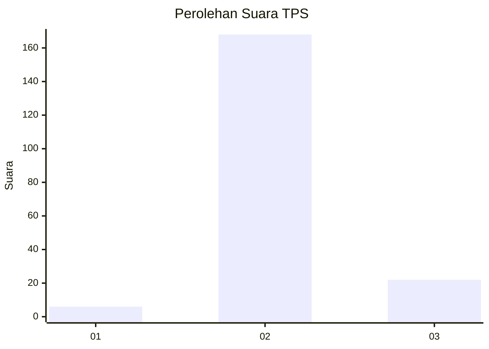
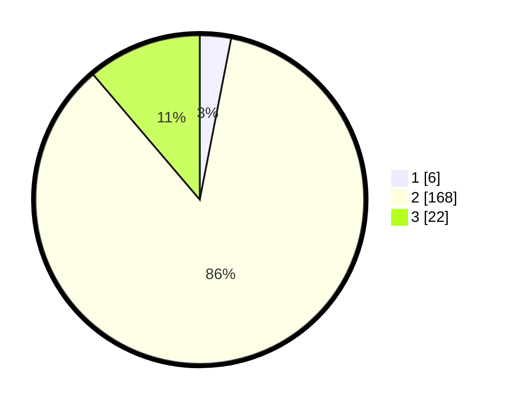

# Hasil

## Grafik

## Tabel

| No. | Nama Paslon    | Suara | Suara (raw) | Persentase |
|:--- |:-------------- | -----:| -----------:| ----------:|
| 1   | ANIES MUHAIMIN | 6     | [6][p-1]    | 3,06       |
| 2   | PRABOWO GIBRAN | 168   | [168][p-2]  | 85,71      |
| 3   | GANJAR MAHFUD  | 22    | [22][p-3]   | 11,22      |

[p-1]: https://github.com/gigit-pemilu/pemilu-2024/blob/main/pilpres/hitung-suara/sub/35-jawa-timur/sub/22-bojonegoro/sub/14-kapas/sub/2003-padangmentoyo/sub/001-tps/sub/paslon-1.txt
[p-2]: https://github.com/gigit-pemilu/pemilu-2024/blob/main/pilpres/hitung-suara/sub/35-jawa-timur/sub/22-bojonegoro/sub/14-kapas/sub/2003-padangmentoyo/sub/001-tps/sub/paslon-2.txt
[p-3]: https://github.com/gigit-pemilu/pemilu-2024/blob/main/pilpres/hitung-suara/sub/35-jawa-timur/sub/22-bojonegoro/sub/14-kapas/sub/2003-padangmentoyo/sub/001-tps/sub/paslon-3.txt

## Foto C Plano

https://sirekap-obj-formc.kpu.go.id/5d31/pemilu/ppwp/35/22/14/20/03/3522142003001-20240214-214544--f22a1a68-9f00-4275-9ab0-1ae9c406098b.jpg

https://sirekap-obj-formc.kpu.go.id/5d31/pemilu/ppwp/35/22/14/20/03/3522142003001-20240214-214705--53d3d1f8-9154-449d-bf33-378d414ab871.jpg

https://sirekap-obj-formc.kpu.go.id/5d31/pemilu/ppwp/35/22/14/20/03/3522142003001-20240218-020447--9268f61f-883b-4b64-afc7-3e8b1effb5ae.jpg

## Metadata

| Key        | Value               |
| ---------- | ------------------- |
| Time Stamp | 2024-02-19 16:00:00 |

