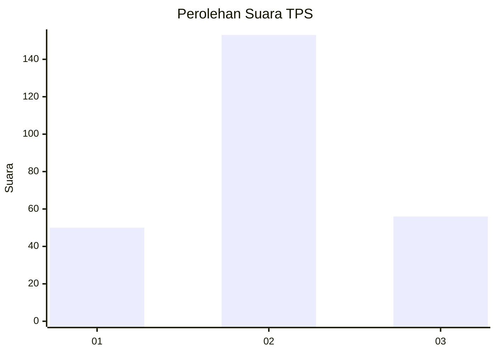
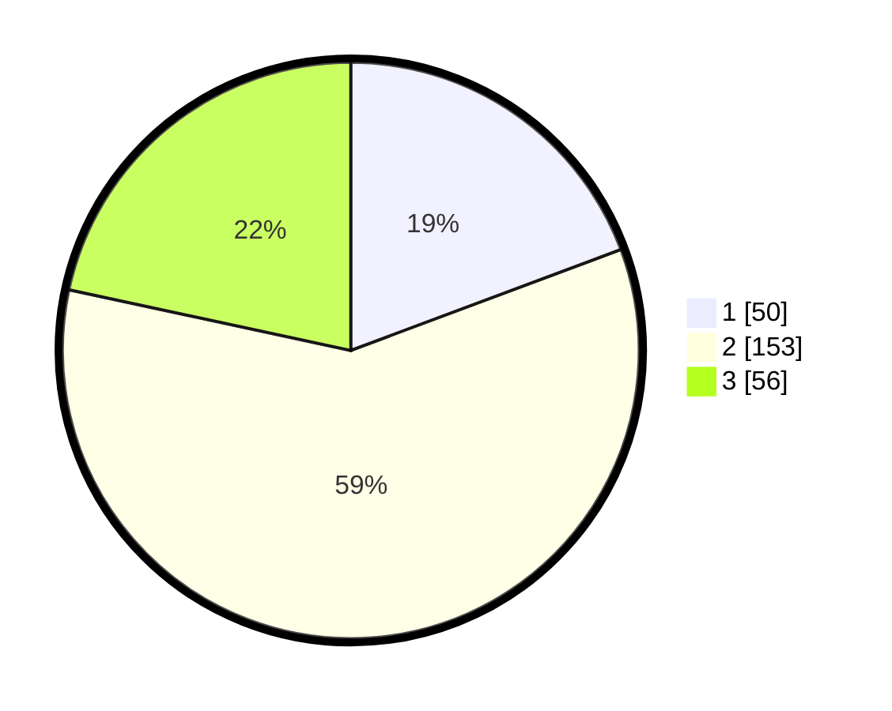

# Hasil

## Grafik

## Tabel

| No. | Nama Paslon    | Suara | Suara (raw) | Persentase |
|:--- |:-------------- | -----:| -----------:| ----------:|
| 1   | ANIES MUHAIMIN | 50    | [50][p-1]   | 19,31      |
| 2   | PRABOWO GIBRAN | 153   | [153][p-2]  | 59,07      |
| 3   | GANJAR MAHFUD  | 56    | [56][p-3]   | 21,62      |

[p-1]: https://github.com/gigit-pemilu/pemilu-2024-35-jawa-timur/blob/main/pilpres/hitung-suara/sub/35-jawa-timur/sub/22-bojonegoro/sub/14-kapas/sub/2008-wedi/sub/004-tps/sub/paslon-1.txt
[p-2]: https://github.com/gigit-pemilu/pemilu-2024-35-jawa-timur/blob/main/pilpres/hitung-suara/sub/35-jawa-timur/sub/22-bojonegoro/sub/14-kapas/sub/2008-wedi/sub/004-tps/sub/paslon-2.txt
[p-3]: https://github.com/gigit-pemilu/pemilu-2024-35-jawa-timur/blob/main/pilpres/hitung-suara/sub/35-jawa-timur/sub/22-bojonegoro/sub/14-kapas/sub/2008-wedi/sub/004-tps/sub/paslon-3.txt

## Foto C Plano

https://sirekap-obj-formc.kpu.go.id/e0f0/pemilu/ppwp/35/22/14/20/08/3522142008004-20240214-232602--28aab7d1-fdcf-4cd4-95df-15cd4e6140e4.jpg

https://sirekap-obj-formc.kpu.go.id/e0f0/pemilu/ppwp/35/22/14/20/08/3522142008004-20240214-232612--6723e084-b206-4ec5-92b4-444d5d8017b8.jpg

https://sirekap-obj-formc.kpu.go.id/e0f0/pemilu/ppwp/35/22/14/20/08/3522142008004-20240214-232621--277919c2-c5bc-435a-9fe1-378da32996f7.jpg

## Metadata

| Key        | Value               |
| ---------- | ------------------- |
| Time Stamp | 2024-02-19 18:00:00 |

