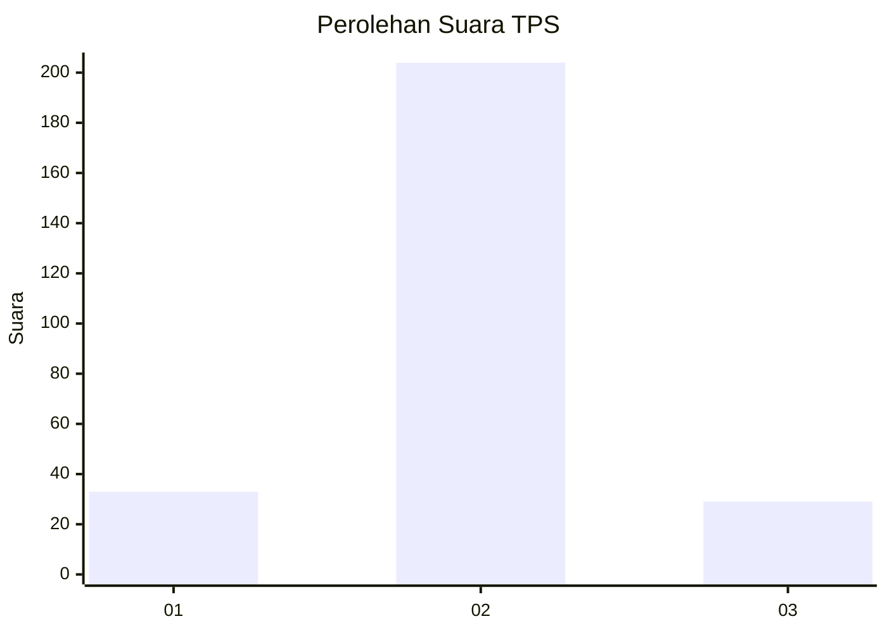
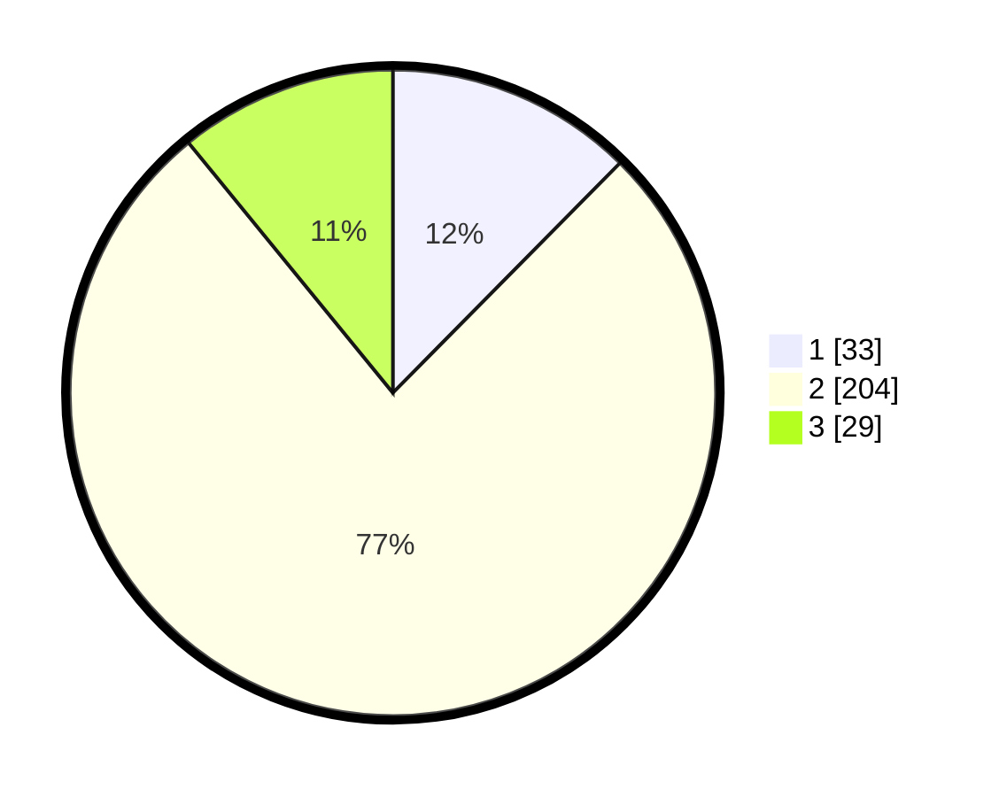

# Hasil

## Grafik

## Tabel

| No. | Nama Paslon    | Suara | Suara (raw) | Persentase |
|:--- |:-------------- | -----:| -----------:| ----------:|
| 1   | ANIES MUHAIMIN | 33    | [33][p-1]   | 12,41      |
| 2   | PRABOWO GIBRAN | 204   | [204][p-2]  | 76,69      |
| 3   | GANJAR MAHFUD  | 29    | [29][p-3]   | 10,90      |

[p-1]: https://github.com/gigit-pemilu/pemilu-2024/blob/main/pilpres/hitung-suara/sub/35-jawa-timur/sub/22-bojonegoro/sub/14-kapas/sub/2008-wedi/sub/005-tps/sub/paslon-1.txt
[p-2]: https://github.com/gigit-pemilu/pemilu-2024/blob/main/pilpres/hitung-suara/sub/35-jawa-timur/sub/22-bojonegoro/sub/14-kapas/sub/2008-wedi/sub/005-tps/sub/paslon-2.txt
[p-3]: https://github.com/gigit-pemilu/pemilu-2024/blob/main/pilpres/hitung-suara/sub/35-jawa-timur/sub/22-bojonegoro/sub/14-kapas/sub/2008-wedi/sub/005-tps/sub/paslon-3.txt

## Foto C Plano

https://sirekap-obj-formc.kpu.go.id/0e29/pemilu/ppwp/35/22/14/20/08/3522142008005-20240214-190954--cff4c474-57b4-4006-81db-97769dd38c3f.jpg

https://sirekap-obj-formc.kpu.go.id/0e29/pemilu/ppwp/35/22/14/20/08/3522142008005-20240214-191002--8ba45659-6725-4ce6-835b-a4aba25c5fdb.jpg

https://sirekap-obj-formc.kpu.go.id/0e29/pemilu/ppwp/35/22/14/20/08/3522142008005-20240214-191007--80ed5235-151d-4ed5-966a-2eee5e673b03.jpg

## Metadata

| Key        | Value               |
| ---------- | ------------------- |
| Time Stamp | 2024-02-19 18:00:00 |

