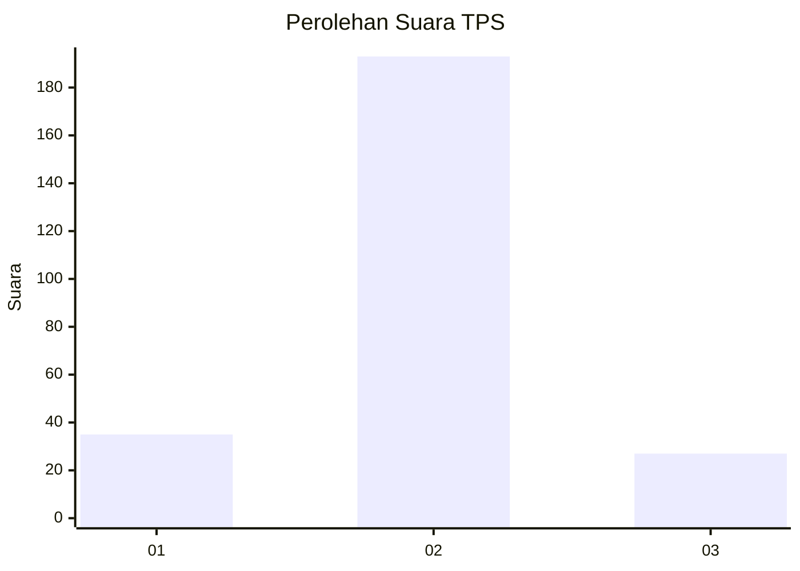
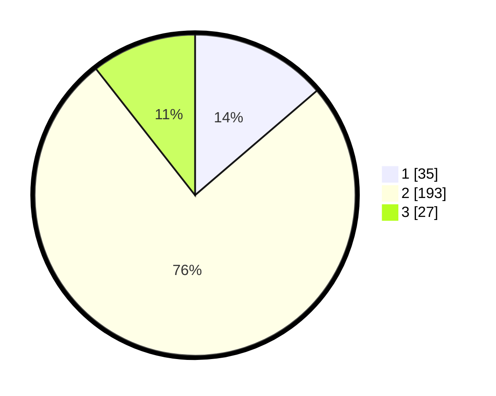

# Hasil

## Grafik

## Tabel

| No. | Nama Paslon    | Suara | Suara (raw) | Persentase |
|:--- |:-------------- | -----:| -----------:| ----------:|
| 1   | ANIES MUHAIMIN | 35    | [35][p-1]   | 13,73      |
| 2   | PRABOWO GIBRAN | 193   | [193][p-2]  | 75,69      |
| 3   | GANJAR MAHFUD  | 27    | [27][p-3]   | 10,59      |

[p-1]: https://github.com/gigit-pemilu/pemilu-2024/blob/main/pilpres/hitung-suara/sub/35-jawa-timur/sub/22-bojonegoro/sub/14-kapas/sub/2008-wedi/sub/007-tps/sub/paslon-1.txt
[p-2]: https://github.com/gigit-pemilu/pemilu-2024/blob/main/pilpres/hitung-suara/sub/35-jawa-timur/sub/22-bojonegoro/sub/14-kapas/sub/2008-wedi/sub/007-tps/sub/paslon-2.txt
[p-3]: https://github.com/gigit-pemilu/pemilu-2024/blob/main/pilpres/hitung-suara/sub/35-jawa-timur/sub/22-bojonegoro/sub/14-kapas/sub/2008-wedi/sub/007-tps/sub/paslon-3.txt

## Foto C Plano

https://sirekap-obj-formc.kpu.go.id/3f75/pemilu/ppwp/35/22/14/20/08/3522142008007-20240214-155911--63036dd1-4ba3-48fa-9063-6d7cc0657a6c.jpg

https://sirekap-obj-formc.kpu.go.id/3f75/pemilu/ppwp/35/22/14/20/08/3522142008007-20240214-160113--c966a73a-9c49-4e2f-bd37-08aa25a6bb47.jpg

https://sirekap-obj-formc.kpu.go.id/3f75/pemilu/ppwp/35/22/14/20/08/3522142008007-20240214-184813--225ee7d7-41af-409d-a994-f282c9f65841.jpg

## Metadata

| Key        | Value               |
| ---------- | ------------------- |
| Time Stamp | 2024-02-19 18:00:00 |

