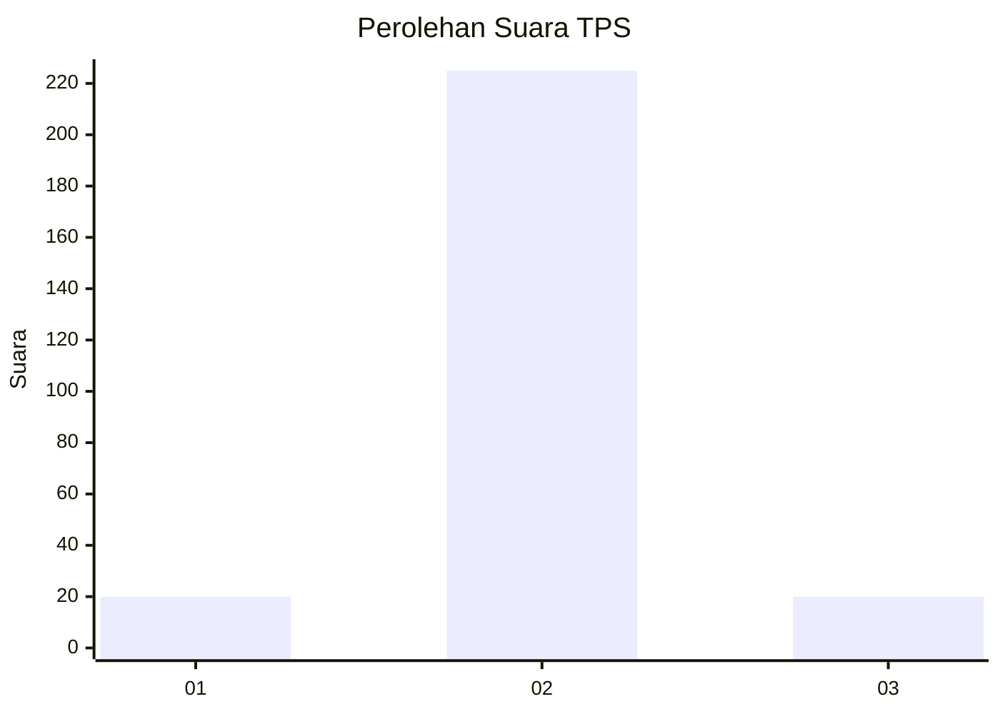
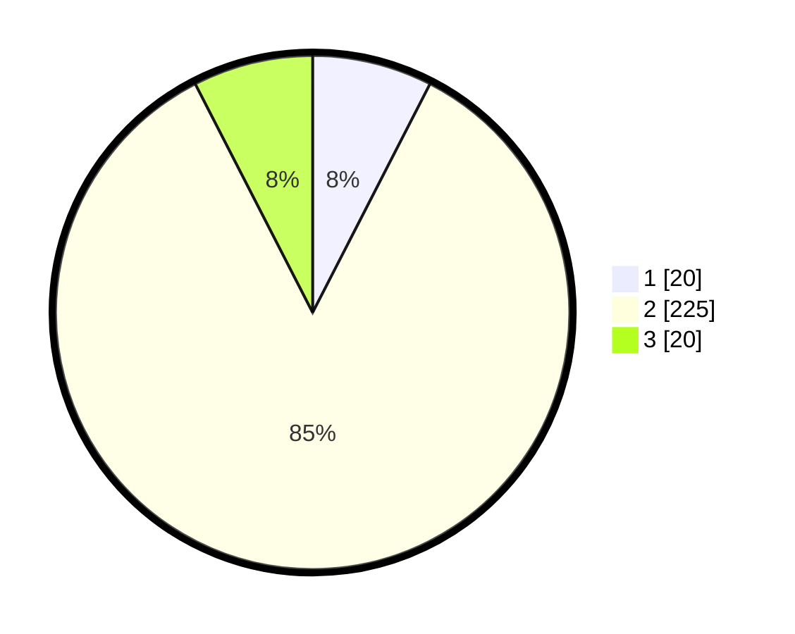

# Hasil

## Grafik

## Tabel

| No. | Nama Paslon    | Suara | Suara (raw) | Persentase |
|:--- |:-------------- | -----:| -----------:| ----------:|
| 1   | ANIES MUHAIMIN | 20    | [20][p-1]   | 7,55       |
| 2   | PRABOWO GIBRAN | 225   | [225][p-2]  | 84,91      |
| 3   | GANJAR MAHFUD  | 20    | [20][p-3]   | 7,55       |

[p-1]: https://github.com/gigit-pemilu/pemilu-2024-35-jawa-timur/blob/main/pilpres/hitung-suara/sub/35-jawa-timur/sub/22-bojonegoro/sub/14-kapas/sub/2008-wedi/sub/011-tps/sub/paslon-1.txt
[p-2]: https://github.com/gigit-pemilu/pemilu-2024-35-jawa-timur/blob/main/pilpres/hitung-suara/sub/35-jawa-timur/sub/22-bojonegoro/sub/14-kapas/sub/2008-wedi/sub/011-tps/sub/paslon-2.txt
[p-3]: https://github.com/gigit-pemilu/pemilu-2024-35-jawa-timur/blob/main/pilpres/hitung-suara/sub/35-jawa-timur/sub/22-bojonegoro/sub/14-kapas/sub/2008-wedi/sub/011-tps/sub/paslon-3.txt

## Foto C Plano

https://sirekap-obj-formc.kpu.go.id/86b9/pemilu/ppwp/35/22/14/20/08/3522142008011-20240214-200333--653deec0-ea04-49d7-885a-f1b49bc8de71.jpg

https://sirekap-obj-formc.kpu.go.id/86b9/pemilu/ppwp/35/22/14/20/08/3522142008011-20240214-200421--0d196c8a-92b3-438b-8a49-ca417e9de49e.jpg

https://sirekap-obj-formc.kpu.go.id/86b9/pemilu/ppwp/35/22/14/20/08/3522142008011-20240214-200550--62b9967d-656a-4332-b458-ff6da800a0e9.jpg

## Metadata

| Key        | Value               |
| ---------- | ------------------- |
| Time Stamp | 2024-02-19 18:00:00 |

