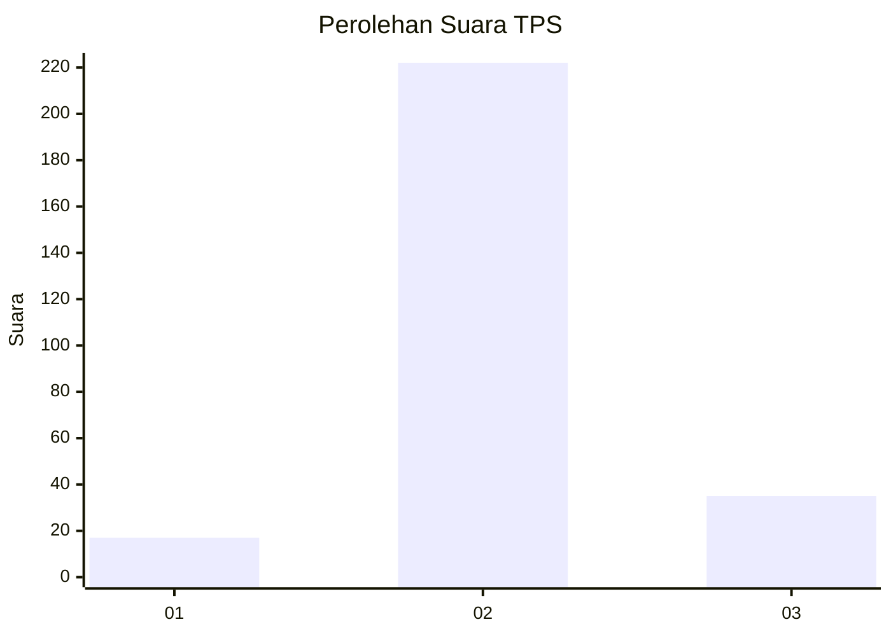
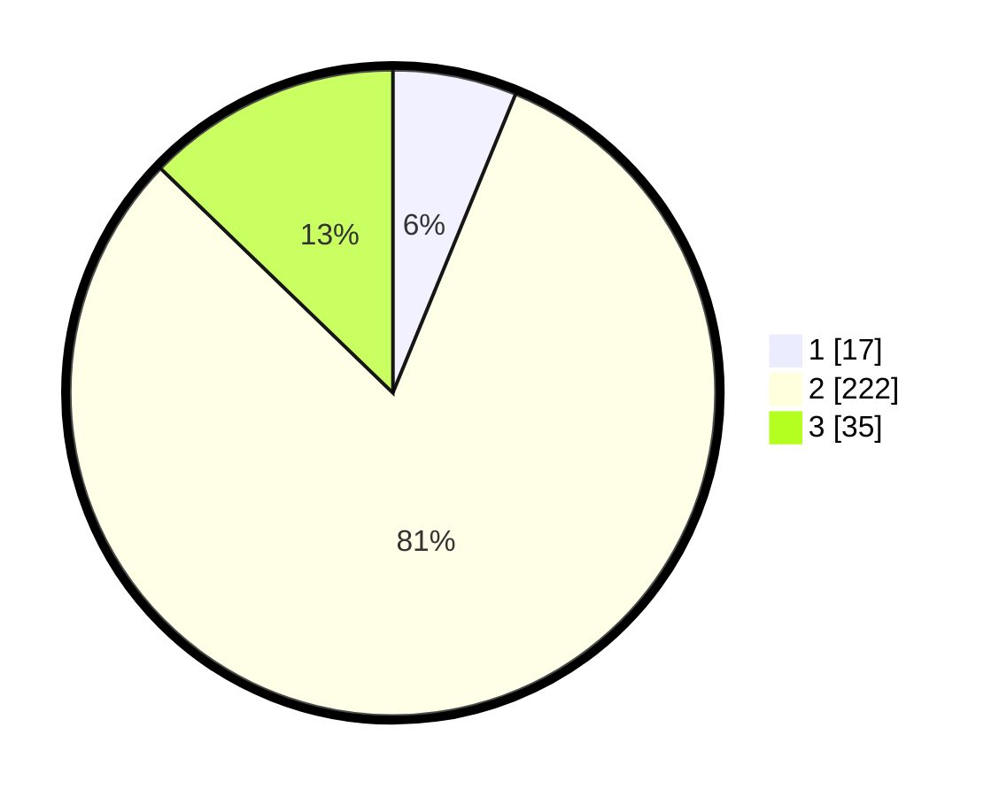

# Hasil

## Grafik

## Tabel

| No. | Nama Paslon    | Suara | Suara (raw) | Persentase |
|:--- |:-------------- | -----:| -----------:| ----------:|
| 1   | ANIES MUHAIMIN | 17    | [17][p-1]   | 6,20       |
| 2   | PRABOWO GIBRAN | 222   | [222][p-2]  | 81,02      |
| 3   | GANJAR MAHFUD  | 35    | [35][p-3]   | 12,77      |

[p-1]: https://github.com/gigit-pemilu/pemilu-2024/blob/main/pilpres/hitung-suara/sub/35-jawa-timur/sub/22-bojonegoro/sub/14-kapas/sub/2008-wedi/sub/012-tps/sub/paslon-1.txt
[p-2]: https://github.com/gigit-pemilu/pemilu-2024/blob/main/pilpres/hitung-suara/sub/35-jawa-timur/sub/22-bojonegoro/sub/14-kapas/sub/2008-wedi/sub/012-tps/sub/paslon-2.txt
[p-3]: https://github.com/gigit-pemilu/pemilu-2024/blob/main/pilpres/hitung-suara/sub/35-jawa-timur/sub/22-bojonegoro/sub/14-kapas/sub/2008-wedi/sub/012-tps/sub/paslon-3.txt

## Foto C Plano

https://sirekap-obj-formc.kpu.go.id/782b/pemilu/ppwp/35/22/14/20/08/3522142008012-20240215-022221--55c687a0-de24-49a9-845f-de0e444ad651.jpg

https://sirekap-obj-formc.kpu.go.id/782b/pemilu/ppwp/35/22/14/20/08/3522142008012-20240215-022251--a8ee4a17-b2df-47ab-aa96-cbdb21b7c623.jpg

https://sirekap-obj-formc.kpu.go.id/782b/pemilu/ppwp/35/22/14/20/08/3522142008012-20240215-022400--4659dcf2-1d65-4dc8-ae58-a89116dfcb10.jpg

## Metadata

| Key        | Value               |
| ---------- | ------------------- |
| Time Stamp | 2024-02-19 18:00:00 |

