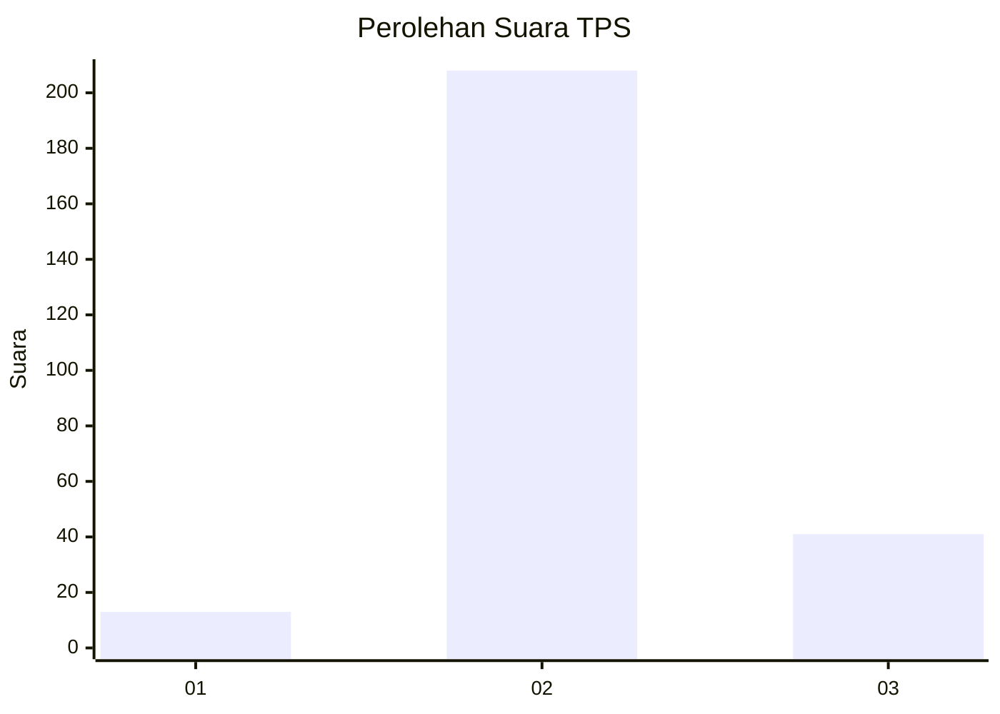
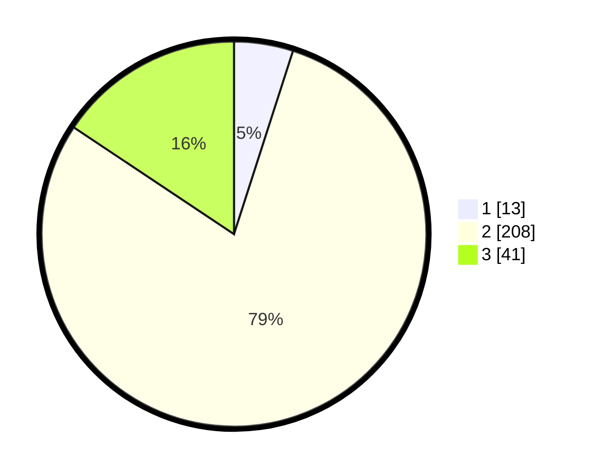

# Hasil

## Grafik

## Tabel

| No. | Nama Paslon    | Suara | Suara (raw) | Persentase |
|:--- |:-------------- | -----:| -----------:| ----------:|
| 1   | ANIES MUHAIMIN | 13    | [13][p-1]   | 4,96       |
| 2   | PRABOWO GIBRAN | 208   | [208][p-2]  | 79,39      |
| 3   | GANJAR MAHFUD  | 41    | [41][p-3]   | 15,65      |

[p-1]: https://github.com/gigit-pemilu/pemilu-2024-35-jawa-timur/blob/main/pilpres/hitung-suara/sub/35-jawa-timur/sub/22-bojonegoro/sub/14-kapas/sub/2013-bogo/sub/004-tps/sub/paslon-1.txt
[p-2]: https://github.com/gigit-pemilu/pemilu-2024-35-jawa-timur/blob/main/pilpres/hitung-suara/sub/35-jawa-timur/sub/22-bojonegoro/sub/14-kapas/sub/2013-bogo/sub/004-tps/sub/paslon-2.txt
[p-3]: https://github.com/gigit-pemilu/pemilu-2024-35-jawa-timur/blob/main/pilpres/hitung-suara/sub/35-jawa-timur/sub/22-bojonegoro/sub/14-kapas/sub/2013-bogo/sub/004-tps/sub/paslon-3.txt

## Foto C Plano

https://sirekap-obj-formc.kpu.go.id/a62a/pemilu/ppwp/35/22/14/20/13/3522142013004-20240214-231216--5a9c79d8-1bdc-481f-9a96-998522562e43.jpg

https://sirekap-obj-formc.kpu.go.id/a62a/pemilu/ppwp/35/22/14/20/13/3522142013004-20240214-231252--a776a68c-10a0-4195-bd80-4ee4e05b1a41.jpg

https://sirekap-obj-formc.kpu.go.id/a62a/pemilu/ppwp/35/22/14/20/13/3522142013004-20240214-231305--a014d01d-c49c-4d98-9396-f1e0ffabef33.jpg

## Metadata

| Key        | Value               |
| ---------- | ------------------- |
| Time Stamp | 2024-02-19 20:00:00 |

