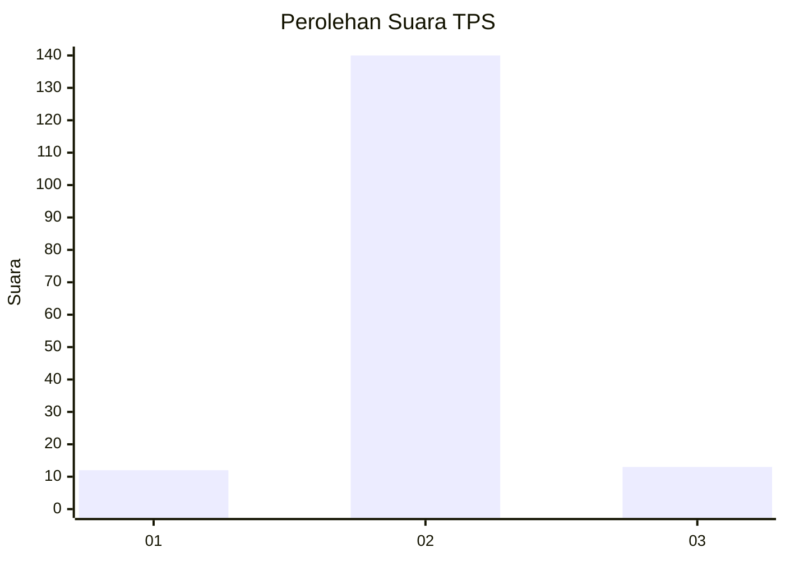
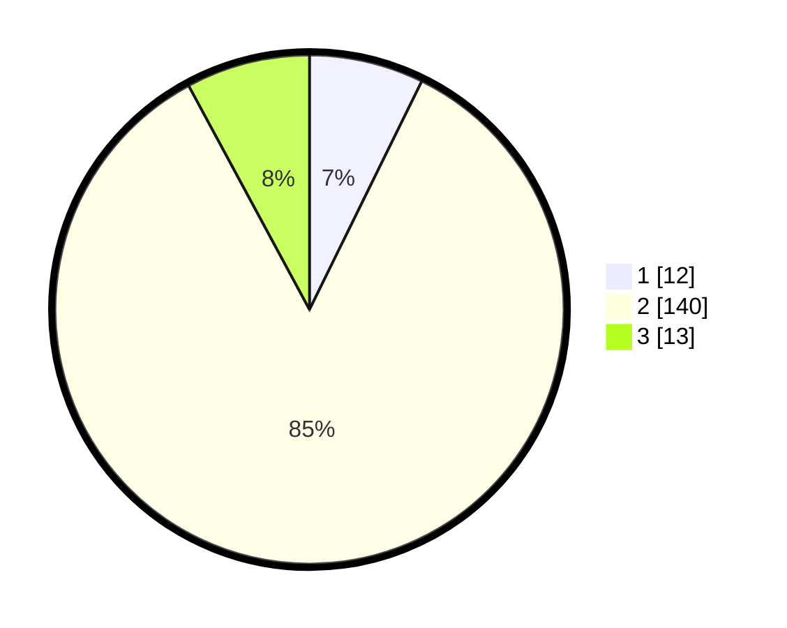

# Hasil

## Grafik

## Tabel

| No. | Nama Paslon    | Suara | Suara (raw) | Persentase |
|:--- |:-------------- | -----:| -----------:| ----------:|
| 1   | ANIES MUHAIMIN | 12    | [12][p-1]   | 7,27       |
| 2   | PRABOWO GIBRAN | 140   | [140][p-2]  | 84,85      |
| 3   | GANJAR MAHFUD  | 13    | [13][p-3]   | 7,88       |

[p-1]: https://github.com/gigit-pemilu/pemilu-2024-35-jawa-timur/blob/main/pilpres/hitung-suara/sub/35-jawa-timur/sub/22-bojonegoro/sub/14-kapas/sub/2016-sukowati/sub/008-tps/sub/paslon-1.txt
[p-2]: https://github.com/gigit-pemilu/pemilu-2024-35-jawa-timur/blob/main/pilpres/hitung-suara/sub/35-jawa-timur/sub/22-bojonegoro/sub/14-kapas/sub/2016-sukowati/sub/008-tps/sub/paslon-2.txt
[p-3]: https://github.com/gigit-pemilu/pemilu-2024-35-jawa-timur/blob/main/pilpres/hitung-suara/sub/35-jawa-timur/sub/22-bojonegoro/sub/14-kapas/sub/2016-sukowati/sub/008-tps/sub/paslon-3.txt

## Foto C Plano

https://sirekap-obj-formc.kpu.go.id/f3e3/pemilu/ppwp/35/22/14/20/16/3522142016008-20240215-015136--3f0207b5-9ad4-4b49-bb7d-1aac108dff7b.jpg

https://sirekap-obj-formc.kpu.go.id/f3e3/pemilu/ppwp/35/22/14/20/16/3522142016008-20240215-015322--fb60be90-b9e0-474e-9822-3ae0c19afada.jpg

https://sirekap-obj-formc.kpu.go.id/f3e3/pemilu/ppwp/35/22/14/20/16/3522142016008-20240215-014549--12fc1f99-5dec-4b01-8591-445ee7dde8ba.jpg

## Metadata

| Key        | Value               |
| ---------- | ------------------- |
| Time Stamp | 2024-02-20 09:00:00 |

