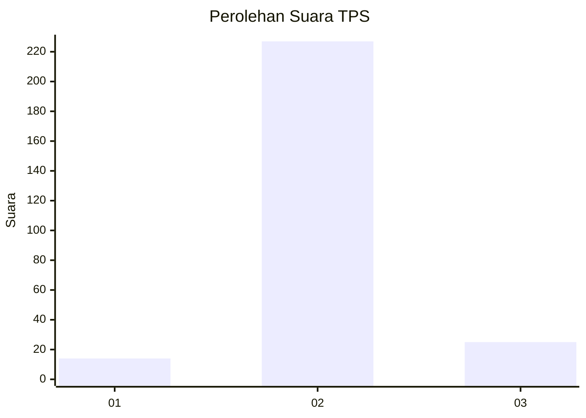
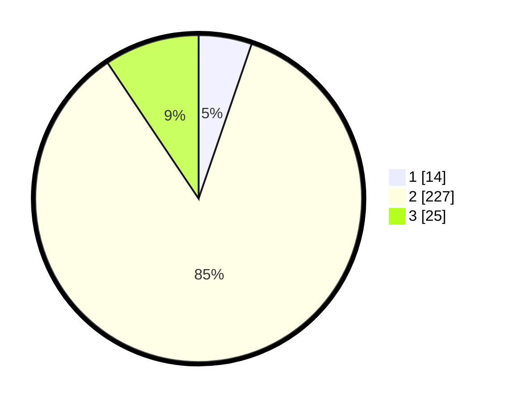

# Hasil

## Grafik

## Tabel

| No. | Nama Paslon    | Suara | Suara (raw) | Persentase |
|:--- |:-------------- | -----:| -----------:| ----------:|
| 1   | ANIES MUHAIMIN | 14    | [14][p-1]   | 5,26       |
| 2   | PRABOWO GIBRAN | 227   | [227][p-2]  | 85,34      |
| 3   | GANJAR MAHFUD  | 25    | [25][p-3]   | 9,40       |

[p-1]: https://github.com/gigit-pemilu/pemilu-2024/blob/main/pilpres/hitung-suara/sub/35-jawa-timur/sub/22-bojonegoro/sub/14-kapas/sub/2018-tikusan/sub/003-tps/sub/paslon-1.txt
[p-2]: https://github.com/gigit-pemilu/pemilu-2024/blob/main/pilpres/hitung-suara/sub/35-jawa-timur/sub/22-bojonegoro/sub/14-kapas/sub/2018-tikusan/sub/003-tps/sub/paslon-2.txt
[p-3]: https://github.com/gigit-pemilu/pemilu-2024/blob/main/pilpres/hitung-suara/sub/35-jawa-timur/sub/22-bojonegoro/sub/14-kapas/sub/2018-tikusan/sub/003-tps/sub/paslon-3.txt

## Foto C Plano

https://sirekap-obj-formc.kpu.go.id/9a32/pemilu/ppwp/35/22/14/20/18/3522142018003-20240215-005710--3e03b35b-2459-4a1e-a86b-ad01d443c738.jpg

https://sirekap-obj-formc.kpu.go.id/9a32/pemilu/ppwp/35/22/14/20/18/3522142018003-20240215-005822--8bd706d0-b917-4cf8-91b7-c002e9ec4667.jpg

https://sirekap-obj-formc.kpu.go.id/9a32/pemilu/ppwp/35/22/14/20/18/3522142018003-20240215-010048--bbe61206-c394-47b4-b62d-cb216bb3429a.jpg

## Metadata

| Key        | Value               |
| ---------- | ------------------- |
| Time Stamp | 2024-02-20 10:00:00 |

