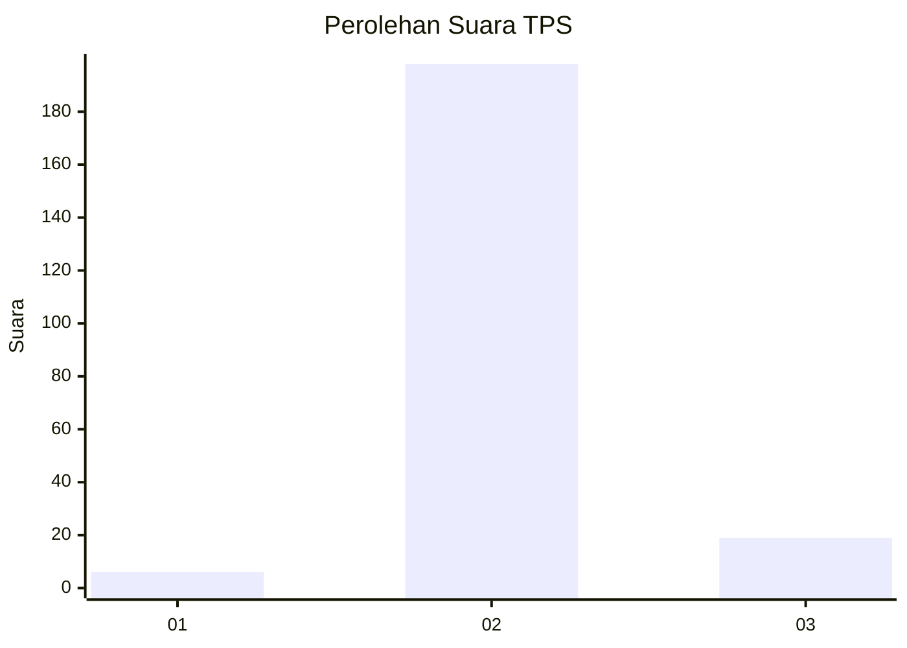
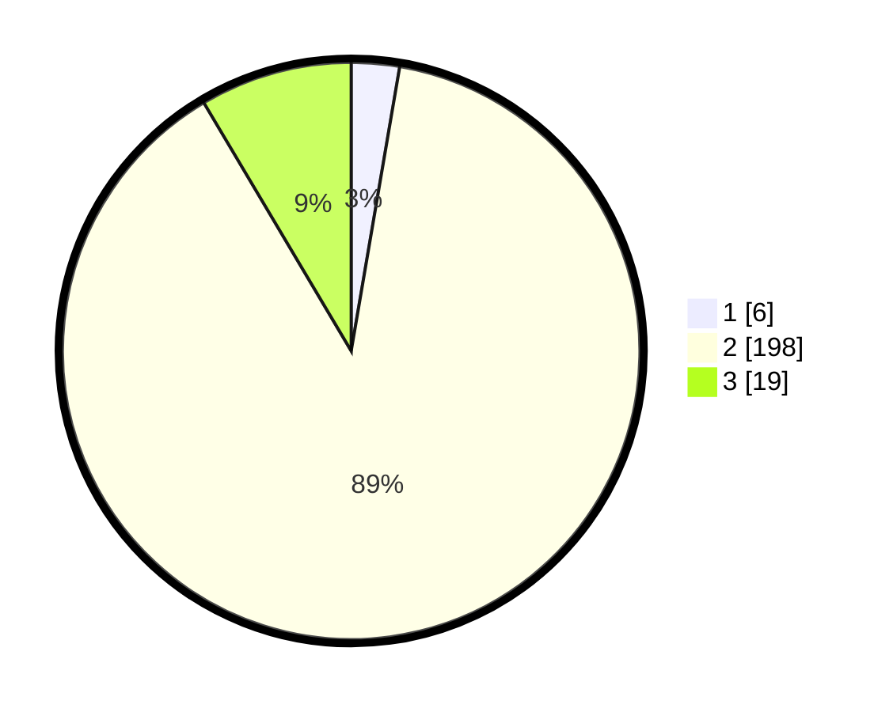

# Hasil

## Grafik

## Tabel

| No. | Nama Paslon    | Suara | Suara (raw) | Persentase |
|:--- |:-------------- | -----:| -----------:| ----------:|
| 1   | ANIES MUHAIMIN | 6     | [6][p-1]    | 2,69       |
| 2   | PRABOWO GIBRAN | 198   | [198][p-2]  | 88,79      |
| 3   | GANJAR MAHFUD  | 19    | [19][p-3]   | 8,52       |

[p-1]: https://github.com/gigit-pemilu/pemilu-2024/blob/main/pilpres/hitung-suara/sub/35-jawa-timur/sub/22-bojonegoro/sub/16-kalitidu/sub/2011-grebegan/sub/005-tps/sub/paslon-1.txt
[p-2]: https://github.com/gigit-pemilu/pemilu-2024/blob/main/pilpres/hitung-suara/sub/35-jawa-timur/sub/22-bojonegoro/sub/16-kalitidu/sub/2011-grebegan/sub/005-tps/sub/paslon-2.txt
[p-3]: https://github.com/gigit-pemilu/pemilu-2024/blob/main/pilpres/hitung-suara/sub/35-jawa-timur/sub/22-bojonegoro/sub/16-kalitidu/sub/2011-grebegan/sub/005-tps/sub/paslon-3.txt

## Foto C Plano

https://sirekap-obj-formc.kpu.go.id/24ca/pemilu/ppwp/35/22/16/20/11/3522162011005-20240214-233035--80c3b226-c466-4ed6-a679-f927aa1a6087.jpg

https://sirekap-obj-formc.kpu.go.id/24ca/pemilu/ppwp/35/22/16/20/11/3522162011005-20240214-233155--43e1378f-4d49-4553-a655-ecf5406f65a3.jpg

https://sirekap-obj-formc.kpu.go.id/24ca/pemilu/ppwp/35/22/16/20/11/3522162011005-20240214-233448--d8434b40-c3a3-44ac-8ccb-4b6c453bae9e.jpg

## Metadata

| Key        | Value               |
| ---------- | ------------------- |
| Time Stamp | 2024-02-19 06:16:00 |

