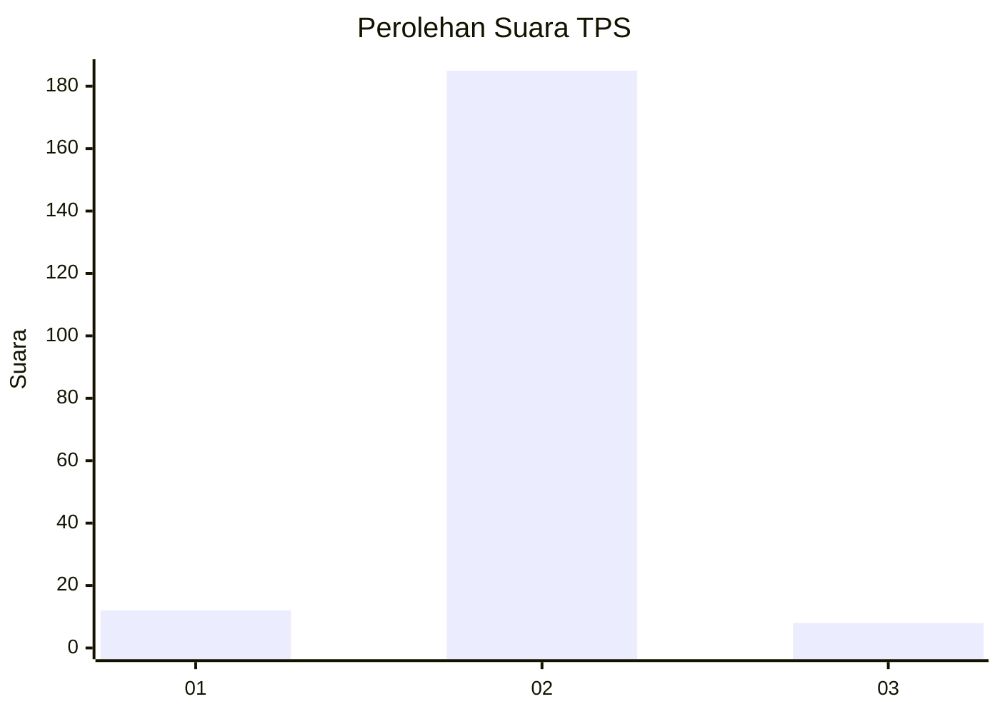
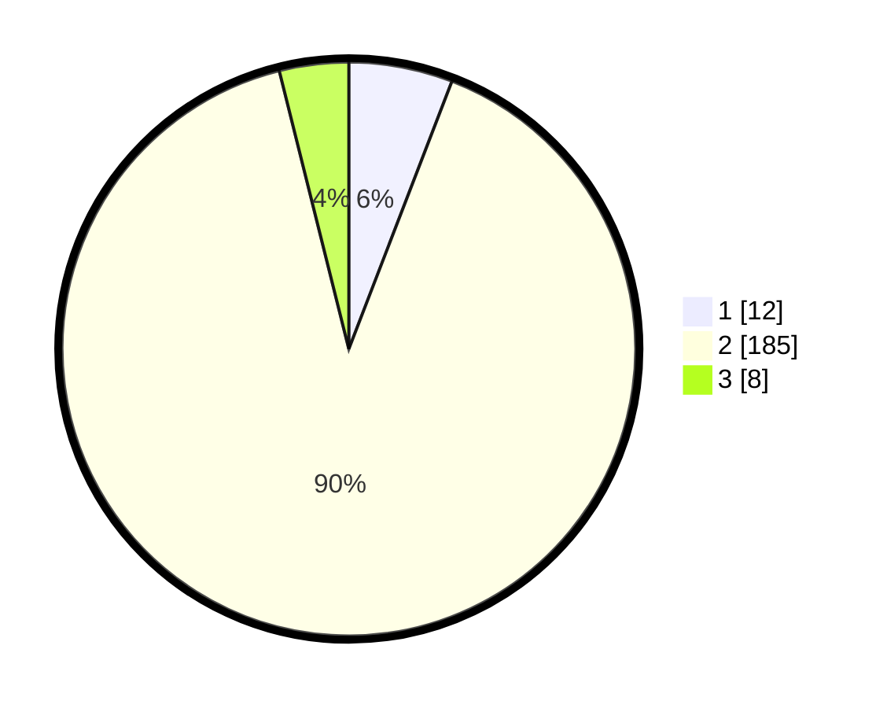

# Hasil

## Grafik

## Tabel

| No. | Nama Paslon    | Suara | Suara (raw) | Persentase |
|:--- |:-------------- | -----:| -----------:| ----------:|
| 1   | ANIES MUHAIMIN | 12    | [12][p-1]   | 5,85       |
| 2   | PRABOWO GIBRAN | 185   | [185][p-2]  | 90,24      |
| 3   | GANJAR MAHFUD  | 8     | [8][p-3]    | 3,90       |

[p-1]: https://github.com/gigit-pemilu/pemilu-2024/blob/main/pilpres/hitung-suara/sub/35-jawa-timur/sub/22-bojonegoro/sub/16-kalitidu/sub/2012-wotanngare/sub/006-tps/sub/paslon-1.txt
[p-2]: https://github.com/gigit-pemilu/pemilu-2024/blob/main/pilpres/hitung-suara/sub/35-jawa-timur/sub/22-bojonegoro/sub/16-kalitidu/sub/2012-wotanngare/sub/006-tps/sub/paslon-2.txt
[p-3]: https://github.com/gigit-pemilu/pemilu-2024/blob/main/pilpres/hitung-suara/sub/35-jawa-timur/sub/22-bojonegoro/sub/16-kalitidu/sub/2012-wotanngare/sub/006-tps/sub/paslon-3.txt

## Foto C Plano

https://sirekap-obj-formc.kpu.go.id/c84e/pemilu/ppwp/35/22/16/20/12/3522162012006-20240214-194233--64423432-90d7-470e-80c2-ec548c706b60.jpg

https://sirekap-obj-formc.kpu.go.id/c84e/pemilu/ppwp/35/22/16/20/12/3522162012006-20240214-194037--be708423-7238-4b19-83b2-f58486134570.jpg

https://sirekap-obj-formc.kpu.go.id/c84e/pemilu/ppwp/35/22/16/20/12/3522162012006-20240214-194254--6e29392e-1878-4288-9e06-77c6649f855d.jpg

## Metadata

| Key        | Value               |
| ---------- | ------------------- |
| Time Stamp | 2024-02-16 21:01:00 |

