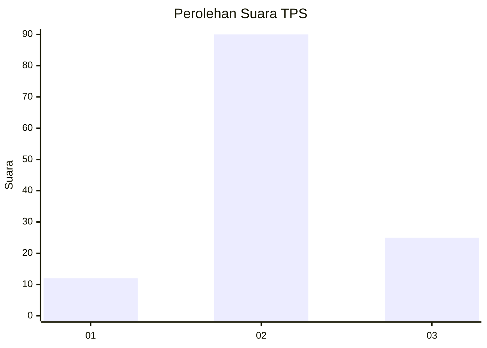
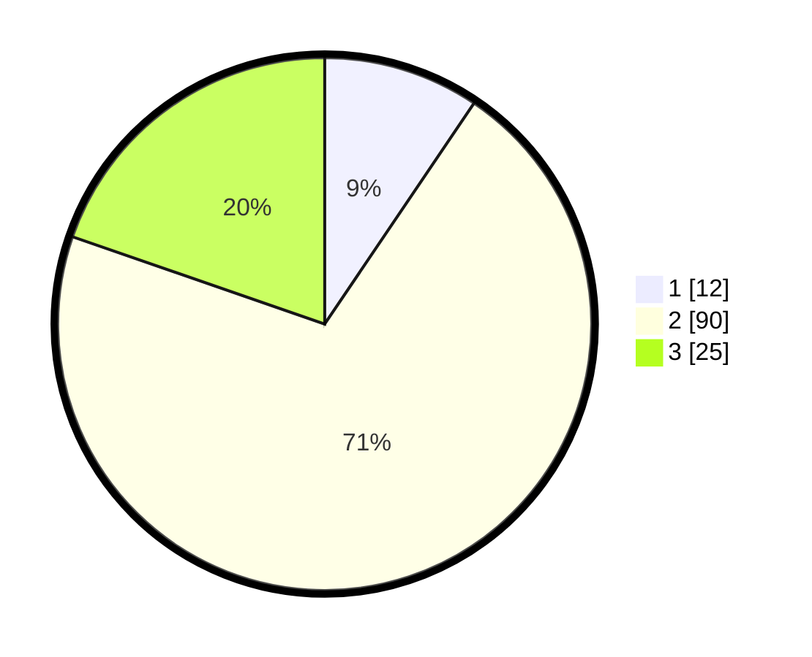

# Hasil

## Grafik

## Tabel

| No. | Nama Paslon    | Suara | Suara (raw) | Persentase |
|:--- |:-------------- | -----:| -----------:| ----------:|
| 1   | ANIES MUHAIMIN | 12    | [12][p-1]   | 9,45       |
| 2   | PRABOWO GIBRAN | 90    | [90][p-2]   | 70,87      |
| 3   | GANJAR MAHFUD  | 25    | [25][p-3]   | 19,69      |

[p-1]: https://github.com/gigit-pemilu/pemilu-2024/blob/main/pilpres/hitung-suara/sub/35-jawa-timur/sub/22-bojonegoro/sub/16-kalitidu/sub/2014-mayanggeneng/sub/002-tps/sub/paslon-1.txt
[p-2]: https://github.com/gigit-pemilu/pemilu-2024/blob/main/pilpres/hitung-suara/sub/35-jawa-timur/sub/22-bojonegoro/sub/16-kalitidu/sub/2014-mayanggeneng/sub/002-tps/sub/paslon-2.txt
[p-3]: https://github.com/gigit-pemilu/pemilu-2024/blob/main/pilpres/hitung-suara/sub/35-jawa-timur/sub/22-bojonegoro/sub/16-kalitidu/sub/2014-mayanggeneng/sub/002-tps/sub/paslon-3.txt

## Foto C Plano

https://sirekap-obj-formc.kpu.go.id/fef6/pemilu/ppwp/35/22/16/20/14/3522162014002-20240214-193213--16e2f918-ce02-48d8-8efc-f8b5f57edb3d.jpg

https://sirekap-obj-formc.kpu.go.id/fef6/pemilu/ppwp/35/22/16/20/14/3522162014002-20240214-141801--87dc3058-82e9-45f2-8dcc-90c52d37d93f.jpg

https://sirekap-obj-formc.kpu.go.id/fef6/pemilu/ppwp/35/22/16/20/14/3522162014002-20240214-141938--0eeedb1c-22b5-42b6-8c7f-484cc16376af.jpg

## Metadata

| Key        | Value               |
| ---------- | ------------------- |
| Time Stamp | 2024-02-14 21:46:01 |

## DATA PEMILIH TETAP

Jumlah pemilih dalam DPT: **128**.
 * L: **64**.
 * P: **64**.

## DATA PENGGUNA HAK PILIH

Jumlah pengguna hak pilih dalam DPT: **107**.
 * L: **48**.
 * P: **59**.

Jumlah pengguna hak pilih dalam DPTb: **0**.
 * L: **0**.
 * P: **0**.

Jumlah pengguna hak pilih dalam DPK: **24**.
 * L: **8**.
 * P: **16**.

Jumlah pengguna hak pilih: **131**.
 * L: **56**.
 * P: **75**.

## JUMLAH SUARA SAH DAN TIDAK SAH

JUMLAH SELURUH SUARA SAH: **127**.

JUMLAH SUARA TIDAK SAH: **4**.

JUMLAH SELURUH SUARA SAH DAN SUARA TIDAK SAH: **131**.

