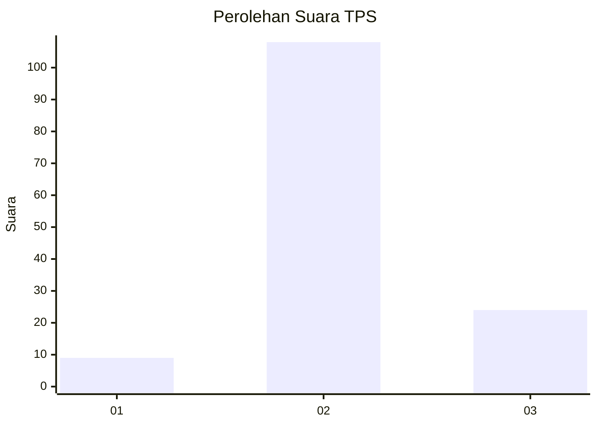

# Hasil

## Grafik

## Tabel

| No. | Nama Paslon    | Suara | Suara (raw) | Persentase |
|:--- |:-------------- | -----:| -----------:| ----------:|
| 1   | ANIES MUHAIMIN | 9     | [9][p-1]    | 6,38       |
| 2   | PRABOWO GIBRAN | 108   | [108][p-2]  | 76,60      |
| 3   | GANJAR MAHFUD  | 24    | [24][p-3]   | 17,02      |

[p-1]: https://github.com/gigit-pemilu/pemilu-2024/blob/main/pilpres/hitung-suara/sub/35-jawa-timur/sub/22-bojonegoro/sub/16-kalitidu/sub/2015-mayangrejo/sub/012-tps/sub/paslon-1.txt
[p-2]: https://github.com/gigit-pemilu/pemilu-2024/blob/main/pilpres/hitung-suara/sub/35-jawa-timur/sub/22-bojonegoro/sub/16-kalitidu/sub/2015-mayangrejo/sub/012-tps/sub/paslon-2.txt
[p-3]: https://github.com/gigit-pemilu/pemilu-2024/blob/main/pilpres/hitung-suara/sub/35-jawa-timur/sub/22-bojonegoro/sub/16-kalitidu/sub/2015-mayangrejo/sub/012-tps/sub/paslon-3.txt

## Foto C Plano

https://sirekap-obj-formc.kpu.go.id/2790/pemilu/ppwp/35/22/16/20/15/3522162015012-20240215-013739--fb99d273-ec0c-49e4-85c6-c3495eec337e.jpg

https://sirekap-obj-formc.kpu.go.id/2790/pemilu/ppwp/35/22/16/20/15/3522162015012-20240215-013852--d1374216-0c0f-4adf-ba40-81b9de5bd754.jpg

https://sirekap-obj-formc.kpu.go.id/2790/pemilu/ppwp/35/22/16/20/15/3522162015012-20240215-013946--33da45c3-227f-4852-a8ff-2484ee5dd825.jpg

## Metadata

| Key        | Value               |
| ---------- | ------------------- |
| Time Stamp | 2024-02-19 18:00:00 |

