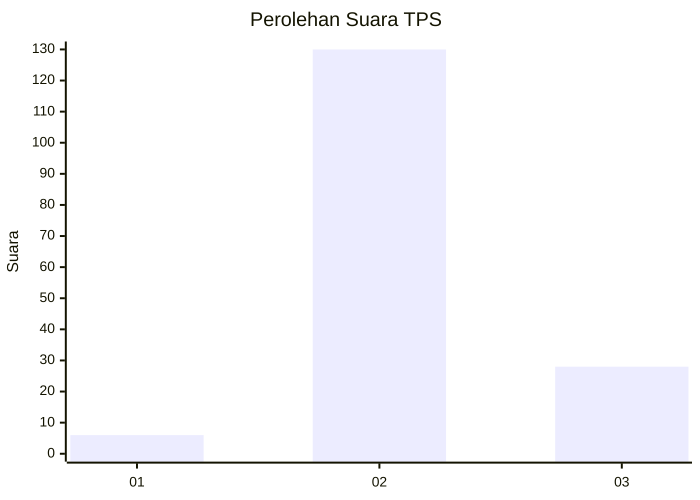

# Hasil

## Grafik

## Tabel

| No. | Nama Paslon    | Suara | Suara (raw) | Persentase |
|:--- |:-------------- | -----:| -----------:| ----------:|
| 1   | ANIES MUHAIMIN | 6     | [6][p-1]    | 3,66       |
| 2   | PRABOWO GIBRAN | 130   | [130][p-2]  | 79,27      |
| 3   | GANJAR MAHFUD  | 28    | [28][p-3]   | 17,07      |

[p-1]: https://github.com/gigit-pemilu/pemilu-2024/blob/main/pilpres/hitung-suara/sub/35-jawa-timur/sub/22-bojonegoro/sub/16-kalitidu/sub/2018-pungpungan/sub/014-tps/sub/paslon-1.txt
[p-2]: https://github.com/gigit-pemilu/pemilu-2024/blob/main/pilpres/hitung-suara/sub/35-jawa-timur/sub/22-bojonegoro/sub/16-kalitidu/sub/2018-pungpungan/sub/014-tps/sub/paslon-2.txt
[p-3]: https://github.com/gigit-pemilu/pemilu-2024/blob/main/pilpres/hitung-suara/sub/35-jawa-timur/sub/22-bojonegoro/sub/16-kalitidu/sub/2018-pungpungan/sub/014-tps/sub/paslon-3.txt

## Foto C Plano

https://sirekap-obj-formc.kpu.go.id/5915/pemilu/ppwp/35/22/16/20/18/3522162018014-20240219-223455--dad77ed8-0e83-45f6-a0a8-22a77b19ce50.jpg

https://sirekap-obj-formc.kpu.go.id/5915/pemilu/ppwp/35/22/16/20/18/3522162018014-20240219-223519--00dc53e5-e2ac-454e-8a40-69ccaa389008.jpg

https://sirekap-obj-formc.kpu.go.id/5915/pemilu/ppwp/35/22/16/20/18/3522162018014-20240219-223537--18fe3b50-98e1-4495-9931-1058f881105a.jpg

## Metadata

| Key        | Value               |
| ---------- | ------------------- |
| Time Stamp | 2024-02-21 21:00:04 |

