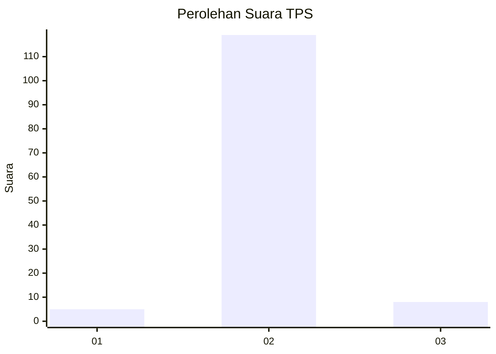
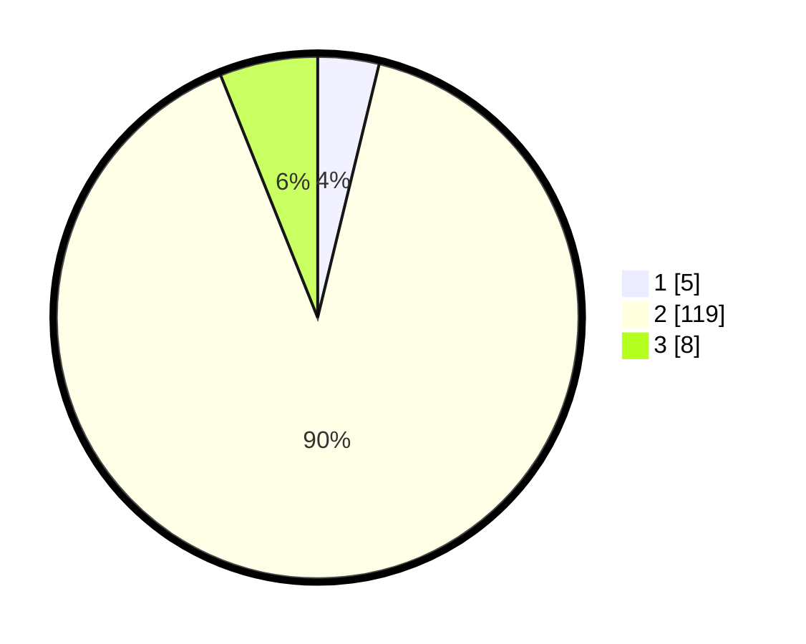

# Hasil

## Grafik

## Tabel

| No. | Nama Paslon    | Suara | Suara (raw) | Persentase |
|:--- |:-------------- | -----:| -----------:| ----------:|
| 1   | ANIES MUHAIMIN | 5     | [5][p-1]    | 3,79       |
| 2   | PRABOWO GIBRAN | 119   | [119][p-2]  | 90,15      |
| 3   | GANJAR MAHFUD  | 8     | [8][p-3]    | 6,06       |

[p-1]: https://github.com/gigit-pemilu/pemilu-2024-35-jawa-timur/blob/main/pilpres/hitung-suara/sub/35-jawa-timur/sub/22-bojonegoro/sub/16-kalitidu/sub/2020-leran/sub/016-tps/sub/paslon-1.txt
[p-2]: https://github.com/gigit-pemilu/pemilu-2024-35-jawa-timur/blob/main/pilpres/hitung-suara/sub/35-jawa-timur/sub/22-bojonegoro/sub/16-kalitidu/sub/2020-leran/sub/016-tps/sub/paslon-2.txt
[p-3]: https://github.com/gigit-pemilu/pemilu-2024-35-jawa-timur/blob/main/pilpres/hitung-suara/sub/35-jawa-timur/sub/22-bojonegoro/sub/16-kalitidu/sub/2020-leran/sub/016-tps/sub/paslon-3.txt

## Foto C Plano

https://sirekap-obj-formc.kpu.go.id/abff/pemilu/ppwp/35/22/16/20/20/3522162020016-20240215-004015--0d5abd7b-d45c-478d-afe4-7f09e45491d1.jpg

https://sirekap-obj-formc.kpu.go.id/abff/pemilu/ppwp/35/22/16/20/20/3522162020016-20240215-004731--bc971e37-d518-4119-8be1-917448cb6593.jpg

https://sirekap-obj-formc.kpu.go.id/abff/pemilu/ppwp/35/22/16/20/20/3522162020016-20240215-004813--912d1a20-52ae-4dc1-b028-b307192a55a0.jpg

## Metadata

| Key        | Value               |
| ---------- | ------------------- |
| Time Stamp | 2024-02-19 20:00:00 |

