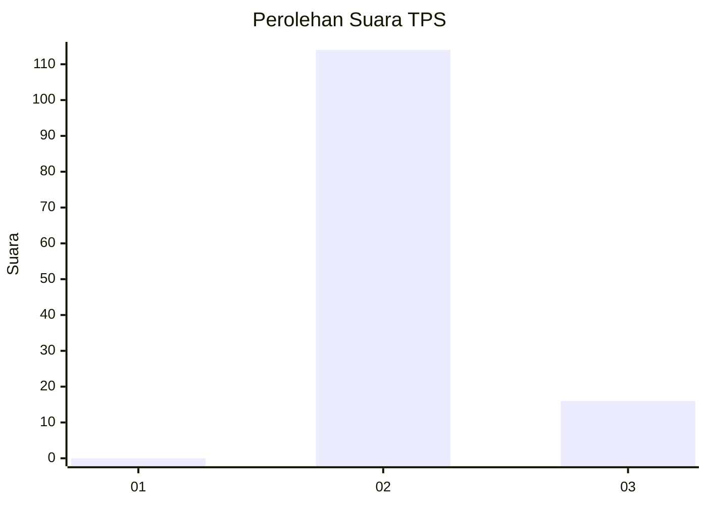
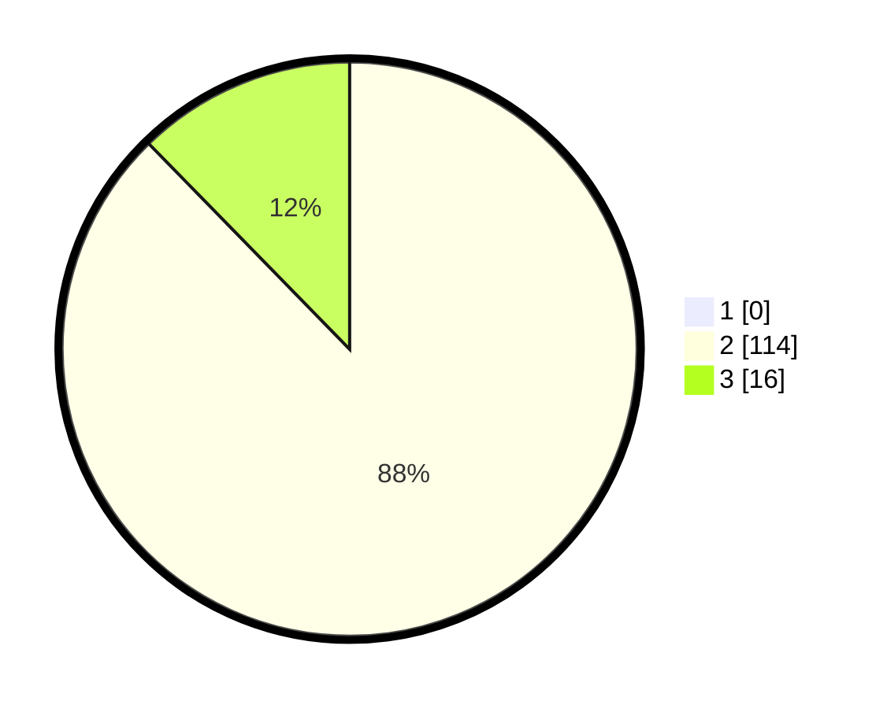

# Hasil

## Grafik

## Tabel

| No. | Nama Paslon    | Suara | Suara (raw) | Persentase |
|:--- |:-------------- | -----:| -----------:| ----------:|
| 1   | ANIES MUHAIMIN | 0     | [0][p-1]    | 0,00       |
| 2   | PRABOWO GIBRAN | 114   | [114][p-2]  | 87,69      |
| 3   | GANJAR MAHFUD  | 16    | [16][p-3]   | 12,31      |

[p-1]: https://github.com/gigit-pemilu/pemilu-2024-35-jawa-timur/blob/main/pilpres/hitung-suara/sub/35-jawa-timur/sub/22-bojonegoro/sub/16-kalitidu/sub/2020-leran/sub/022-tps/sub/paslon-1.txt
[p-2]: https://github.com/gigit-pemilu/pemilu-2024-35-jawa-timur/blob/main/pilpres/hitung-suara/sub/35-jawa-timur/sub/22-bojonegoro/sub/16-kalitidu/sub/2020-leran/sub/022-tps/sub/paslon-2.txt
[p-3]: https://github.com/gigit-pemilu/pemilu-2024-35-jawa-timur/blob/main/pilpres/hitung-suara/sub/35-jawa-timur/sub/22-bojonegoro/sub/16-kalitidu/sub/2020-leran/sub/022-tps/sub/paslon-3.txt

## Foto C Plano

https://sirekap-obj-formc.kpu.go.id/54d4/pemilu/ppwp/35/22/16/20/20/3522162020022-20240214-195242--0c300725-e98f-4a95-99a6-db43fc02300a.jpg

https://sirekap-obj-formc.kpu.go.id/54d4/pemilu/ppwp/35/22/16/20/20/3522162020022-20240214-195410--007a8e4e-0a21-4ea3-b124-7169b48ab9a6.jpg

https://sirekap-obj-formc.kpu.go.id/54d4/pemilu/ppwp/35/22/16/20/20/3522162020022-20240214-195512--fcdb3efd-dcbd-4233-adbc-79020ce5bf99.jpg

## Metadata

| Key        | Value               |
| ---------- | ------------------- |
| Time Stamp | 2024-02-19 20:00:00 |

