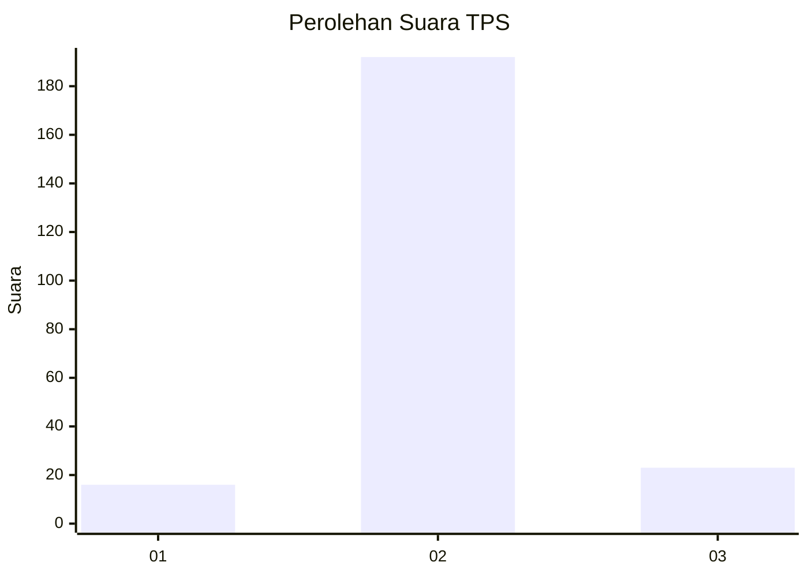
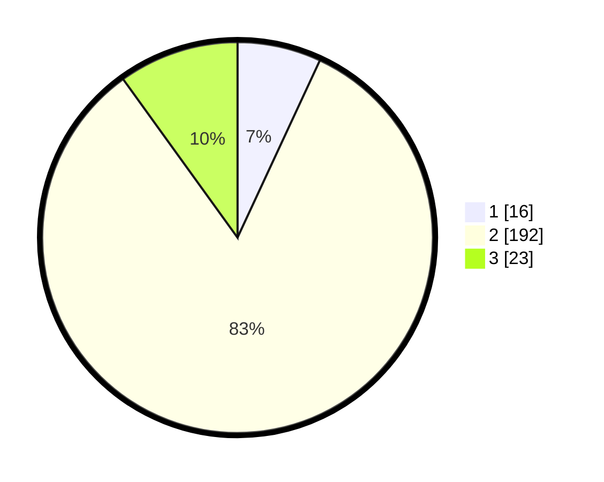

# Hasil

## Grafik

## Tabel

| No. | Nama Paslon    | Suara | Suara (raw) | Persentase |
|:--- |:-------------- | -----:| -----------:| ----------:|
| 1   | ANIES MUHAIMIN | 16    | [16][p-1]   | 6,93       |
| 2   | PRABOWO GIBRAN | 192   | [192][p-2]  | 83,12      |
| 3   | GANJAR MAHFUD  | 23    | [23][p-3]   | 9,96       |

[p-1]: https://github.com/gigit-pemilu/pemilu-2024-35-jawa-timur/blob/main/pilpres/hitung-suara/sub/35-jawa-timur/sub/22-bojonegoro/sub/17-malo/sub/2020-tulungagung/sub/005-tps/sub/paslon-1.txt
[p-2]: https://github.com/gigit-pemilu/pemilu-2024-35-jawa-timur/blob/main/pilpres/hitung-suara/sub/35-jawa-timur/sub/22-bojonegoro/sub/17-malo/sub/2020-tulungagung/sub/005-tps/sub/paslon-2.txt
[p-3]: https://github.com/gigit-pemilu/pemilu-2024-35-jawa-timur/blob/main/pilpres/hitung-suara/sub/35-jawa-timur/sub/22-bojonegoro/sub/17-malo/sub/2020-tulungagung/sub/005-tps/sub/paslon-3.txt

## Foto C Plano

https://sirekap-obj-formc.kpu.go.id/6f50/pemilu/ppwp/35/22/17/20/20/3522172020005-20240214-194226--2cec7988-34f1-4e4d-a562-91b102130916.jpg

https://sirekap-obj-formc.kpu.go.id/6f50/pemilu/ppwp/35/22/17/20/20/3522172020005-20240214-200326--877bfe3c-66ba-4b0d-a327-aee95f0d00b9.jpg

https://sirekap-obj-formc.kpu.go.id/6f50/pemilu/ppwp/35/22/17/20/20/3522172020005-20240214-141354--6913b16c-11c1-4135-8880-dbbd51e386e0.jpg

## Metadata

| Key        | Value               |
| ---------- | ------------------- |
| Time Stamp | 2024-02-15 00:41:44 |

