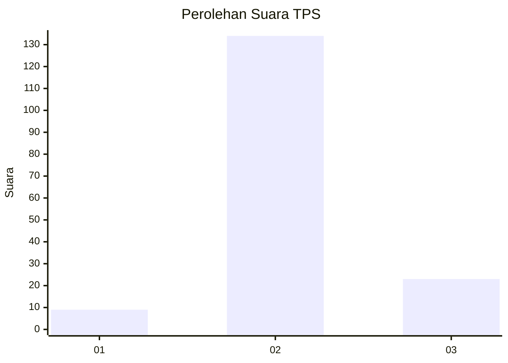
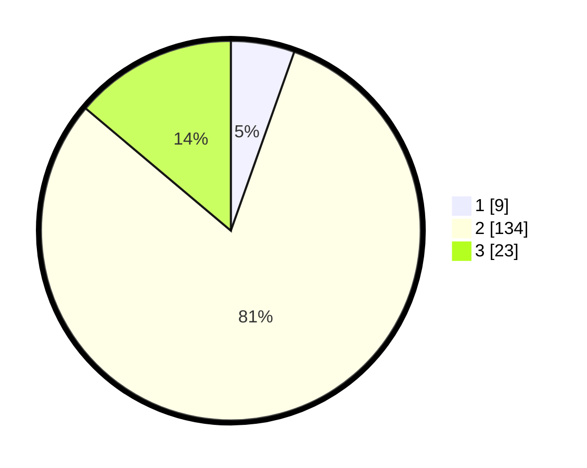

# Hasil

## Grafik

## Tabel

| No. | Nama Paslon    | Suara | Suara (raw) | Persentase |
|:--- |:-------------- | -----:| -----------:| ----------:|
| 1   | ANIES MUHAIMIN | 9     | [9][p-1]    | 5,42       |
| 2   | PRABOWO GIBRAN | 134   | [134][p-2]  | 80,72      |
| 3   | GANJAR MAHFUD  | 23    | [23][p-3]   | 13,86      |

[p-1]: https://github.com/gigit-pemilu/pemilu-2024/blob/main/pilpres/hitung-suara/sub/35-jawa-timur/sub/22-bojonegoro/sub/19-padangan/sub/2002-prangi/sub/001-tps/sub/paslon-1.txt
[p-2]: https://github.com/gigit-pemilu/pemilu-2024/blob/main/pilpres/hitung-suara/sub/35-jawa-timur/sub/22-bojonegoro/sub/19-padangan/sub/2002-prangi/sub/001-tps/sub/paslon-2.txt
[p-3]: https://github.com/gigit-pemilu/pemilu-2024/blob/main/pilpres/hitung-suara/sub/35-jawa-timur/sub/22-bojonegoro/sub/19-padangan/sub/2002-prangi/sub/001-tps/sub/paslon-3.txt

## Foto C Plano

https://sirekap-obj-formc.kpu.go.id/bde0/pemilu/ppwp/35/22/19/20/02/3522192002001-20240215-003208--e21acaf8-82f8-42f6-afcd-8b0daa6296e1.jpg

https://sirekap-obj-formc.kpu.go.id/bde0/pemilu/ppwp/35/22/19/20/02/3522192002001-20240215-015414--07a49cfa-6736-4649-b5ba-144e9c70bb3b.jpg

https://sirekap-obj-formc.kpu.go.id/bde0/pemilu/ppwp/35/22/19/20/02/3522192002001-20240215-015555--4f1c9488-87c5-402e-98de-9c1885895838.jpg

## Metadata

| Key        | Value               |
| ---------- | ------------------- |
| Time Stamp | 2024-02-19 12:00:00 |

