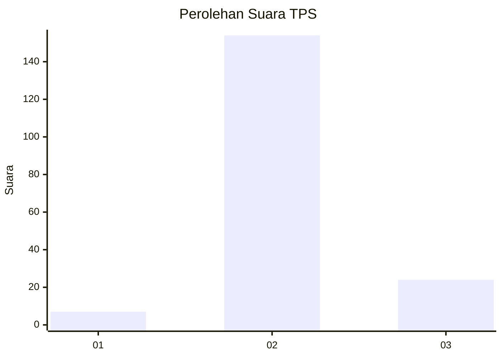
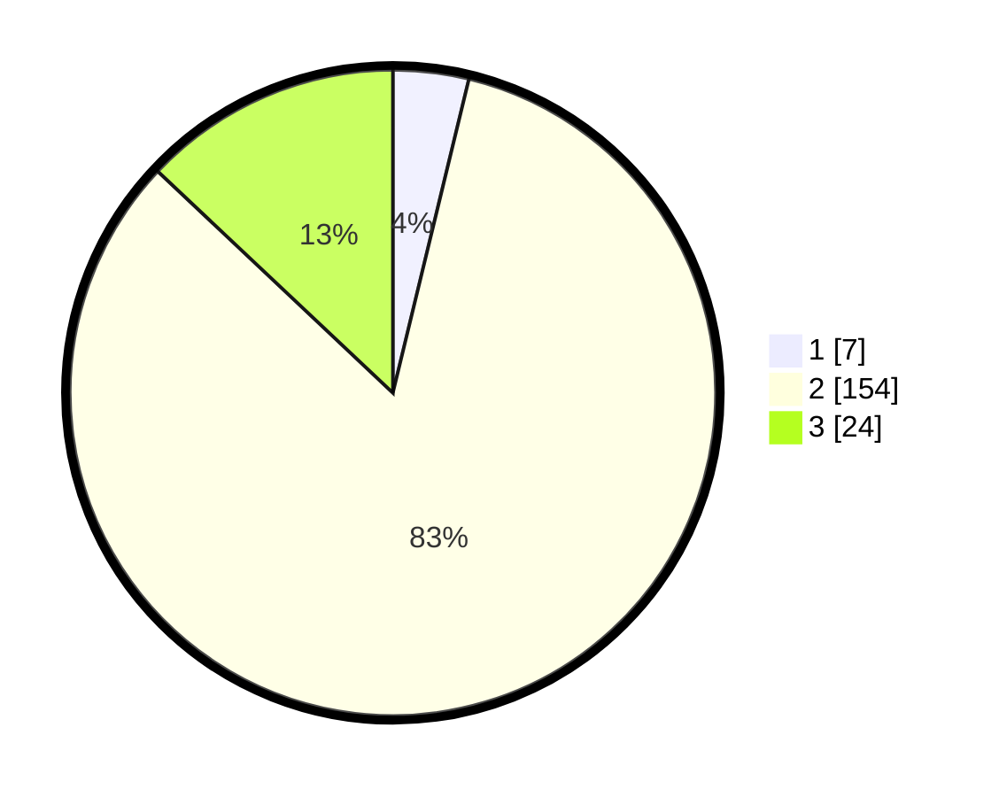

# Hasil

## Grafik

## Tabel

| No. | Nama Paslon    | Suara | Suara (raw) | Persentase |
|:--- |:-------------- | -----:| -----------:| ----------:|
| 1   | ANIES MUHAIMIN | 7     | [7][p-1]    | 3,78       |
| 2   | PRABOWO GIBRAN | 154   | [154][p-2]  | 83,24      |
| 3   | GANJAR MAHFUD  | 24    | [24][p-3]   | 12,97      |

[p-1]: https://github.com/gigit-pemilu/pemilu-2024/blob/main/pilpres/hitung-suara/sub/35-jawa-timur/sub/22-bojonegoro/sub/19-padangan/sub/2002-prangi/sub/005-tps/sub/paslon-1.txt
[p-2]: https://github.com/gigit-pemilu/pemilu-2024/blob/main/pilpres/hitung-suara/sub/35-jawa-timur/sub/22-bojonegoro/sub/19-padangan/sub/2002-prangi/sub/005-tps/sub/paslon-2.txt
[p-3]: https://github.com/gigit-pemilu/pemilu-2024/blob/main/pilpres/hitung-suara/sub/35-jawa-timur/sub/22-bojonegoro/sub/19-padangan/sub/2002-prangi/sub/005-tps/sub/paslon-3.txt

## Foto C Plano

https://sirekap-obj-formc.kpu.go.id/8a25/pemilu/ppwp/35/22/19/20/02/3522192002005-20240215-004206--3a49659c-8cbf-41b2-9c09-a0f36bd218b8.jpg

https://sirekap-obj-formc.kpu.go.id/8a25/pemilu/ppwp/35/22/19/20/02/3522192002005-20240215-004600--5c82da8c-580b-4a38-8d12-7ee8cf367b48.jpg

https://sirekap-obj-formc.kpu.go.id/8a25/pemilu/ppwp/35/22/19/20/02/3522192002005-20240215-004934--d23830cb-7da3-4ad2-ac5b-f61414064f9c.jpg

## Metadata

| Key        | Value               |
| ---------- | ------------------- |
| Time Stamp | 2024-02-19 12:00:00 |

