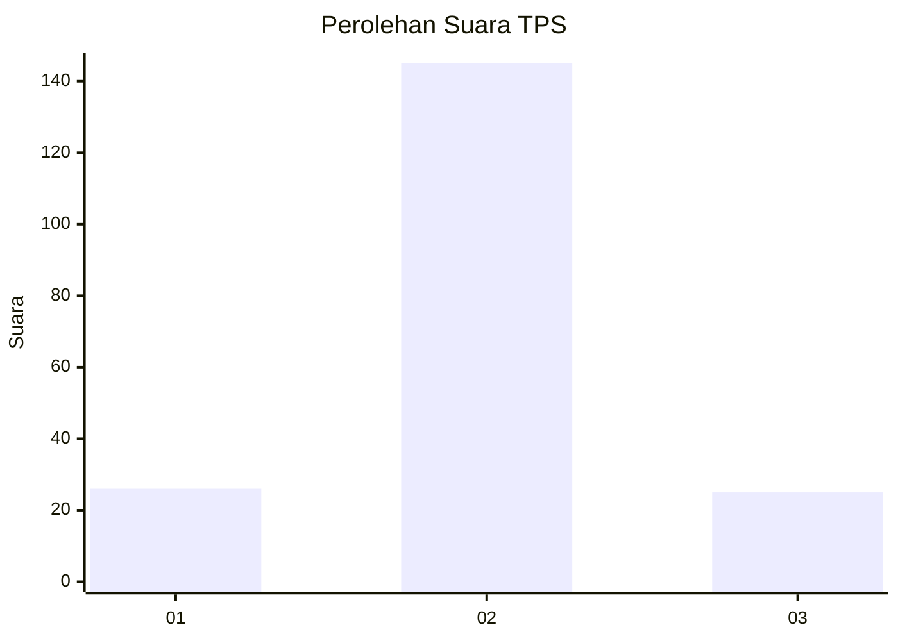
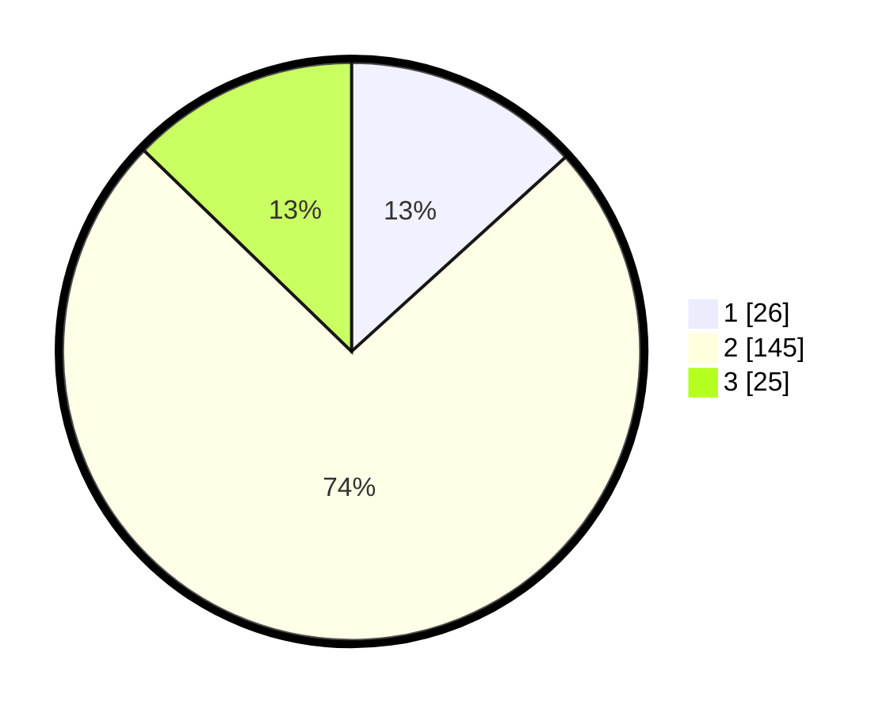

# Hasil

## Grafik

## Tabel

| No. | Nama Paslon    | Suara | Suara (raw) | Persentase |
|:--- |:-------------- | -----:| -----------:| ----------:|
| 1   | ANIES MUHAIMIN | 26    | [26][p-1]   | 13,27      |
| 2   | PRABOWO GIBRAN | 145   | [145][p-2]  | 73,98      |
| 3   | GANJAR MAHFUD  | 25    | [25][p-3]   | 12,76      |

[p-1]: https://github.com/gigit-pemilu/pemilu-2024/blob/main/pilpres/hitung-suara/sub/35-jawa-timur/sub/22-bojonegoro/sub/19-padangan/sub/2004-ngeper/sub/001-tps/sub/paslon-1.txt
[p-2]: https://github.com/gigit-pemilu/pemilu-2024/blob/main/pilpres/hitung-suara/sub/35-jawa-timur/sub/22-bojonegoro/sub/19-padangan/sub/2004-ngeper/sub/001-tps/sub/paslon-2.txt
[p-3]: https://github.com/gigit-pemilu/pemilu-2024/blob/main/pilpres/hitung-suara/sub/35-jawa-timur/sub/22-bojonegoro/sub/19-padangan/sub/2004-ngeper/sub/001-tps/sub/paslon-3.txt

## Foto C Plano

https://sirekap-obj-formc.kpu.go.id/ae50/pemilu/ppwp/35/22/19/20/04/3522192004001-20240215-002426--964ce7a1-9a40-4bc7-aac9-663ed530cbe9.jpg

https://sirekap-obj-formc.kpu.go.id/ae50/pemilu/ppwp/35/22/19/20/04/3522192004001-20240215-000514--0eb7a929-a9bf-4efc-8634-fa9d3af38acb.jpg

https://sirekap-obj-formc.kpu.go.id/ae50/pemilu/ppwp/35/22/19/20/04/3522192004001-20240215-000541--9e06e58f-dbae-4e83-aa1d-df0bf91ea456.jpg

## Metadata

| Key        | Value               |
| ---------- | ------------------- |
| Time Stamp | 2024-02-19 12:00:00 |

