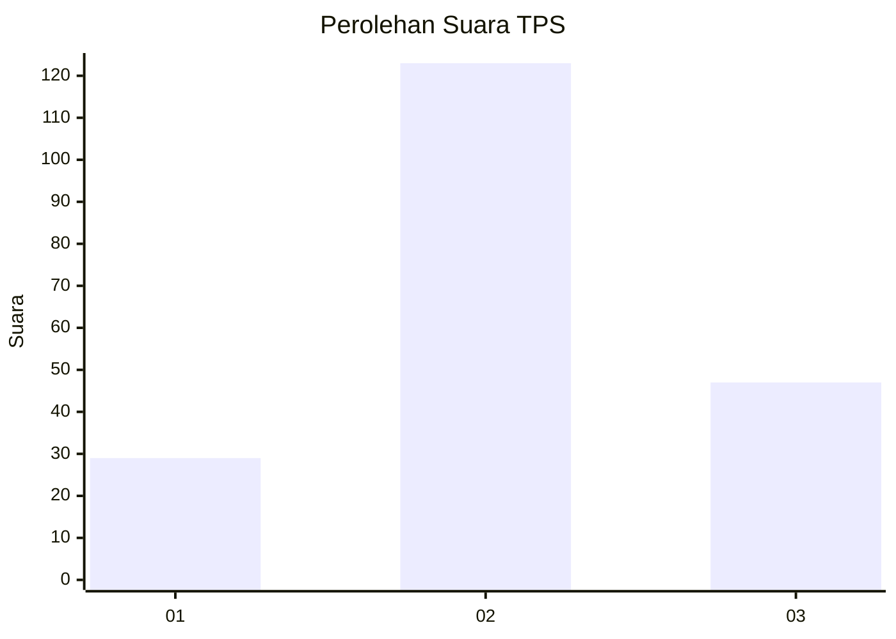
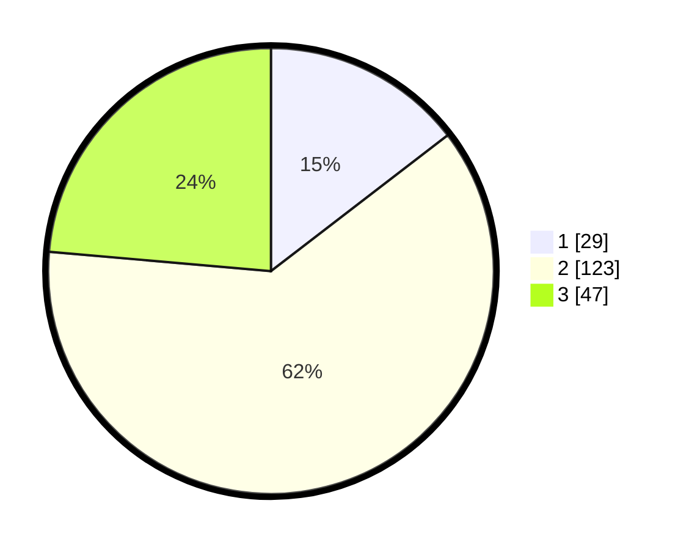

# Hasil

## Grafik

## Tabel

| No. | Nama Paslon    | Suara | Suara (raw) | Persentase |
|:--- |:-------------- | -----:| -----------:| ----------:|
| 1   | ANIES MUHAIMIN | 29    | [29][p-1]   | 14,57      |
| 2   | PRABOWO GIBRAN | 123   | [123][p-2]  | 61,81      |
| 3   | GANJAR MAHFUD  | 47    | [47][p-3]   | 23,62      |

[p-1]: https://github.com/gigit-pemilu/pemilu-2024/blob/main/pilpres/hitung-suara/sub/35-jawa-timur/sub/22-bojonegoro/sub/19-padangan/sub/2004-ngeper/sub/003-tps/sub/paslon-1.txt
[p-2]: https://github.com/gigit-pemilu/pemilu-2024/blob/main/pilpres/hitung-suara/sub/35-jawa-timur/sub/22-bojonegoro/sub/19-padangan/sub/2004-ngeper/sub/003-tps/sub/paslon-2.txt
[p-3]: https://github.com/gigit-pemilu/pemilu-2024/blob/main/pilpres/hitung-suara/sub/35-jawa-timur/sub/22-bojonegoro/sub/19-padangan/sub/2004-ngeper/sub/003-tps/sub/paslon-3.txt

## Foto C Plano

https://sirekap-obj-formc.kpu.go.id/7d08/pemilu/ppwp/35/22/19/20/04/3522192004003-20240215-002408--6c598ddb-6d39-46b7-b58d-0574f3c7bf73.jpg

https://sirekap-obj-formc.kpu.go.id/7d08/pemilu/ppwp/35/22/19/20/04/3522192004003-20240215-004015--bc2fd644-c31d-423c-a491-16cc73f31908.jpg

https://sirekap-obj-formc.kpu.go.id/7d08/pemilu/ppwp/35/22/19/20/04/3522192004003-20240215-003011--ad2dd06f-33c4-4fbd-ad77-283253e330df.jpg

## Metadata

| Key        | Value               |
| ---------- | ------------------- |
| Time Stamp | 2024-02-19 12:00:00 |

