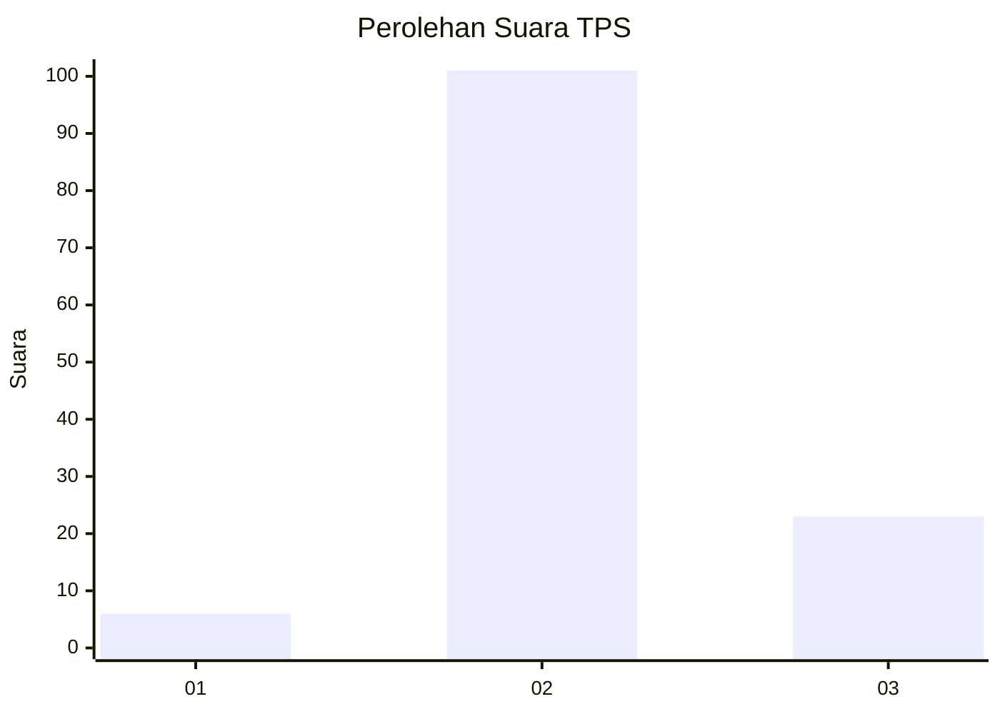

# Hasil

## Grafik

## Tabel

| No. | Nama Paslon    | Suara | Suara (raw) | Persentase |
|:--- |:-------------- | -----:| -----------:| ----------:|
| 1   | ANIES MUHAIMIN | 6     | [6][p-1]    | 4,62       |
| 2   | PRABOWO GIBRAN | 101   | [101][p-2]  | 77,69      |
| 3   | GANJAR MAHFUD  | 23    | [23][p-3]   | 17,69      |

[p-1]: https://github.com/gigit-pemilu/pemilu-2024/blob/main/pilpres/hitung-suara/sub/35-jawa-timur/sub/22-bojonegoro/sub/19-padangan/sub/2005-ngasinan/sub/006-tps/sub/paslon-1.txt
[p-2]: https://github.com/gigit-pemilu/pemilu-2024/blob/main/pilpres/hitung-suara/sub/35-jawa-timur/sub/22-bojonegoro/sub/19-padangan/sub/2005-ngasinan/sub/006-tps/sub/paslon-2.txt
[p-3]: https://github.com/gigit-pemilu/pemilu-2024/blob/main/pilpres/hitung-suara/sub/35-jawa-timur/sub/22-bojonegoro/sub/19-padangan/sub/2005-ngasinan/sub/006-tps/sub/paslon-3.txt

## Foto C Plano

https://sirekap-obj-formc.kpu.go.id/5d72/pemilu/ppwp/35/22/19/20/05/3522192005006-20240215-015405--2b7890fb-f1a8-4bd4-a096-39e71654d1c3.jpg

https://sirekap-obj-formc.kpu.go.id/5d72/pemilu/ppwp/35/22/19/20/05/3522192005006-20240214-210404--417ec3b4-90e3-4725-ba77-56113091fdb9.jpg

https://sirekap-obj-formc.kpu.go.id/5d72/pemilu/ppwp/35/22/19/20/05/3522192005006-20240214-210526--d11b222b-7517-4d82-8e9d-c5465e9b5e55.jpg

## Metadata

| Key        | Value               |
| ---------- | ------------------- |
| Time Stamp | 2024-02-15 19:00:26 |

