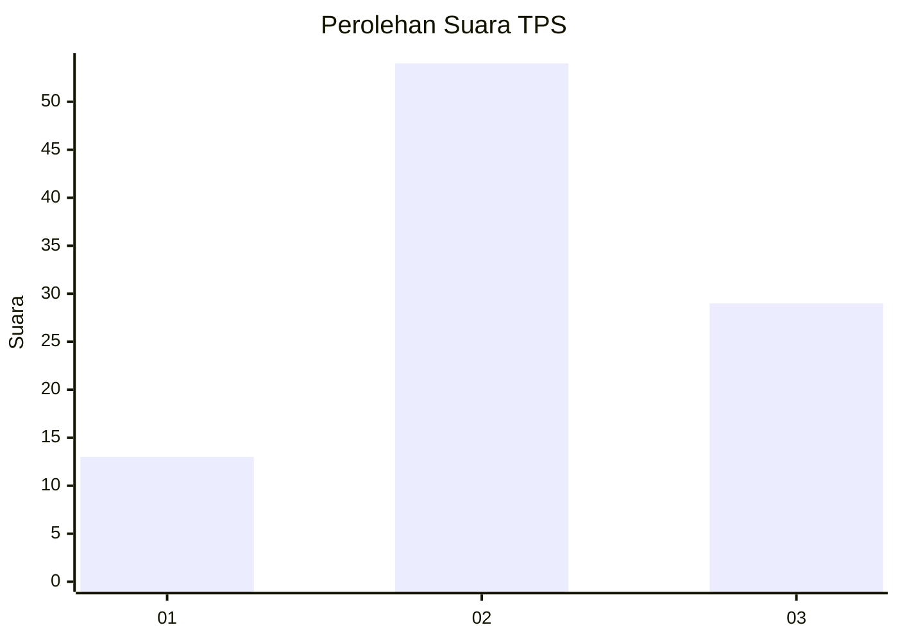
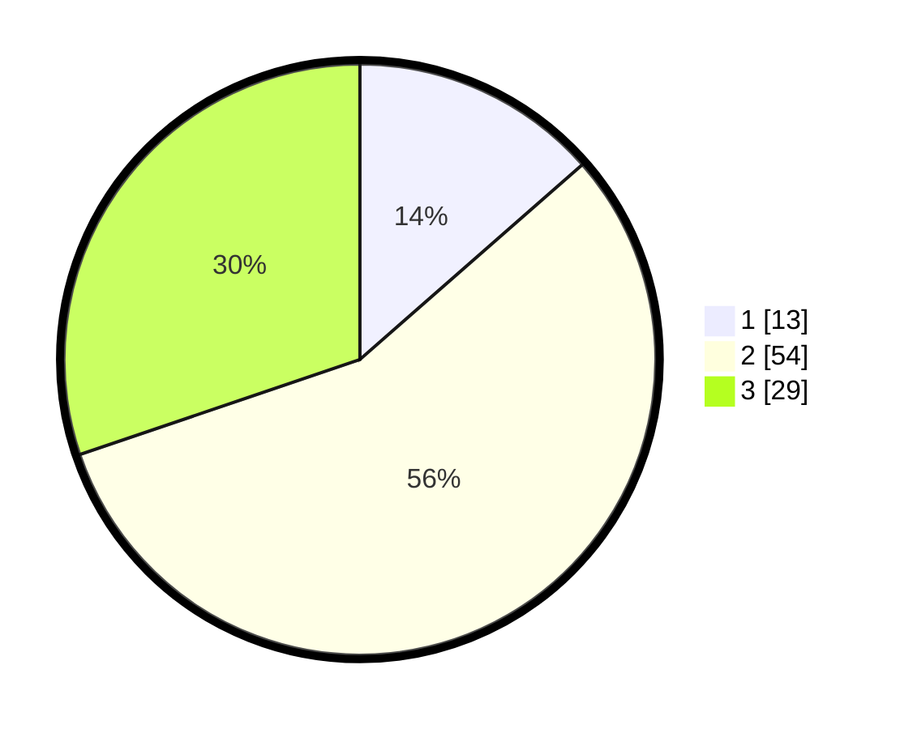

# Hasil

## Grafik

## Tabel

| No. | Nama Paslon    | Suara | Suara (raw) | Persentase |
|:--- |:-------------- | -----:| -----------:| ----------:|
| 1   | ANIES MUHAIMIN | 13    | [13][p-1]   | 13,54      |
| 2   | PRABOWO GIBRAN | 54    | [54][p-2]   | 56,25      |
| 3   | GANJAR MAHFUD  | 29    | [29][p-3]   | 30,21      |

[p-1]: https://github.com/gigit-pemilu/pemilu-2024/blob/main/pilpres/hitung-suara/sub/35-jawa-timur/sub/22-bojonegoro/sub/19-padangan/sub/2009-dengok/sub/008-tps/sub/paslon-1.txt
[p-2]: https://github.com/gigit-pemilu/pemilu-2024/blob/main/pilpres/hitung-suara/sub/35-jawa-timur/sub/22-bojonegoro/sub/19-padangan/sub/2009-dengok/sub/008-tps/sub/paslon-2.txt
[p-3]: https://github.com/gigit-pemilu/pemilu-2024/blob/main/pilpres/hitung-suara/sub/35-jawa-timur/sub/22-bojonegoro/sub/19-padangan/sub/2009-dengok/sub/008-tps/sub/paslon-3.txt

## Foto C Plano

https://sirekap-obj-formc.kpu.go.id/6d33/pemilu/ppwp/35/22/19/20/09/3522192009008-20240218-003722--53b9f512-f0b7-4a7c-8fdb-e198b9e40eac.jpg

https://sirekap-obj-formc.kpu.go.id/6d33/pemilu/ppwp/35/22/19/20/09/3522192009008-20240218-003808--209cc032-bd3a-4758-ab0a-7ba11f8ff6e9.jpg

https://sirekap-obj-formc.kpu.go.id/6d33/pemilu/ppwp/35/22/19/20/09/3522192009008-20240218-003856--8765ea14-3c24-4bbc-949f-196f6e1e0453.jpg

## Metadata

| Key        | Value               |
| ---------- | ------------------- |
| Time Stamp | 2024-02-19 15:00:00 |

