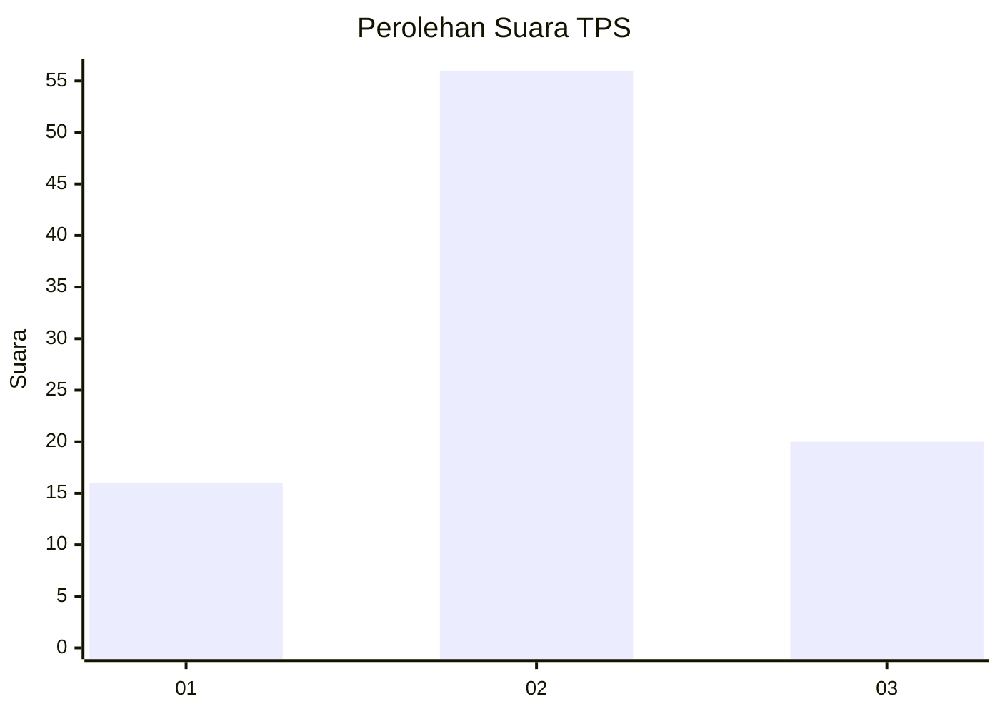
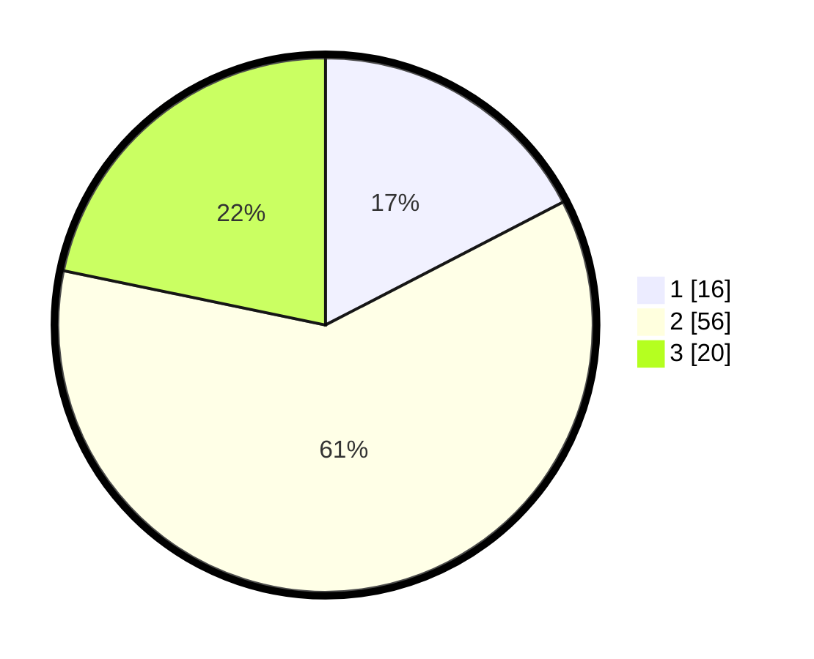

# Hasil

## Grafik

## Tabel

| No. | Nama Paslon    | Suara | Suara (raw) | Persentase |
|:--- |:-------------- | -----:| -----------:| ----------:|
| 1   | ANIES MUHAIMIN | 16    | [16][p-1]   | 17,39      |
| 2   | PRABOWO GIBRAN | 56    | [56][p-2]   | 60,87      |
| 3   | GANJAR MAHFUD  | 20    | [20][p-3]   | 21,74      |

[p-1]: https://github.com/gigit-pemilu/pemilu-2024-35-jawa-timur/blob/main/pilpres/hitung-suara/sub/35-jawa-timur/sub/22-bojonegoro/sub/19-padangan/sub/2009-dengok/sub/009-tps/sub/paslon-1.txt
[p-2]: https://github.com/gigit-pemilu/pemilu-2024-35-jawa-timur/blob/main/pilpres/hitung-suara/sub/35-jawa-timur/sub/22-bojonegoro/sub/19-padangan/sub/2009-dengok/sub/009-tps/sub/paslon-2.txt
[p-3]: https://github.com/gigit-pemilu/pemilu-2024-35-jawa-timur/blob/main/pilpres/hitung-suara/sub/35-jawa-timur/sub/22-bojonegoro/sub/19-padangan/sub/2009-dengok/sub/009-tps/sub/paslon-3.txt

## Foto C Plano

https://sirekap-obj-formc.kpu.go.id/a618/pemilu/ppwp/35/22/19/20/09/3522192009009-20240215-022234--b251f473-7e38-41d2-8753-523155e35e86.jpg

https://sirekap-obj-formc.kpu.go.id/a618/pemilu/ppwp/35/22/19/20/09/3522192009009-20240215-022258--3511b0f9-aa2a-41b9-bf14-befbe07edb14.jpg

https://sirekap-obj-formc.kpu.go.id/a618/pemilu/ppwp/35/22/19/20/09/3522192009009-20240215-022303--cea62ad6-269f-4434-9d82-a367b57db485.jpg

## Metadata

| Key        | Value               |
| ---------- | ------------------- |
| Time Stamp | 2024-02-19 15:00:00 |

