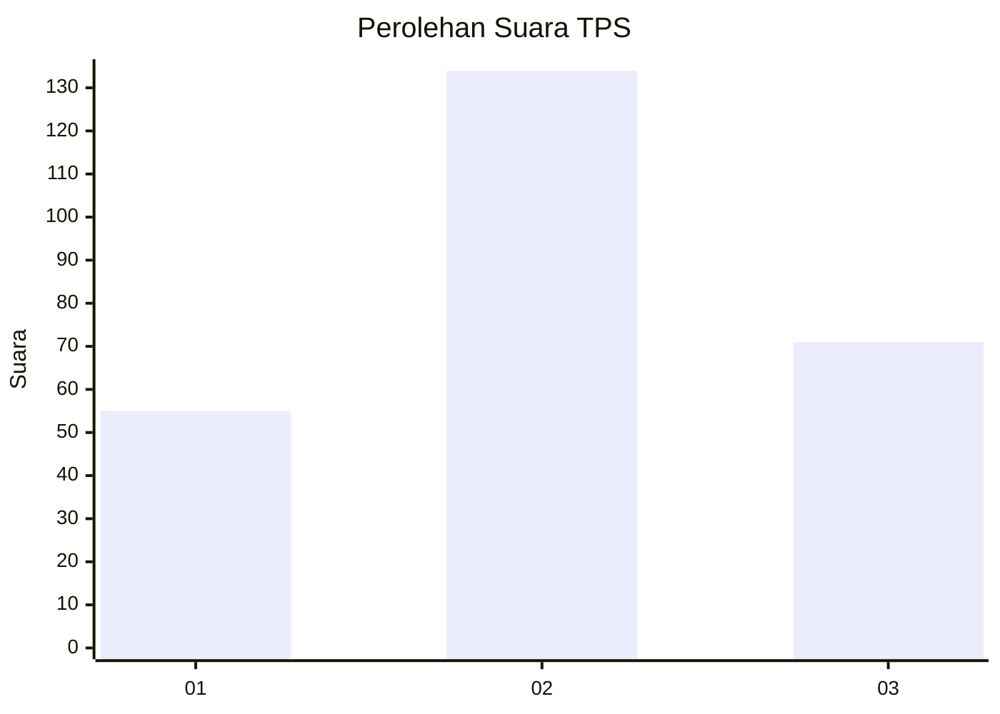
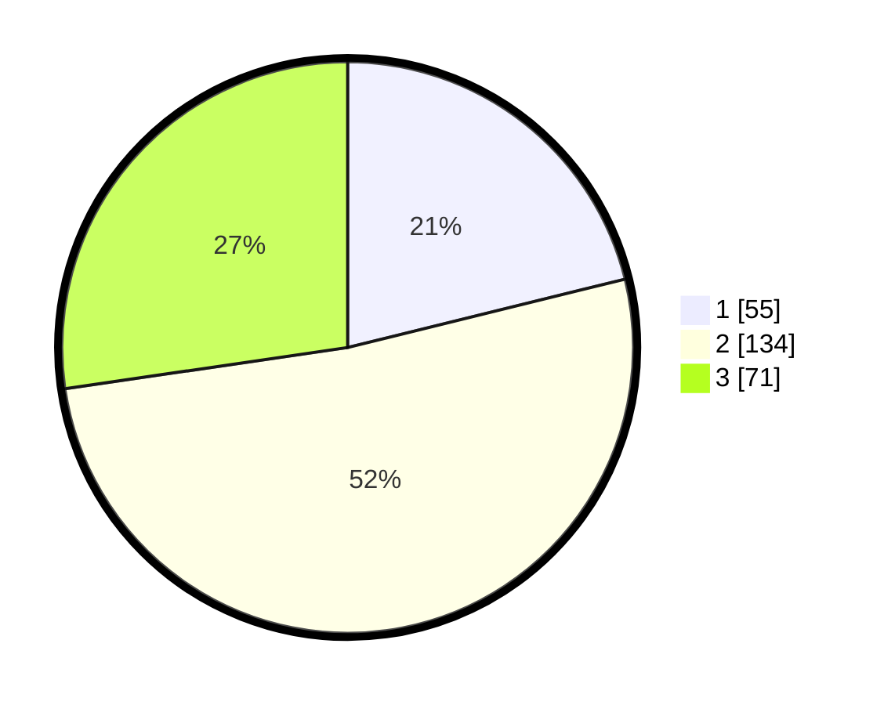

# Hasil

## Grafik

## Tabel

| No. | Nama Paslon    | Suara | Suara (raw) | Persentase |
|:--- |:-------------- | -----:| -----------:| ----------:|
| 1   | ANIES MUHAIMIN | 55    | [55][p-1]   | 21,15      |
| 2   | PRABOWO GIBRAN | 134   | [134][p-2]  | 51,54      |
| 3   | GANJAR MAHFUD  | 71    | [71][p-3]   | 27,31      |

[p-1]: https://github.com/gigit-pemilu/pemilu-2024-35-jawa-timur/blob/main/pilpres/hitung-suara/sub/35-jawa-timur/sub/22-bojonegoro/sub/19-padangan/sub/2010-padangan/sub/014-tps/sub/paslon-1.txt
[p-2]: https://github.com/gigit-pemilu/pemilu-2024-35-jawa-timur/blob/main/pilpres/hitung-suara/sub/35-jawa-timur/sub/22-bojonegoro/sub/19-padangan/sub/2010-padangan/sub/014-tps/sub/paslon-2.txt
[p-3]: https://github.com/gigit-pemilu/pemilu-2024-35-jawa-timur/blob/main/pilpres/hitung-suara/sub/35-jawa-timur/sub/22-bojonegoro/sub/19-padangan/sub/2010-padangan/sub/014-tps/sub/paslon-3.txt

## Foto C Plano

https://sirekap-obj-formc.kpu.go.id/ed8a/pemilu/ppwp/35/22/19/20/10/3522192010014-20240214-222138--0f020dd1-5e77-464a-a421-cf05f97e8f1a.jpg

https://sirekap-obj-formc.kpu.go.id/ed8a/pemilu/ppwp/35/22/19/20/10/3522192010014-20240215-044630--bf00f272-e7d3-4be7-86a2-803c4ffd7257.jpg

https://sirekap-obj-formc.kpu.go.id/ed8a/pemilu/ppwp/35/22/19/20/10/3522192010014-20240214-222407--9d1b4101-81a1-403c-a237-951f75d1a096.jpg

## Metadata

| Key        | Value               |
| ---------- | ------------------- |
| Time Stamp | 2024-02-19 15:00:00 |

