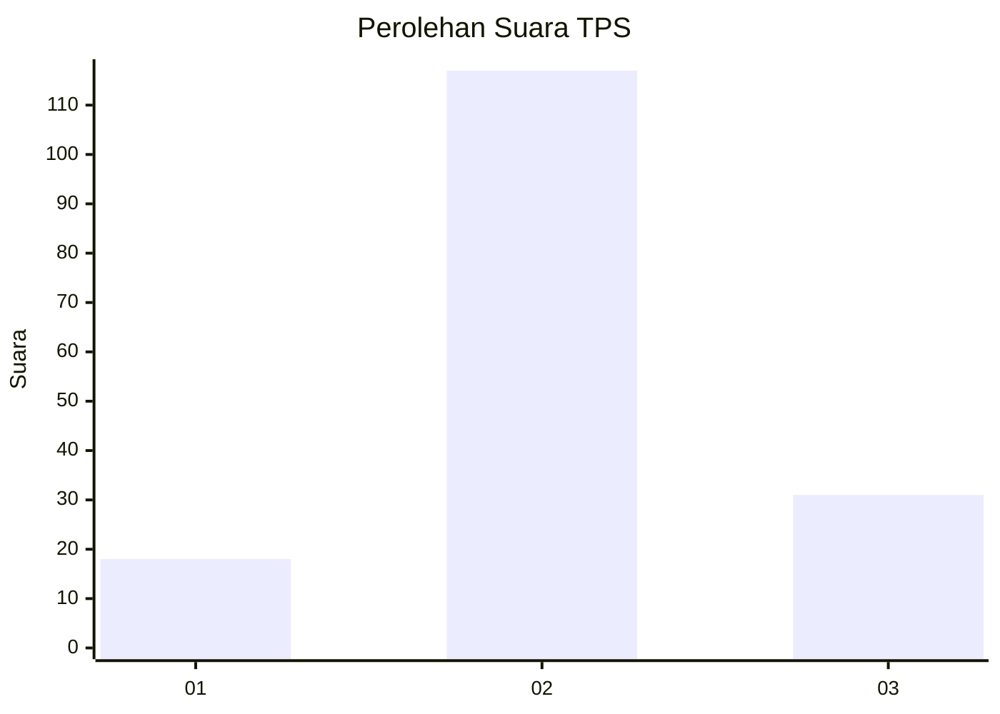
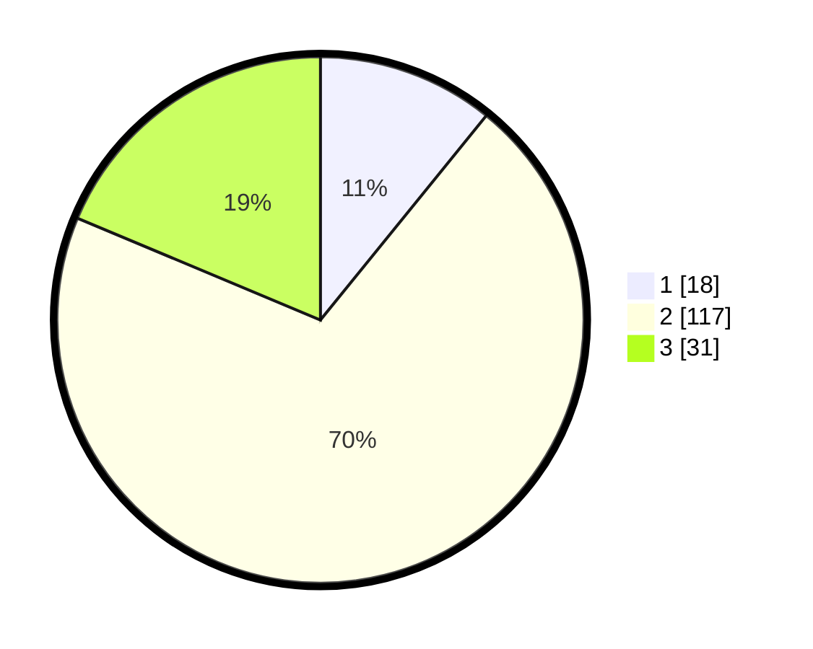

# Hasil

## Grafik

## Tabel

| No. | Nama Paslon    | Suara | Suara (raw) | Persentase |
|:--- |:-------------- | -----:| -----------:| ----------:|
| 1   | ANIES MUHAIMIN | 18    | [18][p-1]   | 10,84      |
| 2   | PRABOWO GIBRAN | 117   | [117][p-2]  | 70,48      |
| 3   | GANJAR MAHFUD  | 31    | [31][p-3]   | 18,67      |

[p-1]: https://github.com/gigit-pemilu/pemilu-2024-35-jawa-timur/blob/main/pilpres/hitung-suara/sub/35-jawa-timur/sub/22-bojonegoro/sub/19-padangan/sub/2012-sonorejo/sub/005-tps/sub/paslon-1.txt
[p-2]: https://github.com/gigit-pemilu/pemilu-2024-35-jawa-timur/blob/main/pilpres/hitung-suara/sub/35-jawa-timur/sub/22-bojonegoro/sub/19-padangan/sub/2012-sonorejo/sub/005-tps/sub/paslon-2.txt
[p-3]: https://github.com/gigit-pemilu/pemilu-2024-35-jawa-timur/blob/main/pilpres/hitung-suara/sub/35-jawa-timur/sub/22-bojonegoro/sub/19-padangan/sub/2012-sonorejo/sub/005-tps/sub/paslon-3.txt

## Foto C Plano

https://sirekap-obj-formc.kpu.go.id/0d95/pemilu/ppwp/35/22/19/20/12/3522192012005-20240214-210349--8bb96ea0-9028-45de-b43b-d01b87ccb959.jpg

https://sirekap-obj-formc.kpu.go.id/0d95/pemilu/ppwp/35/22/19/20/12/3522192012005-20240214-215049--ea1c49e7-0766-4851-a725-194b72f65849.jpg

https://sirekap-obj-formc.kpu.go.id/0d95/pemilu/ppwp/35/22/19/20/12/3522192012005-20240214-210623--e0c04c3b-8b60-4050-b3f6-25adb386b2fd.jpg

## Metadata

| Key        | Value               |
| ---------- | ------------------- |
| Time Stamp | 2024-02-19 16:00:00 |

