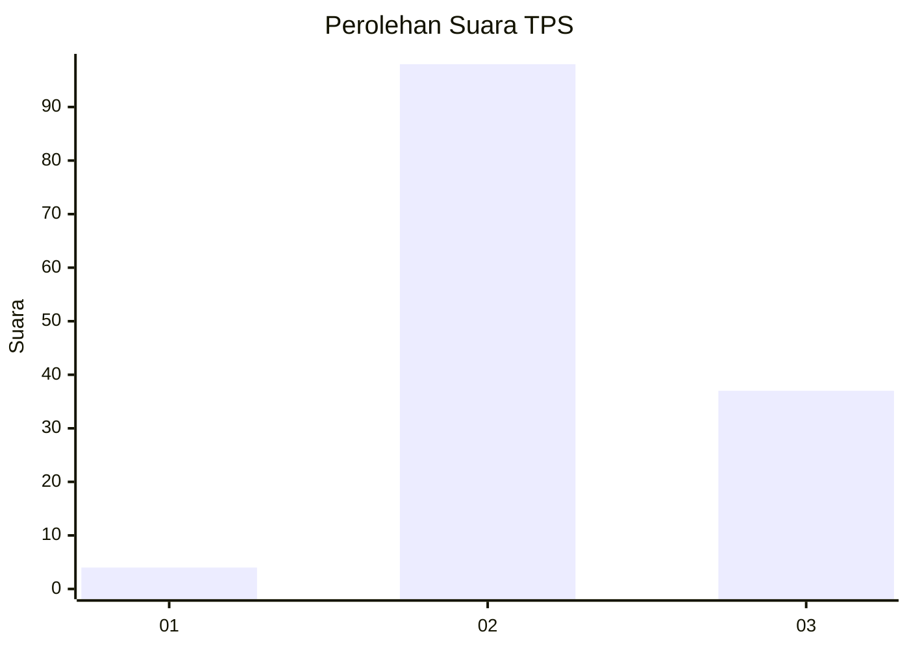
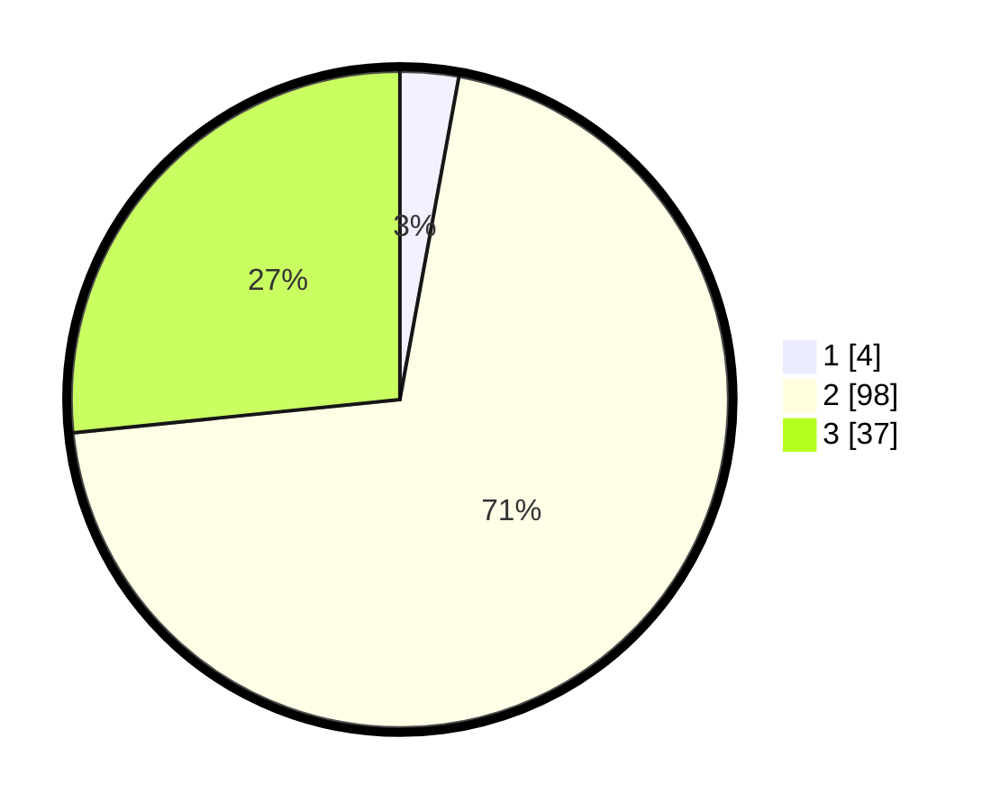

# Hasil

## Grafik

## Tabel

| No. | Nama Paslon    | Suara | Suara (raw) | Persentase |
|:--- |:-------------- | -----:| -----------:| ----------:|
| 1   | ANIES MUHAIMIN | 4     | [4][p-1]    | 2,88       |
| 2   | PRABOWO GIBRAN | 98    | [98][p-2]   | 70,50      |
| 3   | GANJAR MAHFUD  | 37    | [37][p-3]   | 26,62      |

[p-1]: https://github.com/gigit-pemilu/pemilu-2024-35-jawa-timur/blob/main/pilpres/hitung-suara/sub/35-jawa-timur/sub/22-bojonegoro/sub/19-padangan/sub/2016-kendung/sub/001-tps/sub/paslon-1.txt
[p-2]: https://github.com/gigit-pemilu/pemilu-2024-35-jawa-timur/blob/main/pilpres/hitung-suara/sub/35-jawa-timur/sub/22-bojonegoro/sub/19-padangan/sub/2016-kendung/sub/001-tps/sub/paslon-2.txt
[p-3]: https://github.com/gigit-pemilu/pemilu-2024-35-jawa-timur/blob/main/pilpres/hitung-suara/sub/35-jawa-timur/sub/22-bojonegoro/sub/19-padangan/sub/2016-kendung/sub/001-tps/sub/paslon-3.txt

## Foto C Plano

https://sirekap-obj-formc.kpu.go.id/12f0/pemilu/ppwp/35/22/19/20/16/3522192016001-20240214-212505--8476c8a5-8030-4daa-b962-c6e49fce2c9b.jpg

https://sirekap-obj-formc.kpu.go.id/12f0/pemilu/ppwp/35/22/19/20/16/3522192016001-20240214-224434--7941eb2e-1813-44e4-af08-cb256eb76937.jpg

https://sirekap-obj-formc.kpu.go.id/12f0/pemilu/ppwp/35/22/19/20/16/3522192016001-20240214-224603--6f798e81-b84d-4046-8b50-e73f2bb65712.jpg

## Metadata

| Key        | Value               |
| ---------- | ------------------- |
| Time Stamp | 2024-02-15 20:30:46 |

