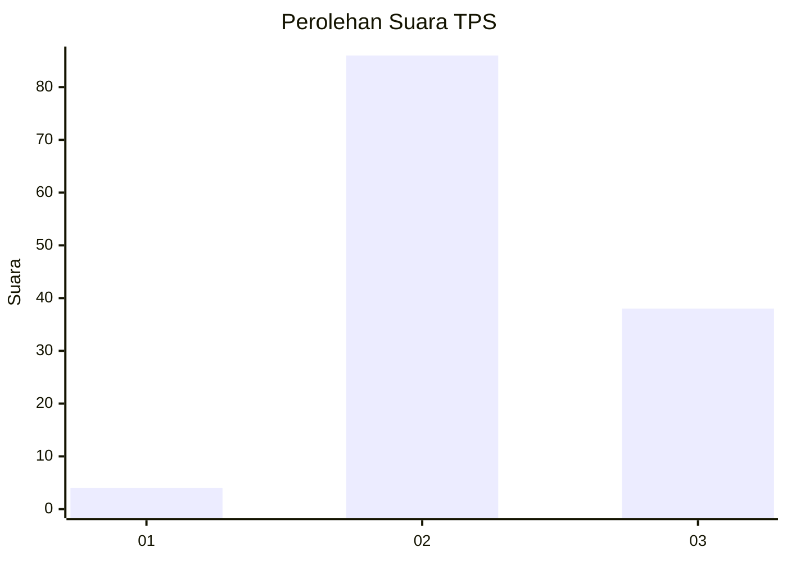
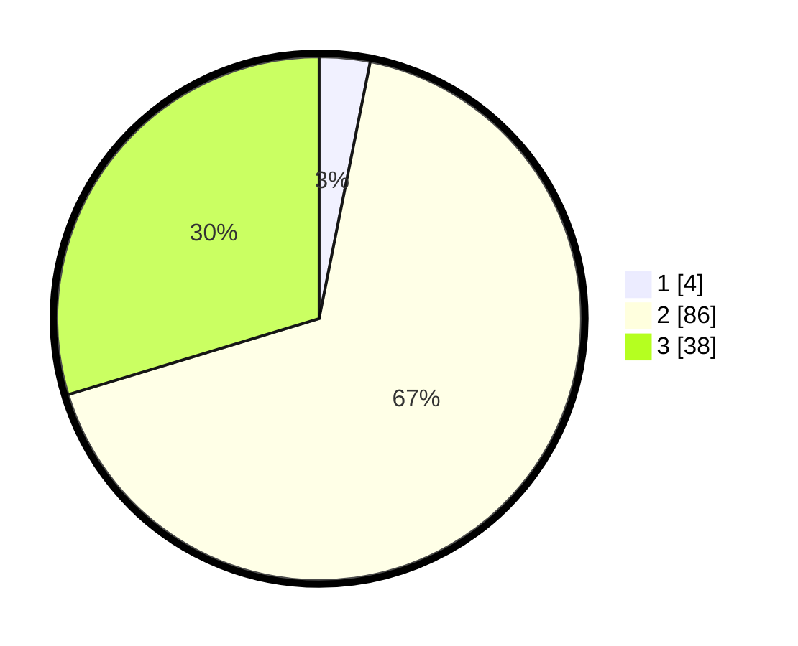

# Hasil

## Grafik

## Tabel

| No. | Nama Paslon    | Suara | Suara (raw) | Persentase |
|:--- |:-------------- | -----:| -----------:| ----------:|
| 1   | ANIES MUHAIMIN | 4     | [4][p-1]    | 3,13       |
| 2   | PRABOWO GIBRAN | 86    | [86][p-2]   | 67,19      |
| 3   | GANJAR MAHFUD  | 38    | [38][p-3]   | 29,69      |

[p-1]: https://github.com/gigit-pemilu/pemilu-2024-35-jawa-timur/blob/main/pilpres/hitung-suara/sub/35-jawa-timur/sub/22-bojonegoro/sub/19-padangan/sub/2016-kendung/sub/004-tps/sub/paslon-1.txt
[p-2]: https://github.com/gigit-pemilu/pemilu-2024-35-jawa-timur/blob/main/pilpres/hitung-suara/sub/35-jawa-timur/sub/22-bojonegoro/sub/19-padangan/sub/2016-kendung/sub/004-tps/sub/paslon-2.txt
[p-3]: https://github.com/gigit-pemilu/pemilu-2024-35-jawa-timur/blob/main/pilpres/hitung-suara/sub/35-jawa-timur/sub/22-bojonegoro/sub/19-padangan/sub/2016-kendung/sub/004-tps/sub/paslon-3.txt

## Foto C Plano

https://sirekap-obj-formc.kpu.go.id/abdb/pemilu/ppwp/35/22/19/20/16/3522192016004-20240214-223715--f991b6d0-f217-4ba6-bfac-b12bf91c5d94.jpg

https://sirekap-obj-formc.kpu.go.id/abdb/pemilu/ppwp/35/22/19/20/16/3522192016004-20240214-223958--c4cc602b-988f-4ad7-804d-24c59e07b1b6.jpg

https://sirekap-obj-formc.kpu.go.id/abdb/pemilu/ppwp/35/22/19/20/16/3522192016004-20240214-224146--c1eabefa-cd7b-4819-a411-fef3a2bb82e8.jpg

## Metadata

| Key        | Value               |
| ---------- | ------------------- |
| Time Stamp | 2024-02-19 16:00:00 |

