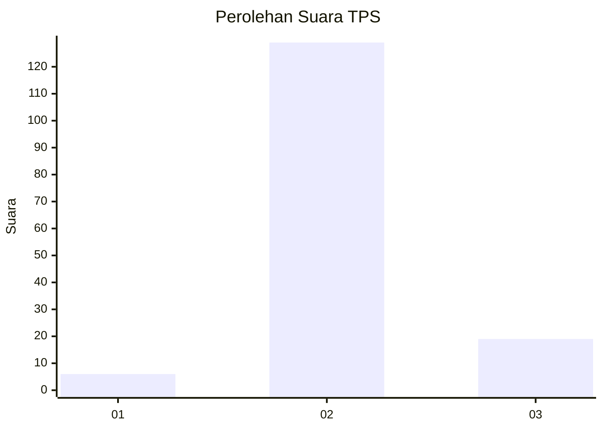
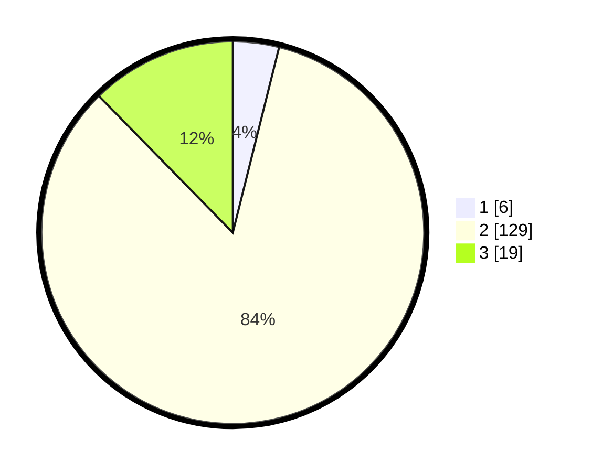

# Hasil

## Grafik

## Tabel

| No. | Nama Paslon    | Suara | Suara (raw) | Persentase |
|:--- |:-------------- | -----:| -----------:| ----------:|
| 1   | ANIES MUHAIMIN | 6     | [6][p-1]    | 3,90       |
| 2   | PRABOWO GIBRAN | 129   | [129][p-2]  | 83,77      |
| 3   | GANJAR MAHFUD  | 19    | [19][p-3]   | 12,34      |

[p-1]: https://github.com/gigit-pemilu/pemilu-2024-35-jawa-timur/blob/main/pilpres/hitung-suara/sub/35-jawa-timur/sub/22-bojonegoro/sub/19-padangan/sub/2016-kendung/sub/008-tps/sub/paslon-1.txt
[p-2]: https://github.com/gigit-pemilu/pemilu-2024-35-jawa-timur/blob/main/pilpres/hitung-suara/sub/35-jawa-timur/sub/22-bojonegoro/sub/19-padangan/sub/2016-kendung/sub/008-tps/sub/paslon-2.txt
[p-3]: https://github.com/gigit-pemilu/pemilu-2024-35-jawa-timur/blob/main/pilpres/hitung-suara/sub/35-jawa-timur/sub/22-bojonegoro/sub/19-padangan/sub/2016-kendung/sub/008-tps/sub/paslon-3.txt

## Foto C Plano

https://sirekap-obj-formc.kpu.go.id/afd2/pemilu/ppwp/35/22/19/20/16/3522192016008-20240215-000824--1bdf52fa-a466-4782-a513-448a7da1f4d6.jpg

https://sirekap-obj-formc.kpu.go.id/afd2/pemilu/ppwp/35/22/19/20/16/3522192016008-20240215-001000--426024ee-d1c6-4b29-a2e4-9e1d31b575e2.jpg

https://sirekap-obj-formc.kpu.go.id/afd2/pemilu/ppwp/35/22/19/20/16/3522192016008-20240215-001252--fbb22ac2-038b-44d1-819a-808e75704c8f.jpg

## Metadata

| Key        | Value               |
| ---------- | ------------------- |
| Time Stamp | 2024-02-19 16:00:00 |

