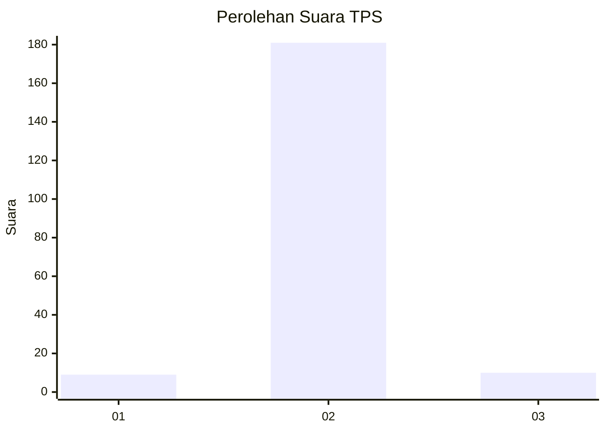
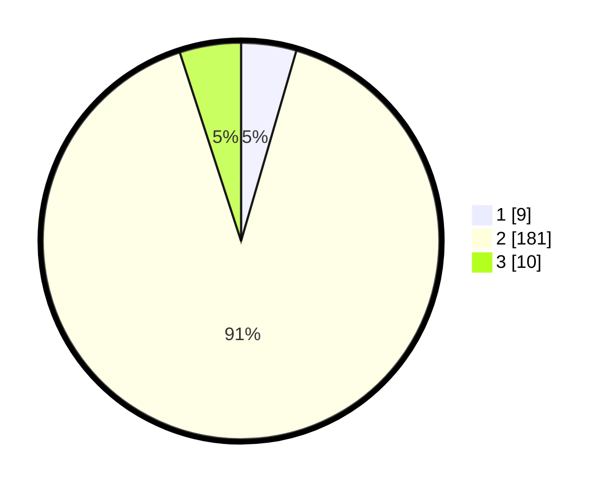

# Hasil

## Grafik

## Tabel

| No. | Nama Paslon    | Suara | Suara (raw) | Persentase |
|:--- |:-------------- | -----:| -----------:| ----------:|
| 1   | ANIES MUHAIMIN | 9     | [9][p-1]    | 4,50       |
| 2   | PRABOWO GIBRAN | 181   | [181][p-2]  | 90,50      |
| 3   | GANJAR MAHFUD  | 10    | [10][p-3]   | 5,00       |

[p-1]: https://github.com/gigit-pemilu/pemilu-2024/blob/main/pilpres/hitung-suara/sub/35-jawa-timur/sub/22-bojonegoro/sub/21-temayang/sub/2001-kedungsumber/sub/002-tps/sub/paslon-1.txt
[p-2]: https://github.com/gigit-pemilu/pemilu-2024/blob/main/pilpres/hitung-suara/sub/35-jawa-timur/sub/22-bojonegoro/sub/21-temayang/sub/2001-kedungsumber/sub/002-tps/sub/paslon-2.txt
[p-3]: https://github.com/gigit-pemilu/pemilu-2024/blob/main/pilpres/hitung-suara/sub/35-jawa-timur/sub/22-bojonegoro/sub/21-temayang/sub/2001-kedungsumber/sub/002-tps/sub/paslon-3.txt

## Foto C Plano

https://sirekap-obj-formc.kpu.go.id/af7a/pemilu/ppwp/35/22/21/20/01/3522212001002-20240215-092637--0a4c0f3b-d5c2-4363-ac48-dd26e013953c.jpg

https://sirekap-obj-formc.kpu.go.id/af7a/pemilu/ppwp/35/22/21/20/01/3522212001002-20240215-092720--38163d65-7d66-4f95-8496-5b2d15a34a32.jpg

https://sirekap-obj-formc.kpu.go.id/af7a/pemilu/ppwp/35/22/21/20/01/3522212001002-20240215-092759--8897ba14-c3b4-48b5-b3cd-0de06984174c.jpg

## Metadata

| Key        | Value               |
| ---------- | ------------------- |
| Time Stamp | 2024-02-25 15:00:00 |

