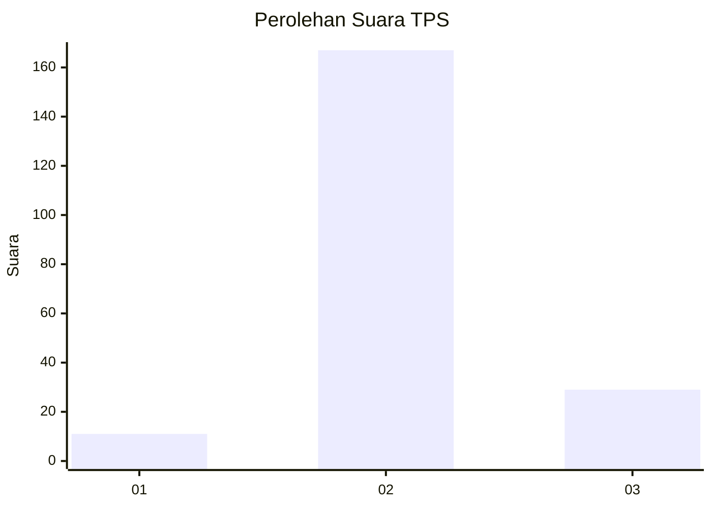
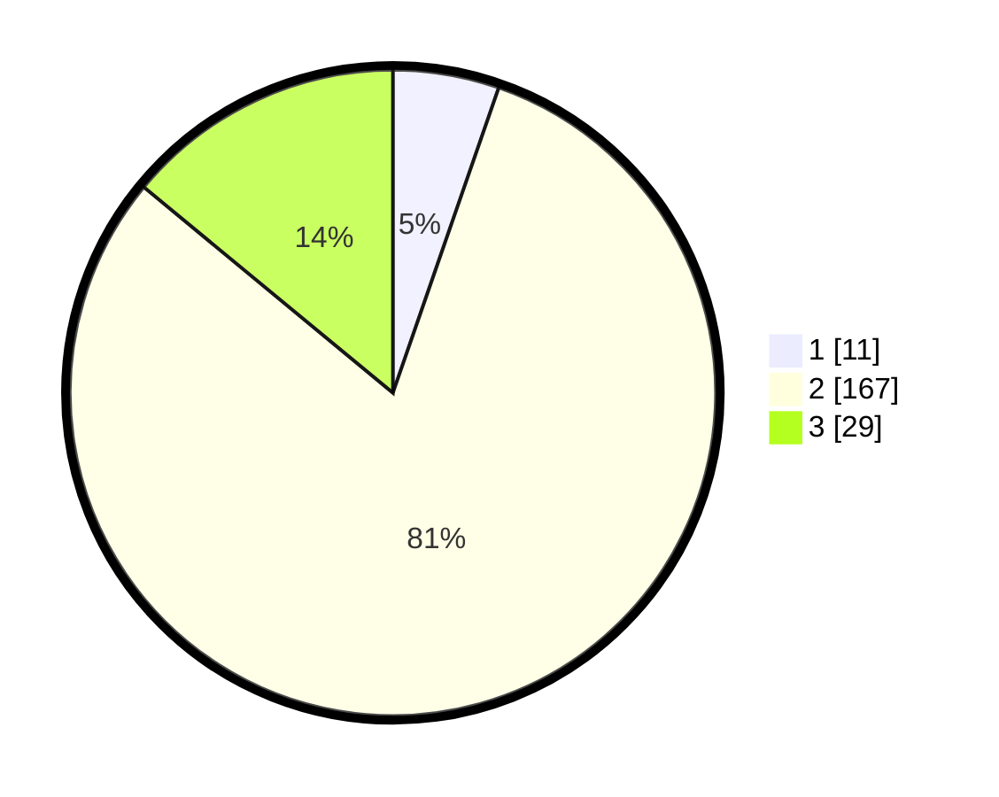

# Hasil

## Grafik

## Tabel

| No. | Nama Paslon    | Suara | Suara (raw) | Persentase |
|:--- |:-------------- | -----:| -----------:| ----------:|
| 1   | ANIES MUHAIMIN | 11    | [11][p-1]   | 5,31       |
| 2   | PRABOWO GIBRAN | 167   | [167][p-2]  | 80,68      |
| 3   | GANJAR MAHFUD  | 29    | [29][p-3]   | 14,01      |

[p-1]: https://github.com/gigit-pemilu/pemilu-2024/blob/main/pilpres/hitung-suara/sub/35-jawa-timur/sub/22-bojonegoro/sub/21-temayang/sub/2001-kedungsumber/sub/004-tps/sub/paslon-1.txt
[p-2]: https://github.com/gigit-pemilu/pemilu-2024/blob/main/pilpres/hitung-suara/sub/35-jawa-timur/sub/22-bojonegoro/sub/21-temayang/sub/2001-kedungsumber/sub/004-tps/sub/paslon-2.txt
[p-3]: https://github.com/gigit-pemilu/pemilu-2024/blob/main/pilpres/hitung-suara/sub/35-jawa-timur/sub/22-bojonegoro/sub/21-temayang/sub/2001-kedungsumber/sub/004-tps/sub/paslon-3.txt

## Foto C Plano

https://sirekap-obj-formc.kpu.go.id/3545/pemilu/ppwp/35/22/21/20/01/3522212001004-20240220-111952--72edba46-ae11-4684-9af8-1af0471f3c3e.jpg

https://sirekap-obj-formc.kpu.go.id/3545/pemilu/ppwp/35/22/21/20/01/3522212001004-20240214-231135--062320dd-ab50-42f4-9f6d-c223f9f624eb.jpg

https://sirekap-obj-formc.kpu.go.id/3545/pemilu/ppwp/35/22/21/20/01/3522212001004-20240220-112004--fa0c3320-bb1a-49dc-95df-299923f60e30.jpg

## Metadata

| Key        | Value               |
| ---------- | ------------------- |
| Time Stamp | 2024-02-21 22:00:00 |

