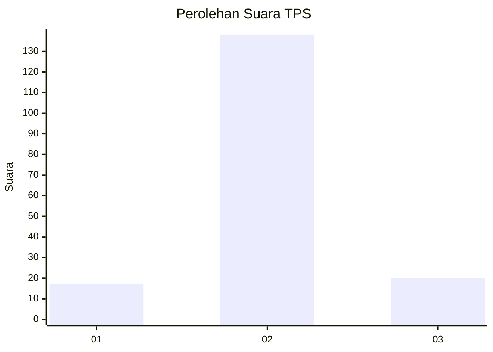
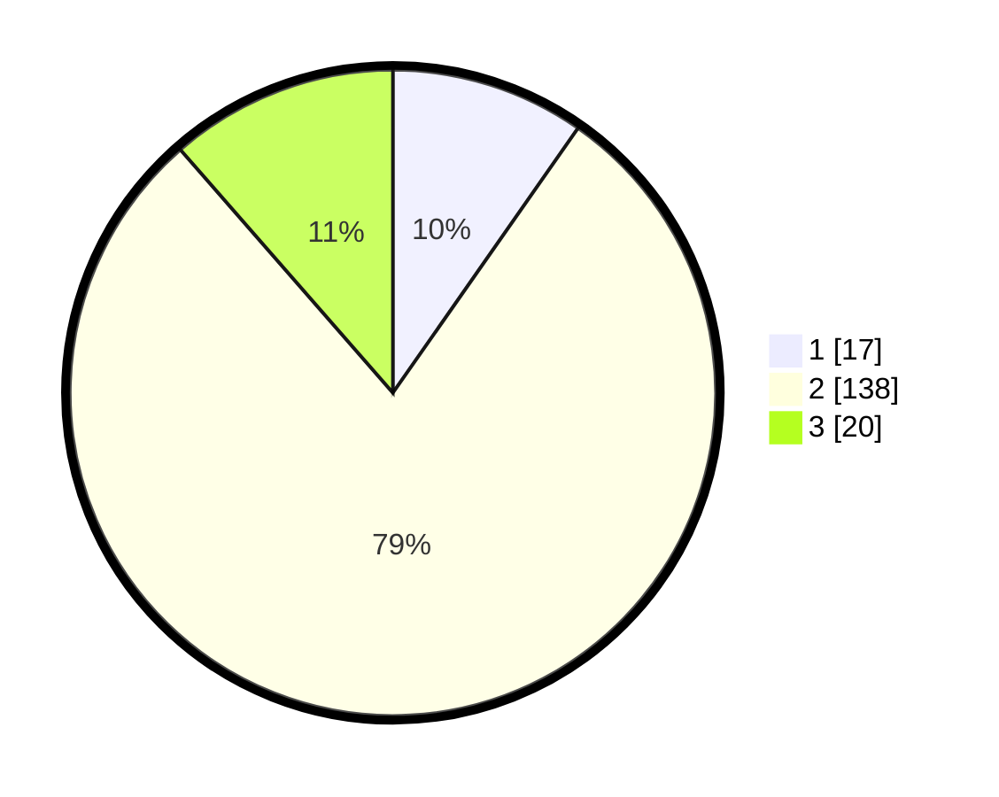

# Hasil

## Grafik

## Tabel

| No. | Nama Paslon    | Suara | Suara (raw) | Persentase |
|:--- |:-------------- | -----:| -----------:| ----------:|
| 1   | ANIES MUHAIMIN | 17    | [17][p-1]   | 9,71       |
| 2   | PRABOWO GIBRAN | 138   | [138][p-2]  | 78,86      |
| 3   | GANJAR MAHFUD  | 20    | [20][p-3]   | 11,43      |

[p-1]: https://github.com/gigit-pemilu/pemilu-2024/blob/main/pilpres/hitung-suara/sub/35-jawa-timur/sub/22-bojonegoro/sub/21-temayang/sub/2001-kedungsumber/sub/005-tps/sub/paslon-1.txt
[p-2]: https://github.com/gigit-pemilu/pemilu-2024/blob/main/pilpres/hitung-suara/sub/35-jawa-timur/sub/22-bojonegoro/sub/21-temayang/sub/2001-kedungsumber/sub/005-tps/sub/paslon-2.txt
[p-3]: https://github.com/gigit-pemilu/pemilu-2024/blob/main/pilpres/hitung-suara/sub/35-jawa-timur/sub/22-bojonegoro/sub/21-temayang/sub/2001-kedungsumber/sub/005-tps/sub/paslon-3.txt

## Foto C Plano

https://sirekap-obj-formc.kpu.go.id/d17f/pemilu/ppwp/35/22/21/20/01/3522212001005-20240215-101626--f2482708-67b9-4f4d-b8b6-603e78908233.jpg

https://sirekap-obj-formc.kpu.go.id/d17f/pemilu/ppwp/35/22/21/20/01/3522212001005-20240220-112159--d81db829-62a9-408d-86d0-4b60295e6a78.jpg

https://sirekap-obj-formc.kpu.go.id/d17f/pemilu/ppwp/35/22/21/20/01/3522212001005-20240214-201536--01bcfbee-4168-4d0a-9d62-0ea49ecba758.jpg

## Metadata

| Key        | Value               |
| ---------- | ------------------- |
| Time Stamp | 2024-02-22 11:00:00 |

