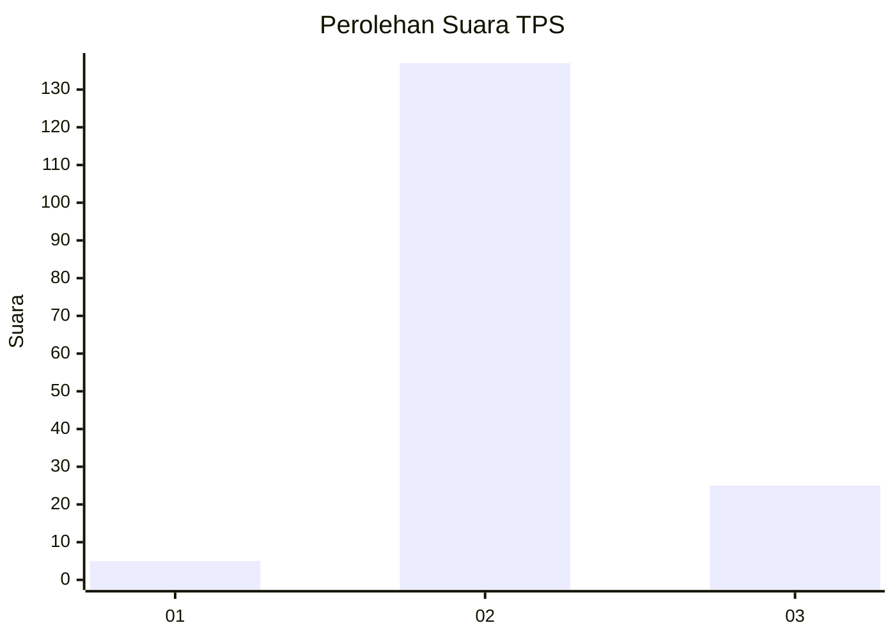
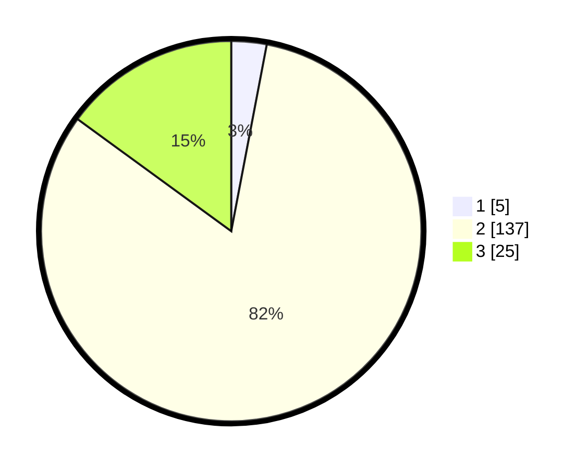

# Hasil

## Grafik

## Tabel

| No. | Nama Paslon    | Suara | Suara (raw) | Persentase |
|:--- |:-------------- | -----:| -----------:| ----------:|
| 1   | ANIES MUHAIMIN | 5     | [5][p-1]    | 2,99       |
| 2   | PRABOWO GIBRAN | 137   | [137][p-2]  | 82,04      |
| 3   | GANJAR MAHFUD  | 25    | [25][p-3]   | 14,97      |

[p-1]: https://github.com/gigit-pemilu/pemilu-2024/blob/main/pilpres/hitung-suara/sub/35-jawa-timur/sub/22-bojonegoro/sub/21-temayang/sub/2001-kedungsumber/sub/012-tps/sub/paslon-1.txt
[p-2]: https://github.com/gigit-pemilu/pemilu-2024/blob/main/pilpres/hitung-suara/sub/35-jawa-timur/sub/22-bojonegoro/sub/21-temayang/sub/2001-kedungsumber/sub/012-tps/sub/paslon-2.txt
[p-3]: https://github.com/gigit-pemilu/pemilu-2024/blob/main/pilpres/hitung-suara/sub/35-jawa-timur/sub/22-bojonegoro/sub/21-temayang/sub/2001-kedungsumber/sub/012-tps/sub/paslon-3.txt

## Foto C Plano

https://sirekap-obj-formc.kpu.go.id/ae15/pemilu/ppwp/35/22/21/20/01/3522212001012-20240220-174105--2efef330-4d57-435e-b2ea-52bbfb8a3518.jpg

https://sirekap-obj-formc.kpu.go.id/ae15/pemilu/ppwp/35/22/21/20/01/3522212001012-20240220-174114--aabb2036-df5c-4440-9e6a-95b6228ef16b.jpg

https://sirekap-obj-formc.kpu.go.id/ae15/pemilu/ppwp/35/22/21/20/01/3522212001012-20240220-174128--b50de761-9ea4-4d24-9d4a-2db7d5dffed9.jpg

## Metadata

| Key        | Value               |
| ---------- | ------------------- |
| Time Stamp | 2024-02-22 12:00:00 |

