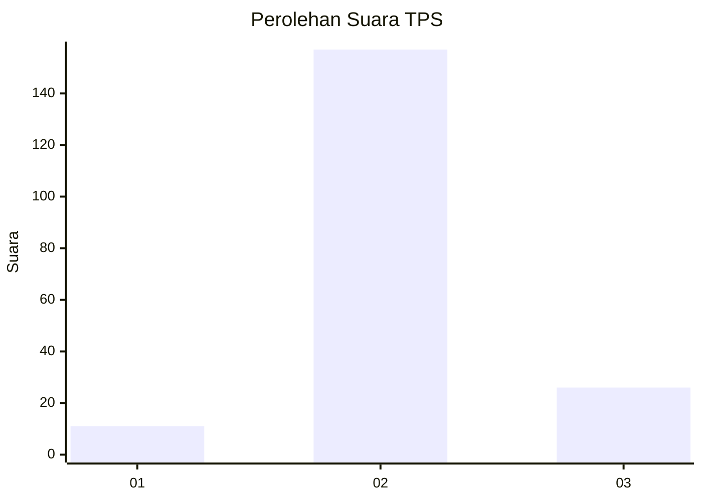
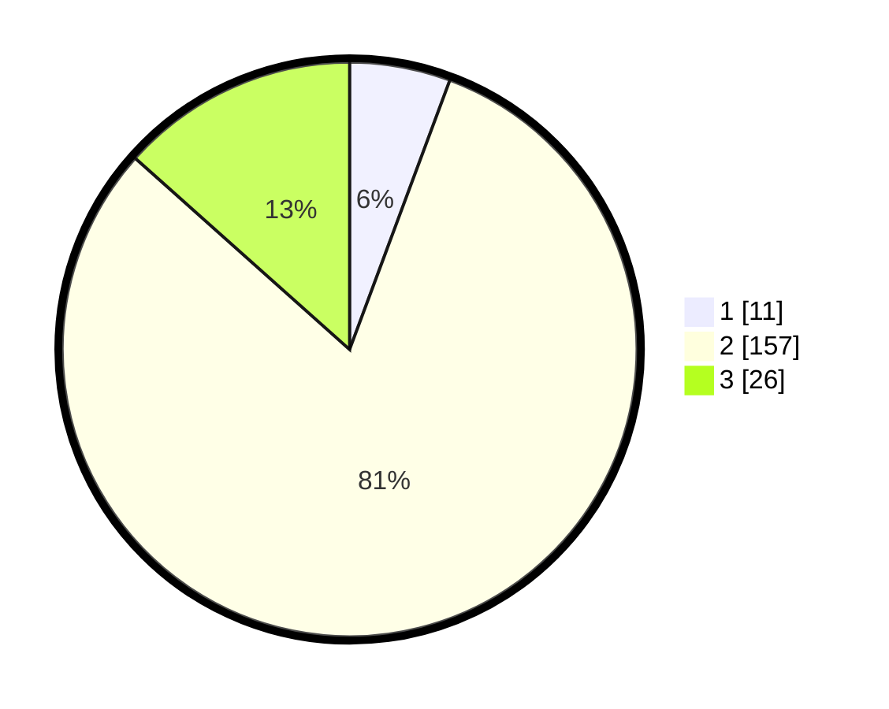

# Hasil

## Grafik

## Tabel

| No. | Nama Paslon    | Suara | Suara (raw) | Persentase |
|:--- |:-------------- | -----:| -----------:| ----------:|
| 1   | ANIES MUHAIMIN | 11    | [11][p-1]   | 5,67       |
| 2   | PRABOWO GIBRAN | 157   | [157][p-2]  | 80,93      |
| 3   | GANJAR MAHFUD  | 26    | [26][p-3]   | 13,40      |

[p-1]: https://github.com/gigit-pemilu/pemilu-2024/blob/main/pilpres/hitung-suara/sub/35-jawa-timur/sub/22-bojonegoro/sub/21-temayang/sub/2004-soko/sub/002-tps/sub/paslon-1.txt
[p-2]: https://github.com/gigit-pemilu/pemilu-2024/blob/main/pilpres/hitung-suara/sub/35-jawa-timur/sub/22-bojonegoro/sub/21-temayang/sub/2004-soko/sub/002-tps/sub/paslon-2.txt
[p-3]: https://github.com/gigit-pemilu/pemilu-2024/blob/main/pilpres/hitung-suara/sub/35-jawa-timur/sub/22-bojonegoro/sub/21-temayang/sub/2004-soko/sub/002-tps/sub/paslon-3.txt

## Foto C Plano

https://sirekap-obj-formc.kpu.go.id/caa6/pemilu/ppwp/35/22/21/20/04/3522212004002-20240220-132837--45d2e056-c20f-425a-9fc2-d4e294f8e4e2.jpg

https://sirekap-obj-formc.kpu.go.id/caa6/pemilu/ppwp/35/22/21/20/04/3522212004002-20240220-134024--bce39481-3616-4ee2-b53c-d3e6941c9fa8.jpg

https://sirekap-obj-formc.kpu.go.id/caa6/pemilu/ppwp/35/22/21/20/04/3522212004002-20240220-134016--5395a37d-5572-42d2-850c-b72a20083786.jpg

## Metadata

| Key        | Value               |
| ---------- | ------------------- |
| Time Stamp | 2024-02-21 21:00:04 |

