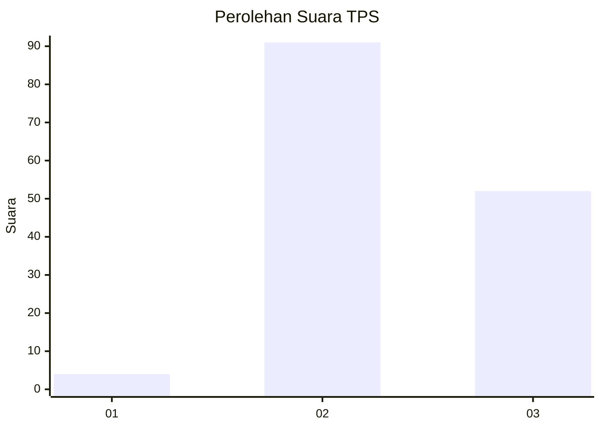
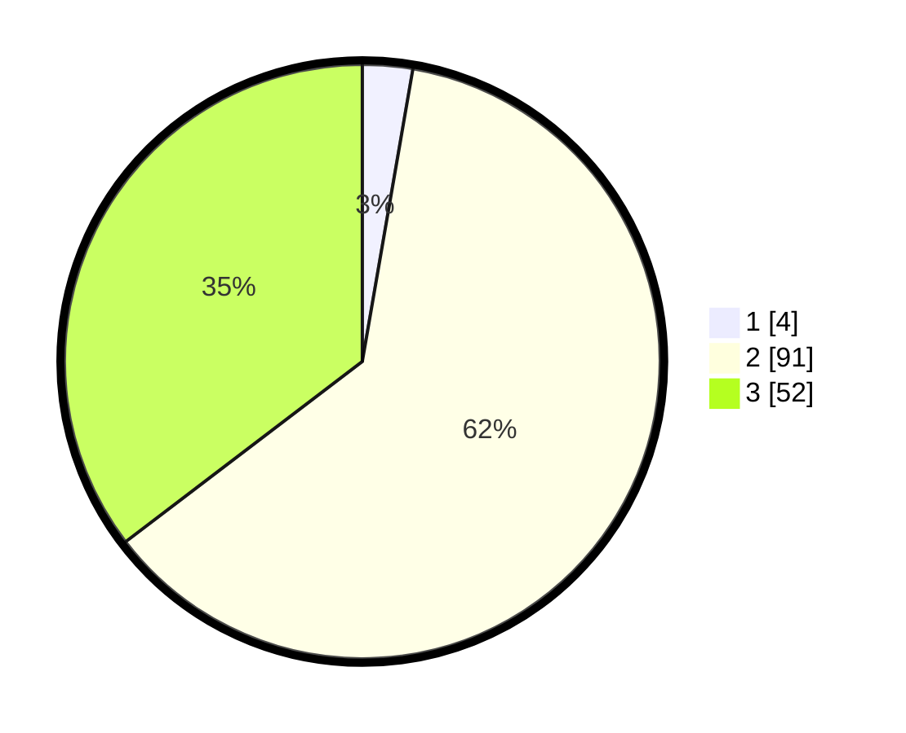

# Hasil

## Grafik

## Tabel

| No. | Nama Paslon    | Suara | Suara (raw) | Persentase |
|:--- |:-------------- | -----:| -----------:| ----------:|
| 1   | ANIES MUHAIMIN | 4     | [4][p-1]    | 2,72       |
| 2   | PRABOWO GIBRAN | 91    | [91][p-2]   | 61,90      |
| 3   | GANJAR MAHFUD  | 52    | [52][p-3]   | 35,37      |

[p-1]: https://github.com/gigit-pemilu/pemilu-2024/blob/main/pilpres/hitung-suara/sub/35-jawa-timur/sub/22-bojonegoro/sub/21-temayang/sub/2004-soko/sub/004-tps/sub/paslon-1.txt
[p-2]: https://github.com/gigit-pemilu/pemilu-2024/blob/main/pilpres/hitung-suara/sub/35-jawa-timur/sub/22-bojonegoro/sub/21-temayang/sub/2004-soko/sub/004-tps/sub/paslon-2.txt
[p-3]: https://github.com/gigit-pemilu/pemilu-2024/blob/main/pilpres/hitung-suara/sub/35-jawa-timur/sub/22-bojonegoro/sub/21-temayang/sub/2004-soko/sub/004-tps/sub/paslon-3.txt

## Foto C Plano

https://sirekap-obj-formc.kpu.go.id/5606/pemilu/ppwp/35/22/21/20/04/3522212004004-20240220-133540--d0009902-6e68-49cd-94ea-f8a230b546c9.jpg

https://sirekap-obj-formc.kpu.go.id/5606/pemilu/ppwp/35/22/21/20/04/3522212004004-20240220-133551--60c2b640-29ca-4841-85c0-5d2ccb0a5f01.jpg

https://sirekap-obj-formc.kpu.go.id/5606/pemilu/ppwp/35/22/21/20/04/3522212004004-20240220-133558--9dac6415-4f74-4cb0-8c19-9acf55c7ceda.jpg

## Metadata

| Key        | Value               |
| ---------- | ------------------- |
| Time Stamp | 2024-02-21 21:00:04 |

