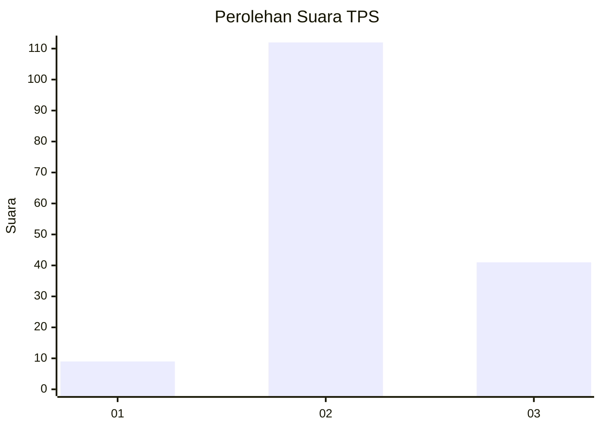
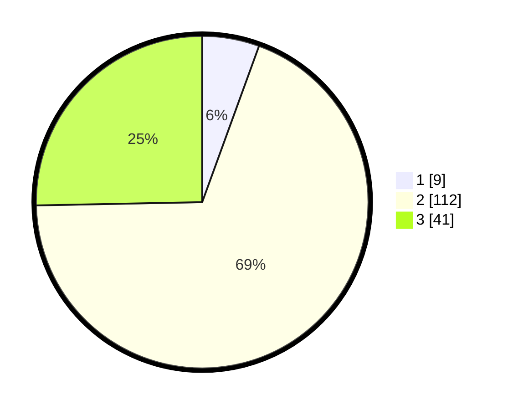

# Hasil

## Grafik

## Tabel

| No. | Nama Paslon    | Suara | Suara (raw) | Persentase |
|:--- |:-------------- | -----:| -----------:| ----------:|
| 1   | ANIES MUHAIMIN | 9     | [9][p-1]    | 5,56       |
| 2   | PRABOWO GIBRAN | 112   | [112][p-2]  | 69,14      |
| 3   | GANJAR MAHFUD  | 41    | [41][p-3]   | 25,31      |

[p-1]: https://github.com/gigit-pemilu/pemilu-2024/blob/main/pilpres/hitung-suara/sub/35-jawa-timur/sub/22-bojonegoro/sub/21-temayang/sub/2004-soko/sub/008-tps/sub/paslon-1.txt
[p-2]: https://github.com/gigit-pemilu/pemilu-2024/blob/main/pilpres/hitung-suara/sub/35-jawa-timur/sub/22-bojonegoro/sub/21-temayang/sub/2004-soko/sub/008-tps/sub/paslon-2.txt
[p-3]: https://github.com/gigit-pemilu/pemilu-2024/blob/main/pilpres/hitung-suara/sub/35-jawa-timur/sub/22-bojonegoro/sub/21-temayang/sub/2004-soko/sub/008-tps/sub/paslon-3.txt

## Foto C Plano

https://sirekap-obj-formc.kpu.go.id/ae01/pemilu/ppwp/35/22/21/20/04/3522212004008-20240218-105515--816520fe-ef58-4d9a-89cc-46ca4f1d1bc6.jpg

https://sirekap-obj-formc.kpu.go.id/ae01/pemilu/ppwp/35/22/21/20/04/3522212004008-20240220-133818--9c6c557f-393e-4cb7-a188-0de4f8dbb421.jpg

https://sirekap-obj-formc.kpu.go.id/ae01/pemilu/ppwp/35/22/21/20/04/3522212004008-20240220-133836--3d4c603f-d9d2-49a2-83c6-8abae73fafbf.jpg

## Metadata

| Key        | Value               |
| ---------- | ------------------- |
| Time Stamp | 2024-02-21 17:00:00 |

