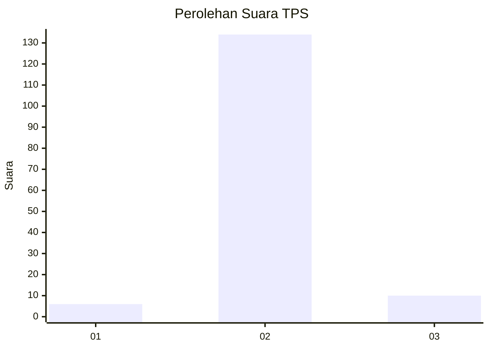
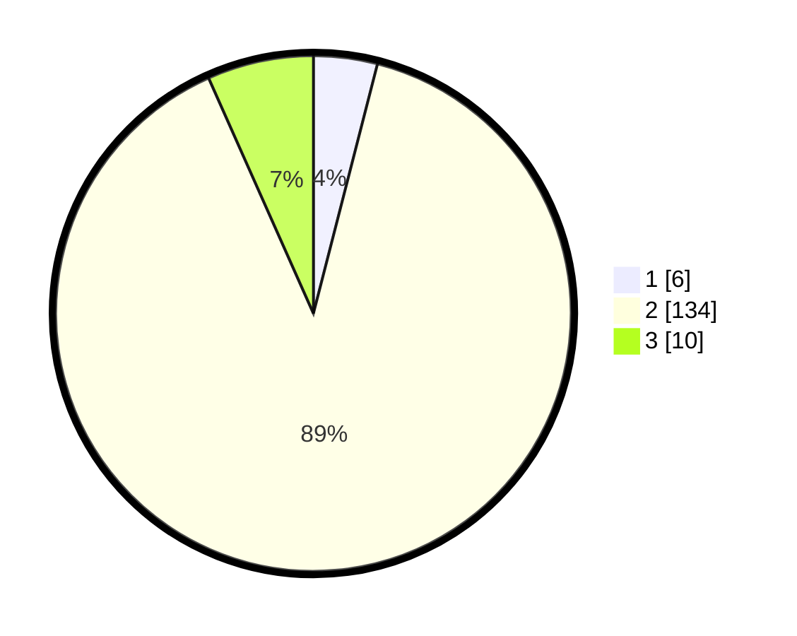

# Hasil

## Grafik

## Tabel

| No. | Nama Paslon    | Suara | Suara (raw) | Persentase |
|:--- |:-------------- | -----:| -----------:| ----------:|
| 1   | ANIES MUHAIMIN | 6     | [6][p-1]    | 4,00       |
| 2   | PRABOWO GIBRAN | 134   | [134][p-2]  | 89,33      |
| 3   | GANJAR MAHFUD  | 10    | [10][p-3]   | 6,67       |

[p-1]: https://github.com/gigit-pemilu/pemilu-2024-35-jawa-timur/blob/main/pilpres/hitung-suara/sub/35-jawa-timur/sub/22-bojonegoro/sub/21-temayang/sub/2008-bakulan/sub/007-tps/sub/paslon-1.txt
[p-2]: https://github.com/gigit-pemilu/pemilu-2024-35-jawa-timur/blob/main/pilpres/hitung-suara/sub/35-jawa-timur/sub/22-bojonegoro/sub/21-temayang/sub/2008-bakulan/sub/007-tps/sub/paslon-2.txt
[p-3]: https://github.com/gigit-pemilu/pemilu-2024-35-jawa-timur/blob/main/pilpres/hitung-suara/sub/35-jawa-timur/sub/22-bojonegoro/sub/21-temayang/sub/2008-bakulan/sub/007-tps/sub/paslon-3.txt

## Foto C Plano

https://sirekap-obj-formc.kpu.go.id/2672/pemilu/ppwp/35/22/21/20/08/3522212008007-20240217-003626--aa084b5e-2062-4f57-827b-02cc154210b7.jpg

https://sirekap-obj-formc.kpu.go.id/2672/pemilu/ppwp/35/22/21/20/08/3522212008007-20240217-003655--e6fb2634-84fb-47c8-afc8-2741e4bd3622.jpg

https://sirekap-obj-formc.kpu.go.id/2672/pemilu/ppwp/35/22/21/20/08/3522212008007-20240217-003713--bbee3b94-de8a-44cc-96f1-141d09e28321.jpg

## Metadata

| Key        | Value               |
| ---------- | ------------------- |
| Time Stamp | 2024-02-21 21:00:04 |

