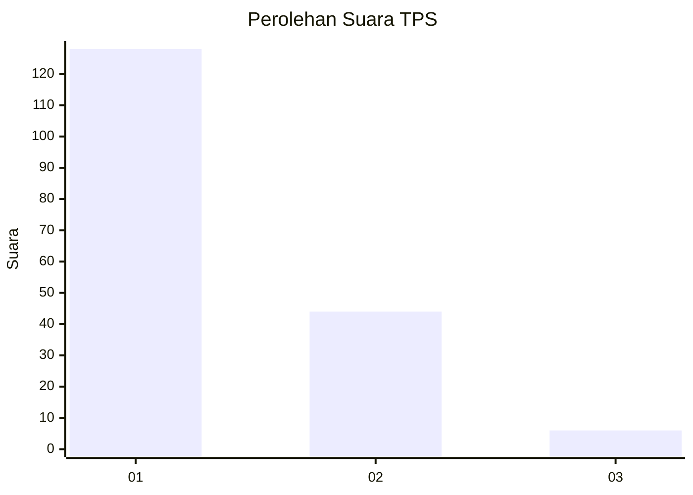
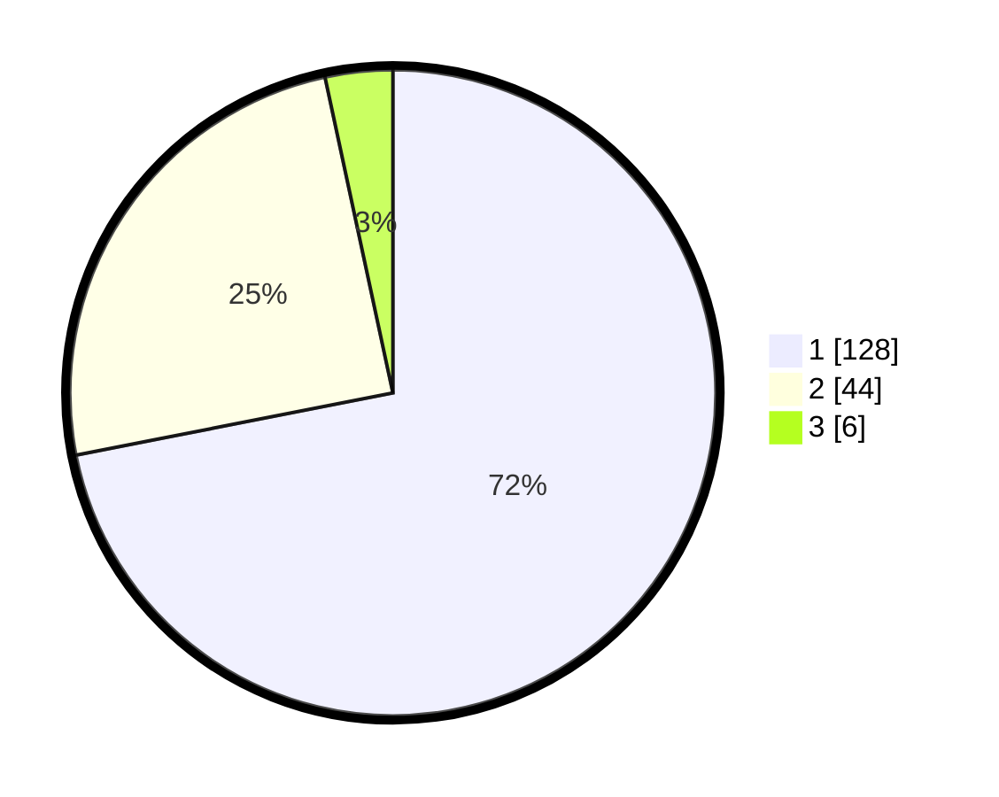

# Hasil

## Grafik

## Tabel

| No. | Nama Paslon    | Suara | Suara (raw) | Persentase |
|:--- |:-------------- | -----:| -----------:| ----------:|
| 1   | ANIES MUHAIMIN | 128   | [128][p-1]  | 71,91      |
| 2   | PRABOWO GIBRAN | 44    | [44][p-2]   | 24,72      |
| 3   | GANJAR MAHFUD  | 6     | [6][p-3]    | 3,37       |

[p-1]: https://github.com/gigit-pemilu/pemilu-2024/blob/main/pilpres/hitung-suara/sub/35-jawa-timur/sub/22-bojonegoro/sub/24-sukosewu/sub/2004-klepek/sub/001-tps/sub/paslon-1.txt
[p-2]: https://github.com/gigit-pemilu/pemilu-2024/blob/main/pilpres/hitung-suara/sub/35-jawa-timur/sub/22-bojonegoro/sub/24-sukosewu/sub/2004-klepek/sub/001-tps/sub/paslon-2.txt
[p-3]: https://github.com/gigit-pemilu/pemilu-2024/blob/main/pilpres/hitung-suara/sub/35-jawa-timur/sub/22-bojonegoro/sub/24-sukosewu/sub/2004-klepek/sub/001-tps/sub/paslon-3.txt

## Foto C Plano

https://sirekap-obj-formc.kpu.go.id/3f5d/pemilu/ppwp/35/22/24/20/04/3522242004001-20240219-171606--4e35d9cc-d28e-4f5e-9d34-179bc7c81464.jpg

https://sirekap-obj-formc.kpu.go.id/3f5d/pemilu/ppwp/35/22/24/20/04/3522242004001-20240219-171658--1b3caadc-5d5b-4cb8-975e-a1e678a7d77f.jpg

https://sirekap-obj-formc.kpu.go.id/3f5d/pemilu/ppwp/35/22/24/20/04/3522242004001-20240219-171741--255a05a1-d195-430d-9d08-77cef400a98e.jpg

## Metadata

| Key        | Value               |
| ---------- | ------------------- |
| Time Stamp | 2024-02-25 13:00:00 |

