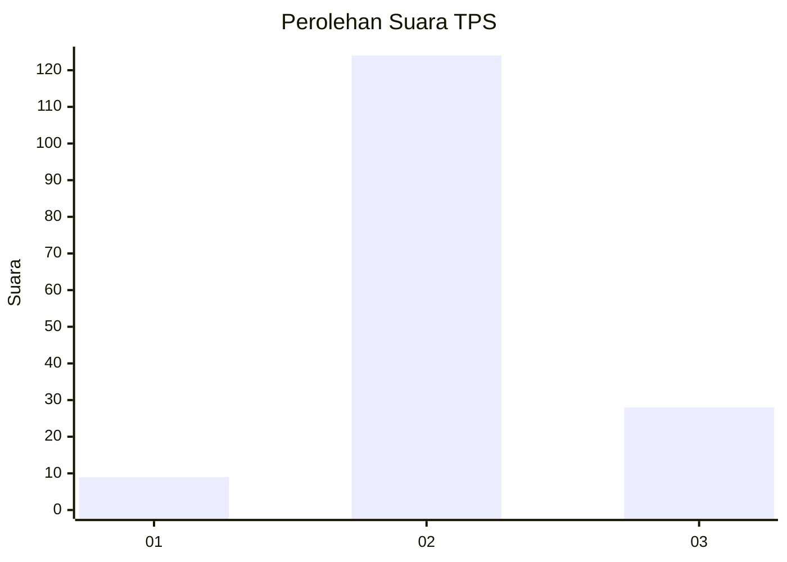

# Hasil

## Grafik

## Tabel

| No. | Nama Paslon    | Suara | Suara (raw) | Persentase |
|:--- |:-------------- | -----:| -----------:| ----------:|
| 1   | ANIES MUHAIMIN | 9     | [9][p-1]    | 5,59       |
| 2   | PRABOWO GIBRAN | 124   | [124][p-2]  | 77,02      |
| 3   | GANJAR MAHFUD  | 28    | [28][p-3]   | 17,39      |

[p-1]: https://github.com/gigit-pemilu/pemilu-2024/blob/main/pilpres/hitung-suara/sub/35-jawa-timur/sub/22-bojonegoro/sub/24-sukosewu/sub/2005-tegalkodo/sub/002-tps/sub/paslon-1.txt
[p-2]: https://github.com/gigit-pemilu/pemilu-2024/blob/main/pilpres/hitung-suara/sub/35-jawa-timur/sub/22-bojonegoro/sub/24-sukosewu/sub/2005-tegalkodo/sub/002-tps/sub/paslon-2.txt
[p-3]: https://github.com/gigit-pemilu/pemilu-2024/blob/main/pilpres/hitung-suara/sub/35-jawa-timur/sub/22-bojonegoro/sub/24-sukosewu/sub/2005-tegalkodo/sub/002-tps/sub/paslon-3.txt

## Foto C Plano

https://sirekap-obj-formc.kpu.go.id/c090/pemilu/ppwp/35/22/24/20/05/3522242005002-20240220-151951--e9d6a6cf-7b40-499e-be5c-8a8dad536180.jpg

https://sirekap-obj-formc.kpu.go.id/c090/pemilu/ppwp/35/22/24/20/05/3522242005002-20240220-152300--d3051117-2db8-44e0-b4ba-74afa72140b5.jpg

https://sirekap-obj-formc.kpu.go.id/c090/pemilu/ppwp/35/22/24/20/05/3522242005002-20240220-152412--7087d76a-a059-4d20-a1f8-c7ea2bc4e55e.jpg

## Metadata

| Key        | Value               |
| ---------- | ------------------- |
| Time Stamp | 2024-02-24 22:31:28 |

