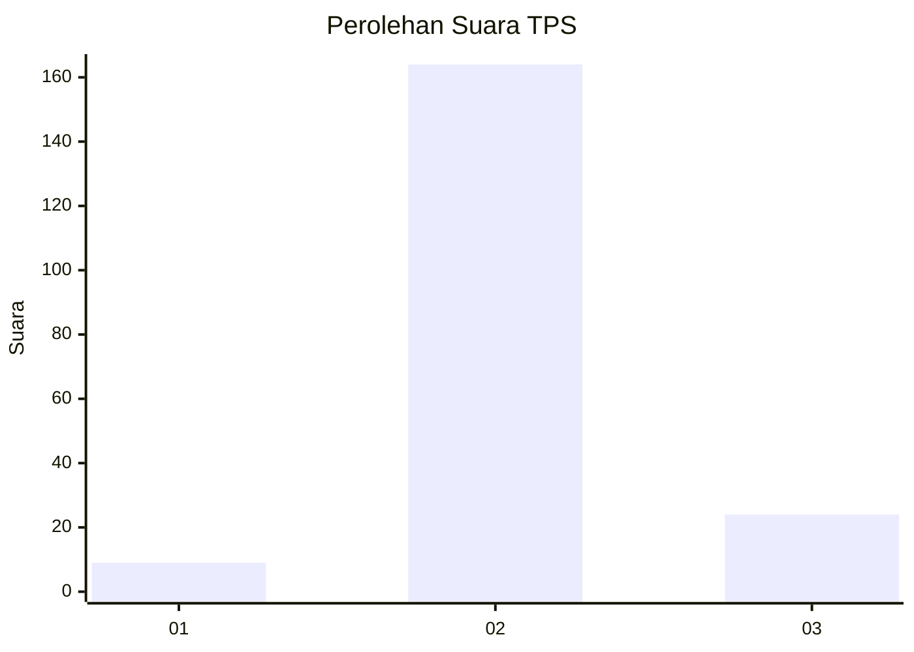
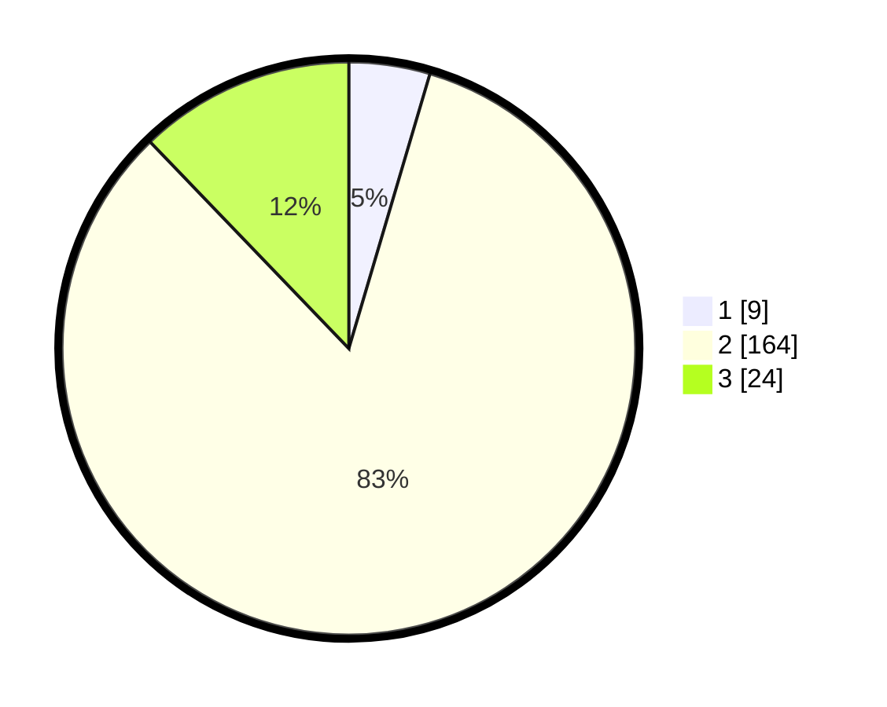

# Hasil

## Grafik

## Tabel

| No. | Nama Paslon    | Suara | Suara (raw) | Persentase |
|:--- |:-------------- | -----:| -----------:| ----------:|
| 1   | ANIES MUHAIMIN | 9     | [9][p-1]    | 4,57       |
| 2   | PRABOWO GIBRAN | 164   | [164][p-2]  | 83,25      |
| 3   | GANJAR MAHFUD  | 24    | [24][p-3]   | 12,18      |

[p-1]: https://github.com/gigit-pemilu/pemilu-2024-35-jawa-timur/blob/main/pilpres/hitung-suara/sub/35-jawa-timur/sub/22-bojonegoro/sub/24-sukosewu/sub/2005-tegalkodo/sub/005-tps/sub/paslon-1.txt
[p-2]: https://github.com/gigit-pemilu/pemilu-2024-35-jawa-timur/blob/main/pilpres/hitung-suara/sub/35-jawa-timur/sub/22-bojonegoro/sub/24-sukosewu/sub/2005-tegalkodo/sub/005-tps/sub/paslon-2.txt
[p-3]: https://github.com/gigit-pemilu/pemilu-2024-35-jawa-timur/blob/main/pilpres/hitung-suara/sub/35-jawa-timur/sub/22-bojonegoro/sub/24-sukosewu/sub/2005-tegalkodo/sub/005-tps/sub/paslon-3.txt

## Foto C Plano

https://sirekap-obj-formc.kpu.go.id/eecd/pemilu/ppwp/35/22/24/20/05/3522242005005-20240214-225606--f08e9970-94f8-41a0-a068-87d687390522.jpg

https://sirekap-obj-formc.kpu.go.id/eecd/pemilu/ppwp/35/22/24/20/05/3522242005005-20240214-225827--eb289b2d-1dbe-4e26-988c-0fa5b381b411.jpg

https://sirekap-obj-formc.kpu.go.id/eecd/pemilu/ppwp/35/22/24/20/05/3522242005005-20240214-230430--405ab45f-d82c-429c-93fd-5491dd9cfc22.jpg

## Metadata

| Key        | Value               |
| ---------- | ------------------- |
| Time Stamp | 2024-02-25 13:00:00 |

