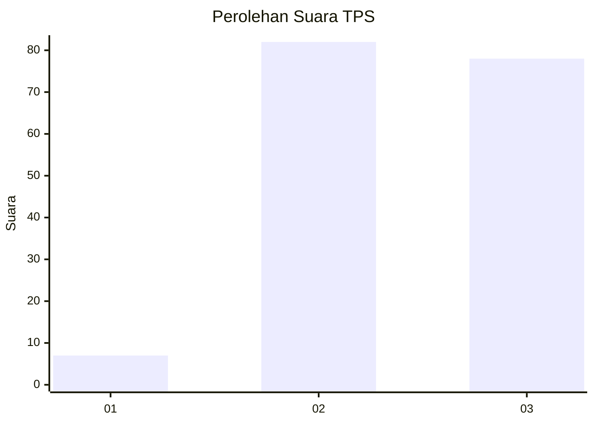
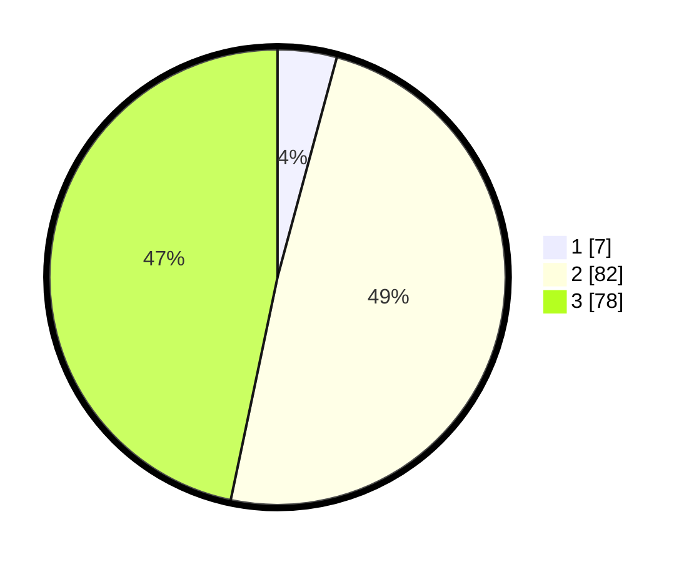

# Hasil

## Grafik

## Tabel

| No. | Nama Paslon    | Suara | Suara (raw) | Persentase |
|:--- |:-------------- | -----:| -----------:| ----------:|
| 1   | ANIES MUHAIMIN | 7     | [7][p-1]    | 4,19       |
| 2   | PRABOWO GIBRAN | 82    | [82][p-2]   | 49,10      |
| 3   | GANJAR MAHFUD  | 78    | [78][p-3]   | 46,71      |

[p-1]: https://github.com/gigit-pemilu/pemilu-2024/blob/main/pilpres/hitung-suara/sub/35-jawa-timur/sub/22-bojonegoro/sub/27-sekar/sub/2006-bareng/sub/013-tps/sub/paslon-1.txt
[p-2]: https://github.com/gigit-pemilu/pemilu-2024/blob/main/pilpres/hitung-suara/sub/35-jawa-timur/sub/22-bojonegoro/sub/27-sekar/sub/2006-bareng/sub/013-tps/sub/paslon-2.txt
[p-3]: https://github.com/gigit-pemilu/pemilu-2024/blob/main/pilpres/hitung-suara/sub/35-jawa-timur/sub/22-bojonegoro/sub/27-sekar/sub/2006-bareng/sub/013-tps/sub/paslon-3.txt

## Foto C Plano

https://sirekap-obj-formc.kpu.go.id/ead5/pemilu/ppwp/35/22/27/20/06/3522272006013-20240214-141624--8cb57a5d-22ba-4304-915b-43128b3ac58b.jpg

https://sirekap-obj-formc.kpu.go.id/ead5/pemilu/ppwp/35/22/27/20/06/3522272006013-20240214-141910--4b7aa81e-4bf3-48cb-ab60-8203bb0b6c7a.jpg

https://sirekap-obj-formc.kpu.go.id/ead5/pemilu/ppwp/35/22/27/20/06/3522272006013-20240214-204625--0c8b54c6-3c7e-4d7c-8782-cac6ec62b64d.jpg

## Metadata

| Key        | Value               |
| ---------- | ------------------- |
| Time Stamp | 2024-02-15 02:10:27 |

