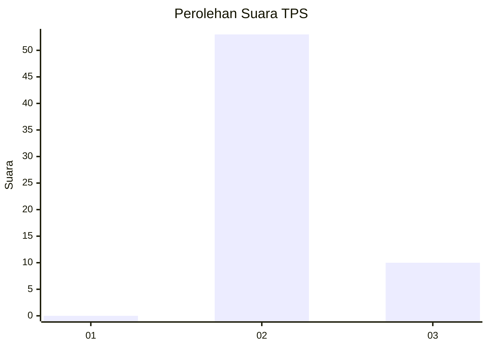
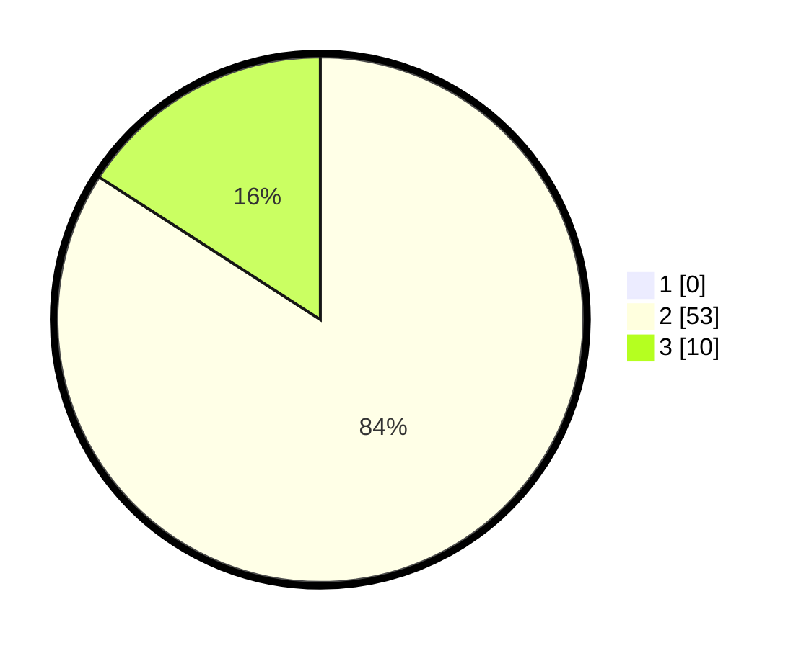

# Hasil

## Grafik

## Tabel

| No. | Nama Paslon    | Suara | Suara (raw) | Persentase |
|:--- |:-------------- | -----:| -----------:| ----------:|
| 1   | ANIES MUHAIMIN | 0     | [0][p-1]    | 0,00       |
| 2   | PRABOWO GIBRAN | 53    | [53][p-2]   | 84,13      |
| 3   | GANJAR MAHFUD  | 10    | [10][p-3]   | 15,87      |

[p-1]: https://github.com/gigit-pemilu/pemilu-2024-35-jawa-timur/blob/main/pilpres/hitung-suara/sub/35-jawa-timur/sub/22-bojonegoro/sub/27-sekar/sub/2006-bareng/sub/020-tps/sub/paslon-1.txt
[p-2]: https://github.com/gigit-pemilu/pemilu-2024-35-jawa-timur/blob/main/pilpres/hitung-suara/sub/35-jawa-timur/sub/22-bojonegoro/sub/27-sekar/sub/2006-bareng/sub/020-tps/sub/paslon-2.txt
[p-3]: https://github.com/gigit-pemilu/pemilu-2024-35-jawa-timur/blob/main/pilpres/hitung-suara/sub/35-jawa-timur/sub/22-bojonegoro/sub/27-sekar/sub/2006-bareng/sub/020-tps/sub/paslon-3.txt

## Foto C Plano

https://sirekap-obj-formc.kpu.go.id/e59b/pemilu/ppwp/35/22/27/20/06/3522272006020-20240216-140959--13c3369f-bbd5-4c00-9405-5bc8bc2fa71b.jpg

https://sirekap-obj-formc.kpu.go.id/e59b/pemilu/ppwp/35/22/27/20/06/3522272006020-20240216-141000--e88305bf-ed95-47d2-9528-044690a2f635.jpg

https://sirekap-obj-formc.kpu.go.id/e59b/pemilu/ppwp/35/22/27/20/06/3522272006020-20240214-214955--d57903af-9642-4c88-ba18-9b5f2fde350a.jpg

## Metadata

| Key        | Value               |
| ---------- | ------------------- |
| Time Stamp | 2024-02-19 06:16:00 |

## DATA PEMILIH TETAP

Jumlah pemilih dalam DPT: **67**.
 * L: **36**.
 * P: **31**.

## DATA PENGGUNA HAK PILIH

Jumlah pengguna hak pilih dalam DPT: **61**.
 * L: **33**.
 * P: **28**.

Jumlah pengguna hak pilih dalam DPTb: **2**.
 * L: **2**.
 * P: **0**.

Jumlah pengguna hak pilih dalam DPK: **0**.
 * L: **0**.
 * P: **0**.

Jumlah pengguna hak pilih: **63**.
 * L: **35**.
 * P: **28**.

## JUMLAH SUARA SAH DAN TIDAK SAH

JUMLAH SELURUH SUARA SAH: **63**.

JUMLAH SUARA TIDAK SAH: **0**.

JUMLAH SELURUH SUARA SAH DAN SUARA TIDAK SAH: **63**.

