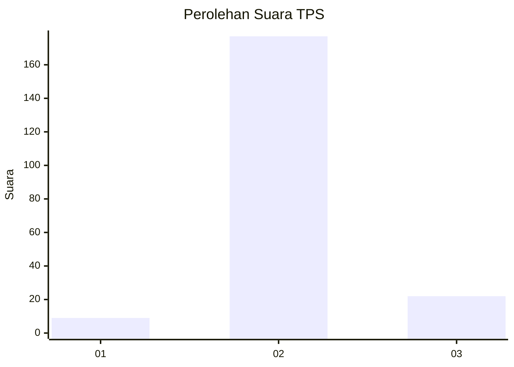
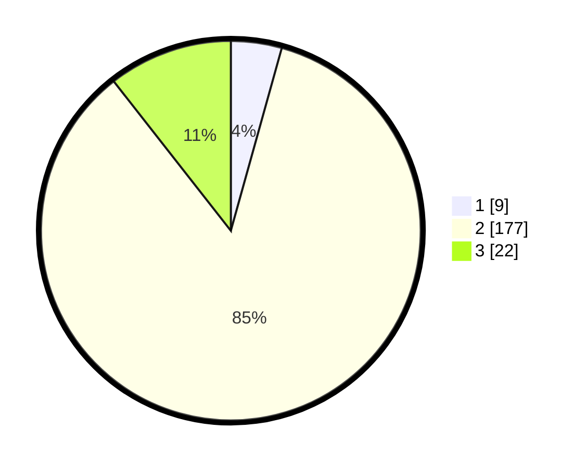

# Hasil

## Grafik

## Tabel

| No. | Nama Paslon    | Suara | Suara (raw) | Persentase |
|:--- |:-------------- | -----:| -----------:| ----------:|
| 1   | ANIES MUHAIMIN | 9     | [9][p-1]    | 4,33       |
| 2   | PRABOWO GIBRAN | 177   | [177][p-2]  | 85,10      |
| 3   | GANJAR MAHFUD  | 22    | [22][p-3]   | 10,58      |

[p-1]: https://github.com/gigit-pemilu/pemilu-2024/blob/main/pilpres/hitung-suara/sub/35-jawa-timur/sub/22-bojonegoro/sub/28-gayam/sub/2001-gayam/sub/015-tps/sub/paslon-1.txt
[p-2]: https://github.com/gigit-pemilu/pemilu-2024/blob/main/pilpres/hitung-suara/sub/35-jawa-timur/sub/22-bojonegoro/sub/28-gayam/sub/2001-gayam/sub/015-tps/sub/paslon-2.txt
[p-3]: https://github.com/gigit-pemilu/pemilu-2024/blob/main/pilpres/hitung-suara/sub/35-jawa-timur/sub/22-bojonegoro/sub/28-gayam/sub/2001-gayam/sub/015-tps/sub/paslon-3.txt

## Foto C Plano

https://sirekap-obj-formc.kpu.go.id/2c24/pemilu/ppwp/35/22/28/20/01/3522282001015-20240214-225320--6edfe948-e3e8-416a-8489-a315b1d6e338.jpg

https://sirekap-obj-formc.kpu.go.id/2c24/pemilu/ppwp/35/22/28/20/01/3522282001015-20240215-162009--ef2d9cf2-a7e4-4165-ace2-c41ac9e3bf6a.jpg

https://sirekap-obj-formc.kpu.go.id/2c24/pemilu/ppwp/35/22/28/20/01/3522282001015-20240215-162020--da181e9e-4a4f-4ac1-a9f0-d10d9f5d1e75.jpg

## Metadata

| Key        | Value               |
| ---------- | ------------------- |
| Time Stamp | 2024-02-15 23:29:50 |

