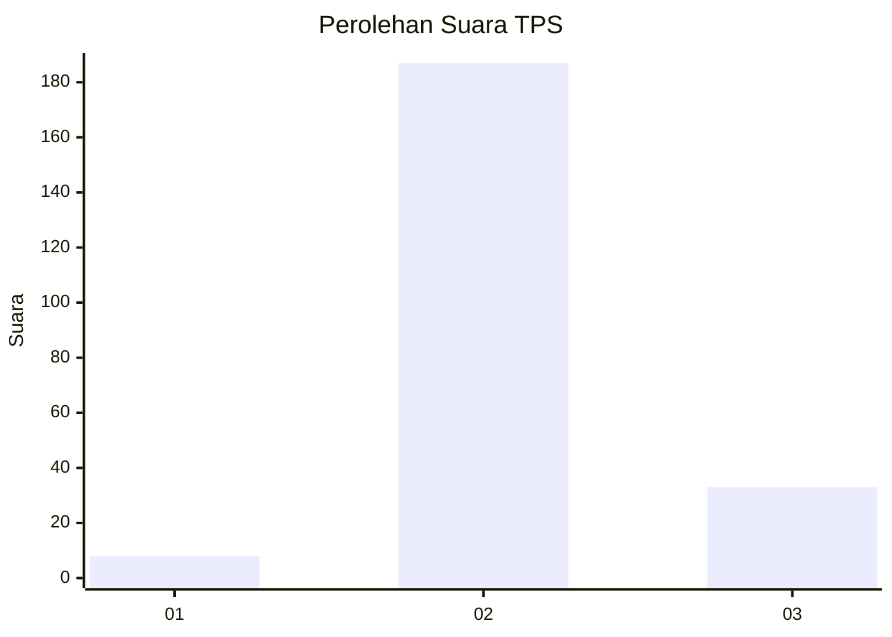
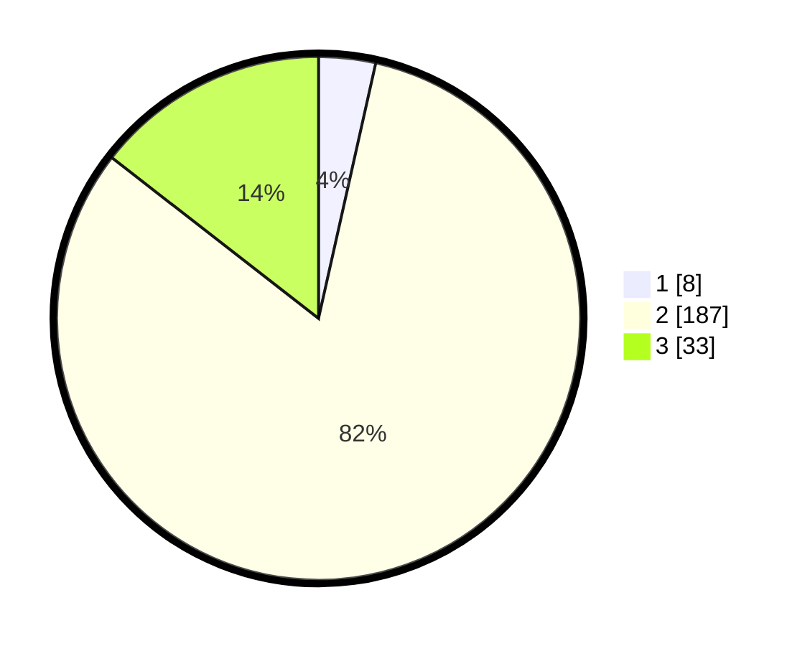

# Hasil

## Grafik

## Tabel

| No. | Nama Paslon    | Suara | Suara (raw) | Persentase |
|:--- |:-------------- | -----:| -----------:| ----------:|
| 1   | ANIES MUHAIMIN | 8     | [8][p-1]    | 3,51       |
| 2   | PRABOWO GIBRAN | 187   | [187][p-2]  | 82,02      |
| 3   | GANJAR MAHFUD  | 33    | [33][p-3]   | 14,47      |

[p-1]: https://github.com/gigit-pemilu/pemilu-2024/blob/main/pilpres/hitung-suara/sub/35-jawa-timur/sub/22-bojonegoro/sub/28-gayam/sub/2004-mojodelik/sub/002-tps/sub/paslon-1.txt
[p-2]: https://github.com/gigit-pemilu/pemilu-2024/blob/main/pilpres/hitung-suara/sub/35-jawa-timur/sub/22-bojonegoro/sub/28-gayam/sub/2004-mojodelik/sub/002-tps/sub/paslon-2.txt
[p-3]: https://github.com/gigit-pemilu/pemilu-2024/blob/main/pilpres/hitung-suara/sub/35-jawa-timur/sub/22-bojonegoro/sub/28-gayam/sub/2004-mojodelik/sub/002-tps/sub/paslon-3.txt

## Foto C Plano

https://sirekap-obj-formc.kpu.go.id/fa81/pemilu/ppwp/35/22/28/20/04/3522282004002-20240217-120634--aa9daebe-db16-40ee-be95-13e54666938f.jpg

https://sirekap-obj-formc.kpu.go.id/fa81/pemilu/ppwp/35/22/28/20/04/3522282004002-20240217-120701--6e5d24fc-5f82-4bf1-9b17-a3f80ebaf401.jpg

https://sirekap-obj-formc.kpu.go.id/fa81/pemilu/ppwp/35/22/28/20/04/3522282004002-20240217-120729--30fd3d59-9661-4fd3-bed1-882dcd3df122.jpg

## Metadata

| Key        | Value               |
| ---------- | ------------------- |
| Time Stamp | 2024-02-22 11:00:00 |

