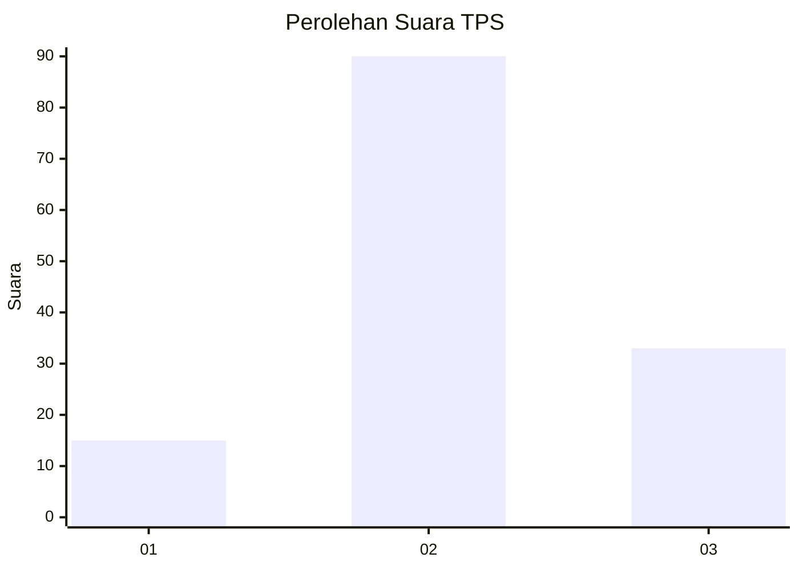
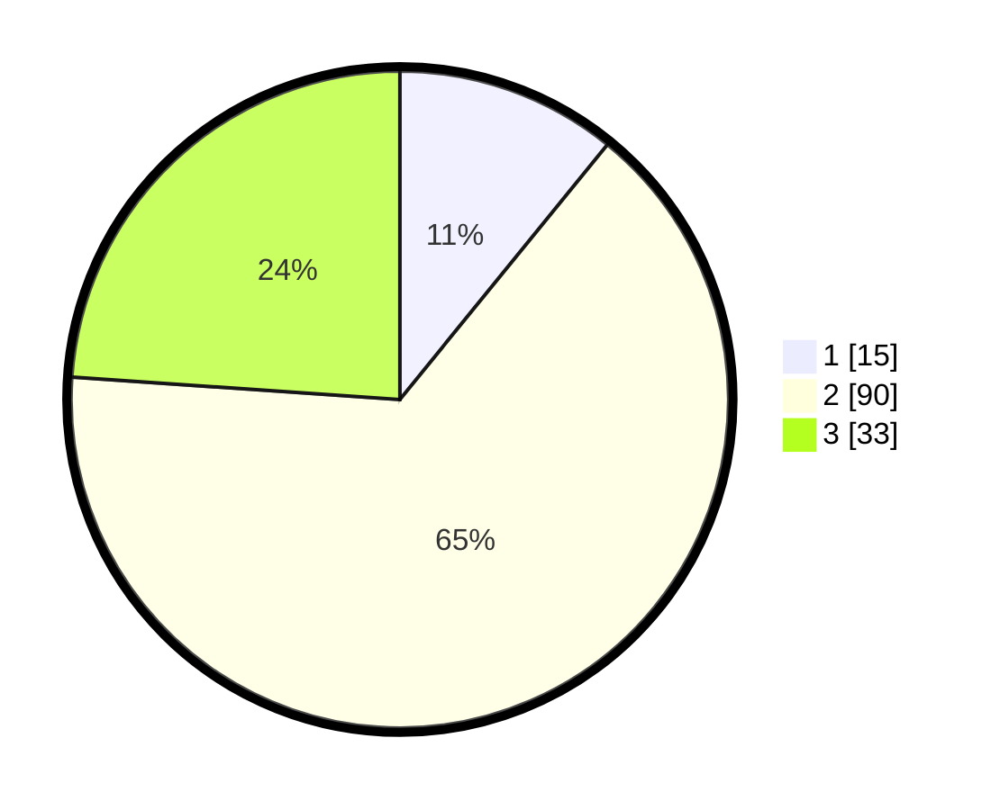

# Hasil

## Grafik

## Tabel

| No. | Nama Paslon    | Suara | Suara (raw) | Persentase |
|:--- |:-------------- | -----:| -----------:| ----------:|
| 1   | ANIES MUHAIMIN | 15    | [15][p-1]   | 10,87      |
| 2   | PRABOWO GIBRAN | 90    | [90][p-2]   | 65,22      |
| 3   | GANJAR MAHFUD  | 33    | [33][p-3]   | 23,91      |

[p-1]: https://github.com/gigit-pemilu/pemilu-2024-35-jawa-timur/blob/main/pilpres/hitung-suara/sub/35-jawa-timur/sub/23-tuban/sub/01-kenduruan/sub/2001-jlodro/sub/004-tps/sub/paslon-1.txt
[p-2]: https://github.com/gigit-pemilu/pemilu-2024-35-jawa-timur/blob/main/pilpres/hitung-suara/sub/35-jawa-timur/sub/23-tuban/sub/01-kenduruan/sub/2001-jlodro/sub/004-tps/sub/paslon-2.txt
[p-3]: https://github.com/gigit-pemilu/pemilu-2024-35-jawa-timur/blob/main/pilpres/hitung-suara/sub/35-jawa-timur/sub/23-tuban/sub/01-kenduruan/sub/2001-jlodro/sub/004-tps/sub/paslon-3.txt

## Foto C Plano

https://sirekap-obj-formc.kpu.go.id/2a2a/pemilu/ppwp/35/23/01/20/01/3523012001004-20240214-193910--57654d7c-e671-4ee9-8330-b19a93ad9f16.jpg

https://sirekap-obj-formc.kpu.go.id/2a2a/pemilu/ppwp/35/23/01/20/01/3523012001004-20240214-160102--72742dc7-189a-428b-a5d3-0c47ca0325b8.jpg

https://sirekap-obj-formc.kpu.go.id/2a2a/pemilu/ppwp/35/23/01/20/01/3523012001004-20240214-160126--0fe22f73-3d43-4ccc-8c54-b29ce05066cf.jpg

## Metadata

| Key        | Value               |
| ---------- | ------------------- |
| Time Stamp | 2024-02-14 21:46:01 |

## DATA PEMILIH TETAP

Jumlah pemilih dalam DPT: **174**.
 * L: **89**.
 * P: **85**.

## DATA PENGGUNA HAK PILIH

Jumlah pengguna hak pilih dalam DPT: **144**.
 * L: **70**.
 * P: **74**.

Jumlah pengguna hak pilih dalam DPTb: **0**.
 * L: **0**.
 * P: **0**.

Jumlah pengguna hak pilih dalam DPK: **0**.
 * L: **0**.
 * P: **0**.

Jumlah pengguna hak pilih: **144**.
 * L: **70**.
 * P: **74**.

## JUMLAH SUARA SAH DAN TIDAK SAH

JUMLAH SELURUH SUARA SAH: **138**.

JUMLAH SUARA TIDAK SAH: **6**.

JUMLAH SELURUH SUARA SAH DAN SUARA TIDAK SAH: **144**.

