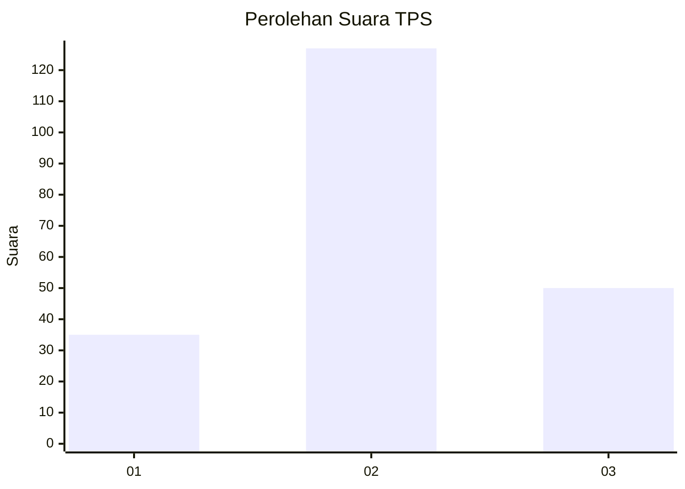
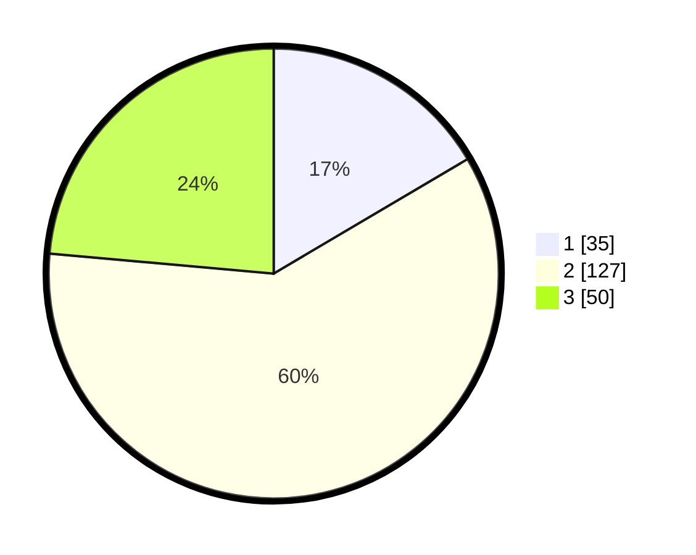

# Hasil

## Grafik

## Tabel

| No. | Nama Paslon    | Suara | Suara (raw) | Persentase |
|:--- |:-------------- | -----:| -----------:| ----------:|
| 1   | ANIES MUHAIMIN | 35    | [35][p-1]   | 16,51      |
| 2   | PRABOWO GIBRAN | 127   | [127][p-2]  | 59,91      |
| 3   | GANJAR MAHFUD  | 50    | [50][p-3]   | 23,58      |

[p-1]: https://github.com/gigit-pemilu/pemilu-2024-35-jawa-timur/blob/main/pilpres/hitung-suara/sub/35-jawa-timur/sub/23-tuban/sub/02-jatirogo/sub/2001-kebonharjo/sub/005-tps/sub/paslon-1.txt
[p-2]: https://github.com/gigit-pemilu/pemilu-2024-35-jawa-timur/blob/main/pilpres/hitung-suara/sub/35-jawa-timur/sub/23-tuban/sub/02-jatirogo/sub/2001-kebonharjo/sub/005-tps/sub/paslon-2.txt
[p-3]: https://github.com/gigit-pemilu/pemilu-2024-35-jawa-timur/blob/main/pilpres/hitung-suara/sub/35-jawa-timur/sub/23-tuban/sub/02-jatirogo/sub/2001-kebonharjo/sub/005-tps/sub/paslon-3.txt

## Foto C Plano

https://sirekap-obj-formc.kpu.go.id/32c1/pemilu/ppwp/35/23/02/20/01/3523022001005-20240217-122316--016eafff-699f-437d-b95c-9bb70a2f1601.jpg

https://sirekap-obj-formc.kpu.go.id/32c1/pemilu/ppwp/35/23/02/20/01/3523022001005-20240217-121739--1eaff0c4-37ac-4b23-8422-80489235025e.jpg

https://sirekap-obj-formc.kpu.go.id/32c1/pemilu/ppwp/35/23/02/20/01/3523022001005-20240217-121918--0d06bc26-a06e-49da-92b4-adbae2a815fe.jpg

## Metadata

| Key        | Value               |
| ---------- | ------------------- |
| Time Stamp | 2024-02-17 13:37:34 |

