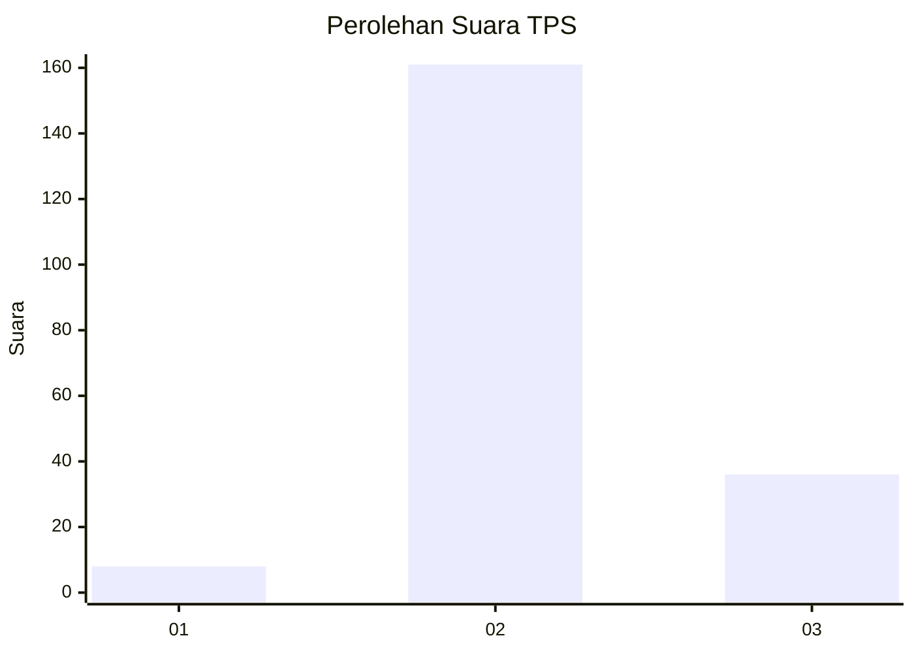

# Hasil

## Grafik

## Tabel

| No. | Nama Paslon    | Suara | Suara (raw) | Persentase |
|:--- |:-------------- | -----:| -----------:| ----------:|
| 1   | ANIES MUHAIMIN | 8     | [8][p-1]    | 3,90       |
| 2   | PRABOWO GIBRAN | 161   | [161][p-2]  | 78,54      |
| 3   | GANJAR MAHFUD  | 36    | [36][p-3]   | 17,56      |

[p-1]: https://github.com/gigit-pemilu/pemilu-2024/blob/main/pilpres/hitung-suara/sub/35-jawa-timur/sub/23-tuban/sub/05-senori/sub/2004-banyuurip/sub/006-tps/sub/paslon-1.txt
[p-2]: https://github.com/gigit-pemilu/pemilu-2024/blob/main/pilpres/hitung-suara/sub/35-jawa-timur/sub/23-tuban/sub/05-senori/sub/2004-banyuurip/sub/006-tps/sub/paslon-2.txt
[p-3]: https://github.com/gigit-pemilu/pemilu-2024/blob/main/pilpres/hitung-suara/sub/35-jawa-timur/sub/23-tuban/sub/05-senori/sub/2004-banyuurip/sub/006-tps/sub/paslon-3.txt

## Foto C Plano

https://sirekap-obj-formc.kpu.go.id/626c/pemilu/ppwp/35/23/05/20/04/3523052004006-20240215-012731--d9591f40-a2f1-4d8b-85ea-d904ff874033.jpg

https://sirekap-obj-formc.kpu.go.id/626c/pemilu/ppwp/35/23/05/20/04/3523052004006-20240215-013034--df1c22fa-cd24-4306-90bd-f86a9d40bf8c.jpg

https://sirekap-obj-formc.kpu.go.id/626c/pemilu/ppwp/35/23/05/20/04/3523052004006-20240215-013551--7ea6d8de-2237-4e2f-b3b8-4c6df29955d2.jpg

## Metadata

| Key        | Value               |
| ---------- | ------------------- |
| Time Stamp | 2024-02-15 20:30:46 |

