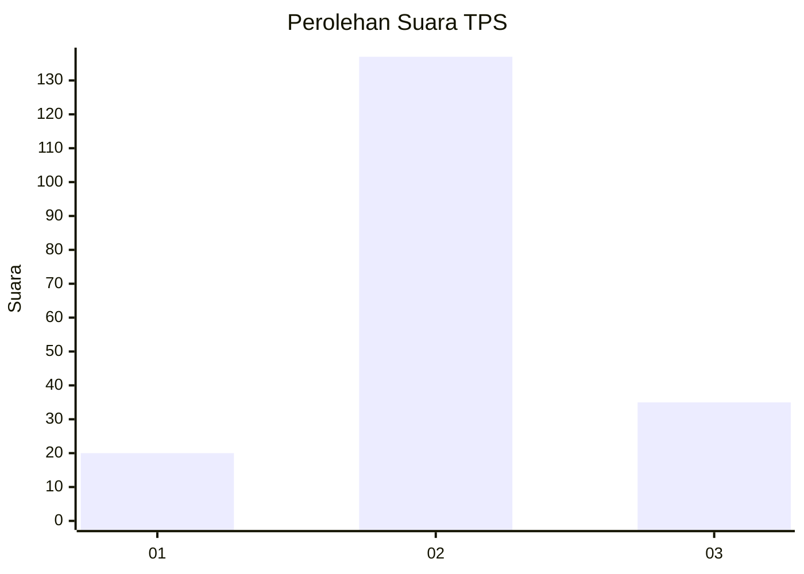
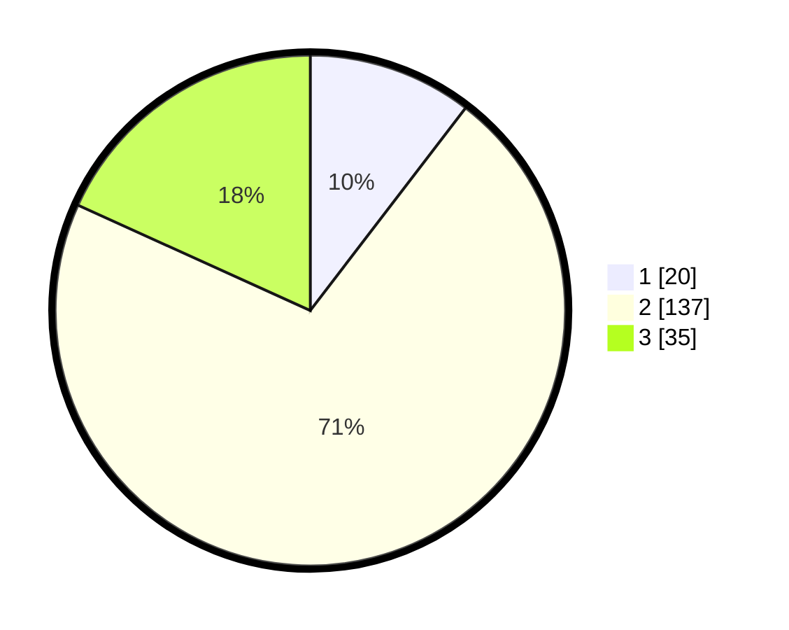

# Hasil

## Grafik

## Tabel

| No. | Nama Paslon    | Suara | Suara (raw) | Persentase |
|:--- |:-------------- | -----:| -----------:| ----------:|
| 1   | ANIES MUHAIMIN | 20    | [20][p-1]   | 10,42      |
| 2   | PRABOWO GIBRAN | 137   | [137][p-2]  | 71,35      |
| 3   | GANJAR MAHFUD  | 35    | [35][p-3]   | 18,23      |

[p-1]: https://github.com/gigit-pemilu/pemilu-2024/blob/main/pilpres/hitung-suara/sub/35-jawa-timur/sub/23-tuban/sub/05-senori/sub/2011-rayung/sub/005-tps/sub/paslon-1.txt
[p-2]: https://github.com/gigit-pemilu/pemilu-2024/blob/main/pilpres/hitung-suara/sub/35-jawa-timur/sub/23-tuban/sub/05-senori/sub/2011-rayung/sub/005-tps/sub/paslon-2.txt
[p-3]: https://github.com/gigit-pemilu/pemilu-2024/blob/main/pilpres/hitung-suara/sub/35-jawa-timur/sub/23-tuban/sub/05-senori/sub/2011-rayung/sub/005-tps/sub/paslon-3.txt

## Foto C Plano

https://sirekap-obj-formc.kpu.go.id/ebcc/pemilu/ppwp/35/23/05/20/11/3523052011005-20240219-011523--b2df95a3-a2b9-41cb-98da-9411bd871fdf.jpg

https://sirekap-obj-formc.kpu.go.id/ebcc/pemilu/ppwp/35/23/05/20/11/3523052011005-20240219-054040--1a4b81a0-743a-477d-b99a-8145b134b7ab.jpg

https://sirekap-obj-formc.kpu.go.id/ebcc/pemilu/ppwp/35/23/05/20/11/3523052011005-20240219-011736--a3c7cbea-a12b-4a83-a290-9cf2f3dd6844.jpg

## Metadata

| Key        | Value               |
| ---------- | ------------------- |
| Time Stamp | 2024-02-19 17:00:00 |

