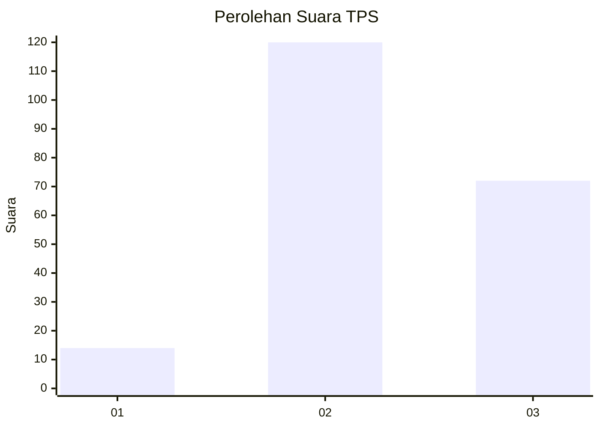
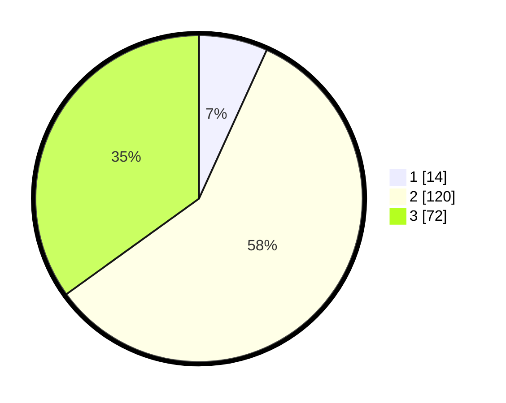

# Hasil

## Grafik

## Tabel

| No. | Nama Paslon    | Suara | Suara (raw) | Persentase |
|:--- |:-------------- | -----:| -----------:| ----------:|
| 1   | ANIES MUHAIMIN | 14    | [14][p-1]   | 6,80       |
| 2   | PRABOWO GIBRAN | 120   | [120][p-2]  | 58,25      |
| 3   | GANJAR MAHFUD  | 72    | [72][p-3]   | 34,95      |

[p-1]: https://github.com/gigit-pemilu/pemilu-2024/blob/main/pilpres/hitung-suara/sub/35-jawa-timur/sub/23-tuban/sub/08-kerek/sub/2007-hargoretno/sub/003-tps/sub/paslon-1.txt
[p-2]: https://github.com/gigit-pemilu/pemilu-2024/blob/main/pilpres/hitung-suara/sub/35-jawa-timur/sub/23-tuban/sub/08-kerek/sub/2007-hargoretno/sub/003-tps/sub/paslon-2.txt
[p-3]: https://github.com/gigit-pemilu/pemilu-2024/blob/main/pilpres/hitung-suara/sub/35-jawa-timur/sub/23-tuban/sub/08-kerek/sub/2007-hargoretno/sub/003-tps/sub/paslon-3.txt

## Foto C Plano

https://sirekap-obj-formc.kpu.go.id/7a14/pemilu/ppwp/35/23/08/20/07/3523082007003-20240215-204230--e9442e4f-7f64-49f9-8556-0cdf5917db80.jpg

https://sirekap-obj-formc.kpu.go.id/7a14/pemilu/ppwp/35/23/08/20/07/3523082007003-20240215-215440--e8c3339a-7409-4795-88c0-f7f06158a998.jpg

https://sirekap-obj-formc.kpu.go.id/7a14/pemilu/ppwp/35/23/08/20/07/3523082007003-20240215-215640--961e2859-cc3e-46b8-91f8-b0ea73f9d790.jpg

## Metadata

| Key        | Value               |
| ---------- | ------------------- |
| Time Stamp | 2024-02-19 06:16:00 |

