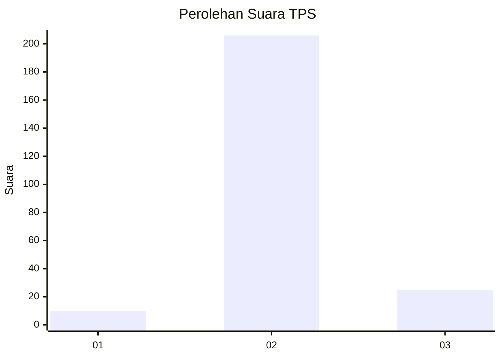
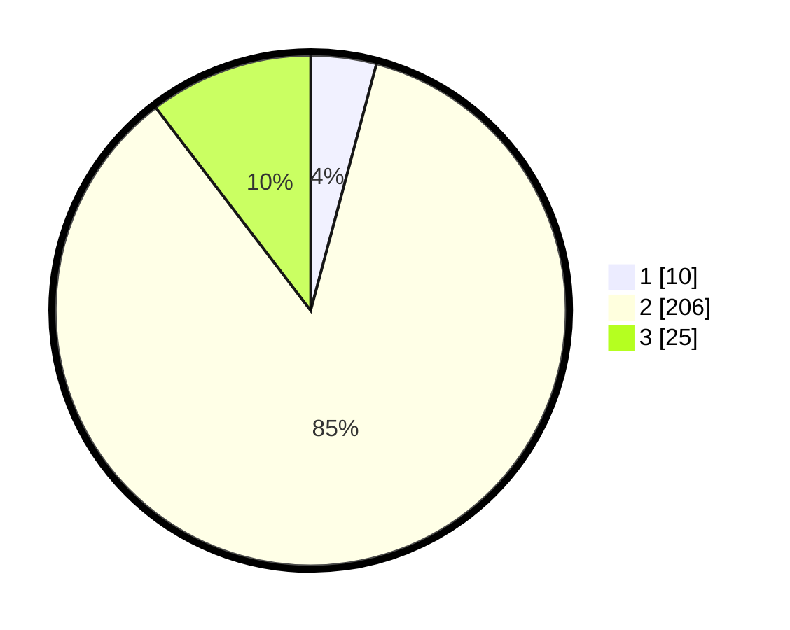

# Hasil

## Grafik

## Tabel

| No. | Nama Paslon    | Suara | Suara (raw) | Persentase |
|:--- |:-------------- | -----:| -----------:| ----------:|
| 1   | ANIES MUHAIMIN | 10    | [10][p-1]   | 4,15       |
| 2   | PRABOWO GIBRAN | 206   | [206][p-2]  | 85,48      |
| 3   | GANJAR MAHFUD  | 25    | [25][p-3]   | 10,37      |

[p-1]: https://github.com/gigit-pemilu/pemilu-2024/blob/main/pilpres/hitung-suara/sub/35-jawa-timur/sub/23-tuban/sub/08-kerek/sub/2017-padasan/sub/002-tps/sub/paslon-1.txt
[p-2]: https://github.com/gigit-pemilu/pemilu-2024/blob/main/pilpres/hitung-suara/sub/35-jawa-timur/sub/23-tuban/sub/08-kerek/sub/2017-padasan/sub/002-tps/sub/paslon-2.txt
[p-3]: https://github.com/gigit-pemilu/pemilu-2024/blob/main/pilpres/hitung-suara/sub/35-jawa-timur/sub/23-tuban/sub/08-kerek/sub/2017-padasan/sub/002-tps/sub/paslon-3.txt

## Foto C Plano

https://sirekap-obj-formc.kpu.go.id/2638/pemilu/ppwp/35/23/08/20/17/3523082017002-20240215-204419--5995086d-6fbc-4c66-9422-6b49793e0709.jpg

https://sirekap-obj-formc.kpu.go.id/2638/pemilu/ppwp/35/23/08/20/17/3523082017002-20240214-141050--d0d0faae-d3ed-4ac9-83a8-2c3a72cda156.jpg

https://sirekap-obj-formc.kpu.go.id/2638/pemilu/ppwp/35/23/08/20/17/3523082017002-20240215-212525--150815ab-0740-441f-8c1e-9cbbcbd4c063.jpg

## Metadata

| Key        | Value               |
| ---------- | ------------------- |
| Time Stamp | 2024-02-15 22:30:27 |

